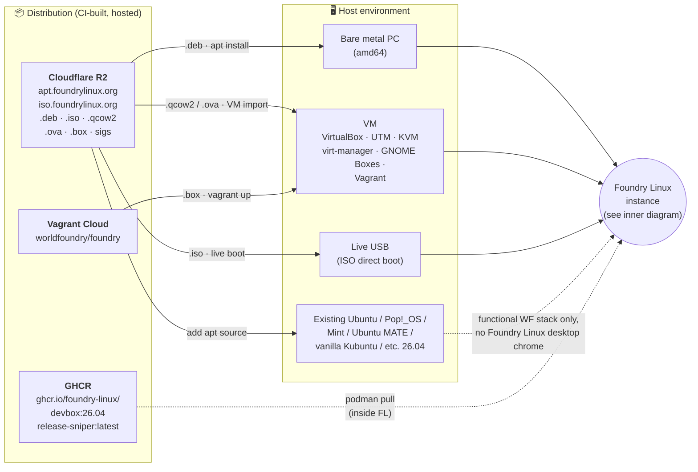
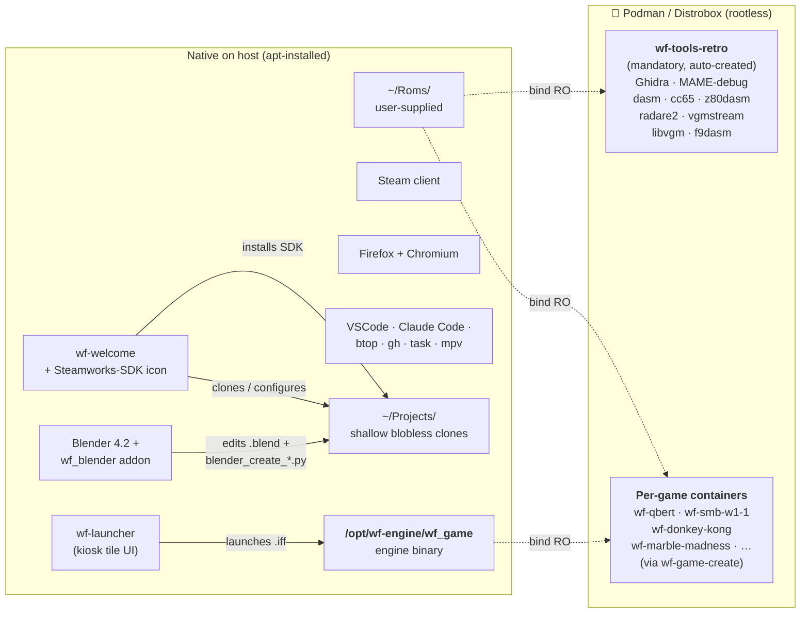
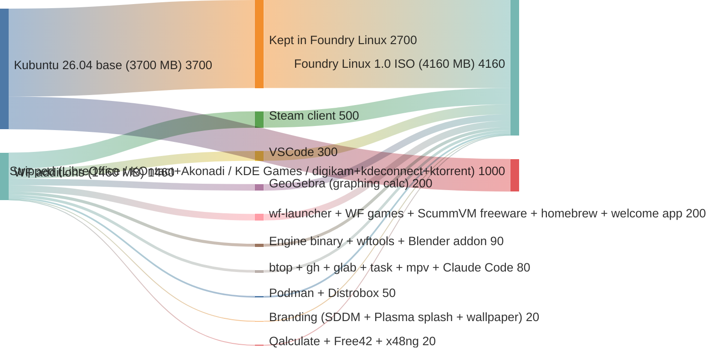
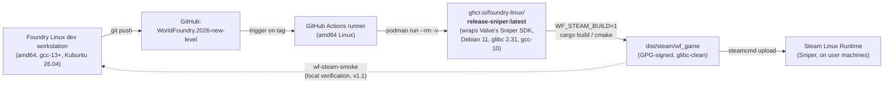

# Foundry Linux — a Debian/Ubuntu derivative for World Foundry game dev

> **⚠️ Historical artifact (superseded).** This is the original 2026‑05‑16 north‑star proposal, moved here from `docs/plans/` because it no longer describes the shipped product. **It is not a current spec — do not action it.** What actually shipped diverged in several ways:
> - The **`foundry-dev` umbrella** (this doc's centerpiece) was replaced by the edition tiers `foundry-core ⊆ foundry-anvil ⊆ foundry-sprite ⊆ foundry-atelier` + `foundry-desktop` (the core/desktop split landed 2026‑05‑28). See [`CLAUDE.md` § Editions](../../CLAUDE.md).
> - **Dropped without follow‑through:** Steam/Sniper release containers, per‑game Distrobox, gamescope kiosk, and the AWS‑SSM/OIDC/YubiKey two‑tier signing scheme (replaced by single‑key GPG signing via GitHub Actions secret + DR backup to a private R2 bucket).
> - **Scope expanded** beyond the WF toolchain into a general creative/retro‑gaming catalogue (~20 art/audio/emulator/game metapackages — Krita, Ardour, Dolphin, PCSX2, 0 A.D., …) that this proposal never anticipated.
>
> For current architecture and roadmap, read `CLAUDE.md` and the live entries in `TODO.md`. The text below is preserved verbatim as the project's founding rationale.


## Context

World Foundry has a complex, layered toolchain: C++17 engine, Rust asset compilers (`iffcomp-rs`, `levcomp-rs`, `textile-rs`, `chargrab-rs`), [Blender 4.2](https://www.blender.org/) with a custom native-Rust addon (`wf_blender` + `wf_core.so`), [zForth](https://github.com/zevv/zForth) scripting, plus a deep retro-porting stack ([MAME](https://www.mamedev.org/), [Ghidra](https://ghidra-sre.org/), [f9dasm](https://github.com/Arakula/f9dasm), [vgmstream](https://vgmstream.org/), [libvgm](https://github.com/ValleyBell/libvgm), [dasm](https://dasm-assembler.github.io/), [cc65](https://cc65.github.io/), [z80dasm](https://www.tablix.org/~avian/blog/articles/z80dasm/), [radare2](https://rada.re/), [binwalk](https://github.com/ReFirmLabs/binwalk), [sox](https://sox.sourceforge.net/), m68k binutils). Getting a clean machine from "fresh Ubuntu install" to "running a level you authored in Blender against a live engine bridge on port 7777" is currently dozens of manual steps spread across `Taskfile.yml`, `engine/build_game.sh`, and `docs/investigations/2026-05-15-claude-arcade-tooling.md`.

**Goal:** make WF game dev a single download. Secondary: enable a dedicated "Foundry Linux workstation" as a physical machine, a VM, or a container, so the toolchain stays isolated from a user's daily-driver OS. **Non-goal:** distro market share — this is to lower the activation energy for contributors, not to compete with [Pop!_OS](https://pop.system76.com/).

**Scope is deliberately broader than World Foundry alone.** The distro is named **Foundry Linux** (not "World Foundry Linux") so it has headroom for game-dev and game-adjacent tooling that isn't strictly WF: general Blender components (see the APT-repo-as-Blender-hub note in Channel 1), the retro-porting toolchain that's useful even outside WF projects, future engines we want to support, community-contributed game-dev utilities. World Foundry is the gravitational centre of the project, but the distro isn't fenced to it.

**Decisions taken so far (from user):**
- **Name: Foundry Linux.** (See "Open decisions" #1 for rationale.)
- **Dev workstation base: [Kubuntu 26.04 LTS "Resolute Raccoon"](https://kubuntu.org/news/kubuntu-26-04-release-notes/).** Released April 23, 2026. KDE Plasma 6.6 as the default DE, Qt 6.10.2, KDE Frameworks 6.24.0, KDE Gear 25.12.3. Supported until April 2029. Ships gcc-13+, Python 3.12+, modern Mesa, `nvidia-driver-550+` in `ubuntu-drivers` recommendations. **Calamares is Kubuntu's default installer** (since 24.04) — so our installer choice already matches the base. No installer migration needed.
- **Why Kubuntu/KDE over Ubuntu/GNOME** (the original v1 plan): KDE Plasma is the better dev environment — more configurable, better multi-monitor handling for IDE+terminal+browser+game-window setups, superior file manager ([Dolphin](https://apps.kde.org/dolphin/)), split-pane terminal ([Konsole](https://apps.kde.org/konsole/)), powerful text editor ([Kate](https://kate-editor.org/)), better Wayland story in 2026. Our biggest target audience is new contributors; they deserve the best dev environment we can give them out of the box. Kubuntu is healthy and on a regular release cadence (see Open Decision #2 for the full rationale).
- **Steam release builds: [Sniper SDK](https://gitlab.steamos.cloud/steamrt/steamrt/-/blob/steamrt/sniper/README.md) container** (`registry.gitlab.steamos.cloud/steamrt/sniper/sdk`). The current [Steam Linux Runtime](https://github.com/ValveSoftware/steam-runtime) is [Debian 11](https://www.debian.org/releases/bullseye/)-based (glibc 2.31, GCC 10), so binaries built natively on any modern Ubuntu would demand a too-new glibc and fail on Steam. Decoupling "dev workstation" from "shippable artifact": devs work on Kubuntu 26.04; release CI builds inside the Sniper SDK. See "Steam release builds" section below. (Sniper is Valve's name for Steam Runtime 3.0 — that one's not my naming convention to fix.)
- All four delivery channels supported: setup script, APT repo, OCI/container image, bootable ISO
- **Packaging policy: `.deb` only.** No snap, no flatpak, and no source builds on end-user machines. See "Open decisions" #4.

---

## Recommendation: four delivery channels, phased rollout

| Phase | Channel | Effort | Use case |
|-------|---------|--------|----------|
| 0 | **Setup script** (`curl … \| bash`) on vanilla Kubuntu 26.04 (or any Ubuntu-family 26.04) | days | Get developers unblocked immediately on whatever they're already running |
| 1 | **APT repo** (signed, hosted on [Cloudflare R2](https://www.cloudflare.com/products/r2/)) + **`foundry-dev` metapackage** | 1–2 weeks | Reproducible installs, upgrade path, deps tracked by `apt` |
| 2 | **[OCI](https://opencontainers.org/) image** (`ghcr.io/foundry-linux/devbox`) + [Distrobox](https://distrobox.it/) recipe | 1–2 weeks | "Dedicated workstation" use case via container on any host (Linux/macOS/Windows-WSL) |
| 3 | **Foundry Linux ISO** (Ubuntu remix built with [`live-build`](https://wiki.debian.org/DebianLive) or [`cubic`](https://launchpad.net/cubic)) | 1–2 months | The full distro experience: bootable USB, hands-on installer, branded desktop |

Each phase reuses the previous one's artifacts:
- The metapackage in Phase 1 just `apt install`s what the script in Phase 0 already curates.
- The OCI image in Phase 2 is a `Dockerfile FROM kubuntu:26.04` (or `FROM ubuntu:26.04` + install Plasma seed) `RUN apt install foundry-dev` plus the workstation conveniences.
- The ISO in Phase 3 is a live-build seed that pulls from the same APT repo and bakes in the same metapackage.

This keeps one source of truth (the metapackage's dependency list) across all four channels.

---

## Architecture overview

Two diagrams — outer (distribution → host environment) and inner (what's inside a running Foundry Linux). Split because cramming both into one made every node unreadable.

### Outer: distribution → host environment



### Inner: what's inside a running Foundry Linux



**Key relationships:**

| Relationship | Mechanism |
|---|---|
| ISO/qcow2/OVA/box → Foundry Linux instance | Boot or hypervisor import |
| APT repo → any Ubuntu-family 26.04 (Ubuntu, Kubuntu, Pop!_OS, Mint, MATE, etc.) | `apt install foundry-dev` |
| Engine binary on host → per-game containers | Read-only bind mount at `/opt/wf-engine` (one build, used by all games) |
| `~/Roms/` on host → all containers | Read-only bind mount (user owns the ROMs once, every container sees them) |
| Per-game container → host | Distrobox manages GUI passthrough, controller input, audio (PipeWire socket), GPU |
| Steam client → games | Cohabits in `~/.steam/`, no special integration with WF tools |
| Release-build container (Sniper SDK) → host | Never runs on user machines; only in GitHub Actions CI to produce shippable Steam binaries (see Steam release builds section for that flow) |

---

## Distro composition (what's preinstalled)

### ISO composition: Kubuntu → strip → add → Foundry Linux

Three visualizations of the same data, so you can pick the one that lands best.

#### Option A — Sankey (flow widths proportional to MB)



#### Option B — Treemap (area proportional to MB; shows where the bytes live in the final ISO)

<div style="display:flex;width:800px;height:340px;border:1px solid #333;font-family:sans-serif;font-size:0.85em">
  <div style="background:#4a78c8;color:white;flex:2700;display:flex;align-items:center;justify-content:center;text-align:center;padding:8px">
    <div><b>Kept from Kubuntu</b><br>2,700 MB<br>(65%)</div>
  </div>
  <div style="flex:1460;display:flex;flex-direction:column">
    <div style="background:#2e8b57;color:white;flex:500;display:flex;align-items:center;justify-content:center;text-align:center;padding:6px"><div><b>Steam</b><br>500 MB</div></div>
    <div style="background:#3aa86a;color:white;flex:300;display:flex;align-items:center;justify-content:center;text-align:center;padding:6px"><div><b>VSCode</b><br>300 MB</div></div>
    <div style="flex:400;display:flex">
      <div style="background:#4fb27a;color:white;flex:200;display:flex;align-items:center;justify-content:center;text-align:center;padding:6px"><div><b>wf-launcher +<br>WF games +<br>freeware + welcome</b><br>200 MB</div></div>
      <div style="background:#5cba87;color:white;flex:200;display:flex;align-items:center;justify-content:center;text-align:center;padding:6px"><div><b>GeoGebra</b><br>(graphing calc)<br>200 MB</div></div>
    </div>
    <div style="flex:260;display:flex">
      <div style="background:#6abe8e;color:white;flex:90;display:flex;align-items:center;justify-content:center;text-align:center;padding:4px;font-size:0.85em"><div><b>Engine + wftools + addon</b><br>90</div></div>
      <div style="background:#7ec99e;color:white;flex:80;display:flex;align-items:center;justify-content:center;text-align:center;padding:4px;font-size:0.85em"><div><b>CLI tools</b><br>80</div></div>
      <div style="background:#92d4ae;color:black;flex:50;display:flex;align-items:center;justify-content:center;text-align:center;padding:4px;font-size:0.8em"><div><b>Podman</b><br>50</div></div>
      <div style="background:#a8dfbf;color:black;flex:20;display:flex;align-items:center;justify-content:center;text-align:center;padding:4px;font-size:0.75em"><div><b>Brand</b><br>20</div></div>
      <div style="background:#bee9d0;color:black;flex:20;display:flex;align-items:center;justify-content:center;text-align:center;padding:4px;font-size:0.75em"><div><b>Calcs</b><br>20</div></div>
    </div>
  </div>
</div>
<p style="font-size:0.9em;color:#666;margin-top:4px"><span style="background:#4a78c8;color:white;padding:2px 8px">Blue</span> = Kubuntu base inheritance · <span style="background:#4fb27a;color:white;padding:2px 8px">Green</span> = WF stack additions. <i>Total Foundry Linux 1.0 ISO: 4,160 MB.</i></p>

#### Option C — Before/after stacked bars (side-by-side)

<div style="display:flex;align-items:flex-end;gap:60px;height:560px;font-family:sans-serif;font-size:0.9em;margin:16px 0">

  <div style="text-align:center">
    <div style="font-weight:bold;margin-bottom:8px">Stock Kubuntu 26.04</div>
    <div style="color:#666;margin-bottom:8px">3,700 MB</div>
    <div style="display:flex;flex-direction:column;width:160px;border:2px solid #333">
      <div style="background:#d05050;color:white;height:135px;display:flex;align-items:center;justify-content:center;text-align:center;padding:6px">
        <div><b>Stripped</b><br>(LibreOffice, KOntact,<br>KDE Games, etc.)<br>1,000 MB</div>
      </div>
      <div style="background:#4a78c8;color:white;height:365px;display:flex;align-items:center;justify-content:center;text-align:center;padding:6px">
        <div><b>Kept</b><br>2,700 MB</div>
      </div>
    </div>
  </div>

  <div style="font-size:2.5em;align-self:center;color:#666">→</div>

  <div style="text-align:center">
    <div style="font-weight:bold;margin-bottom:8px">Foundry Linux 1.0</div>
    <div style="color:#666;margin-bottom:8px">4,160 MB <span style="color:#1f7a3f">(+460 MB)</span></div>
    <div style="display:flex;flex-direction:column;width:160px;border:2px solid #333">
      <div style="background:#4fb27a;color:white;height:197px;display:flex;align-items:center;justify-content:center;text-align:center;padding:6px">
        <div><b>WF additions</b><br>(Steam, VSCode,<br>GeoGebra, WF stack,<br>dev + calc tools)<br>1,460 MB</div>
      </div>
      <div style="background:#4a78c8;color:white;height:365px;display:flex;align-items:center;justify-content:center;text-align:center;padding:6px">
        <div><b>Kept from Kubuntu</b><br>2,700 MB</div>
      </div>
    </div>
  </div>

</div>
<p style="font-size:0.9em;color:#666;margin-top:0">Heights proportional (1 MB ≈ 0.135 px). The blue "Kept" segments are identical between the two bars — that's the inheritance. Red is what we strip; green is what we add. Net ISO change: +460 MB.</p>

**Net ISO size change: +460 MB** (~12% larger than stock Kubuntu 26.04). The 1,000 MB of consumer-app strips don't cancel the 1,460 MB of WF stack + dev tooling we add — Steam (500 MB), VSCode (300 MB), and GeoGebra (200 MB) account for most of the bulge.

**Pulled to disk on first boot — NOT in the ISO:**
- **`wf-tools-retro` container** (Ghidra ~400, MAME ~200, dasm/cc65/z80dasm/radare2/binwalk/vgmstream/libvgm/f9dasm ~100): **+700 MB at first run**
- **Per-game containers** (created on demand via `wf-game-create`): **+50–200 MB each**

**Installed-disk footprint:** stock Kubuntu 26.04 fresh install ~10–11 GB → Foundry Linux 1.0 fresh install ~11–12 GB → after first-boot pull of `wf-tools-retro` ~12–13 GB. Per-game containers grow disk usage as users create them.

### Inherited from Kubuntu 26.04 base (kept as-is)
[KDE Plasma 6.6](https://kde.org/announcements/plasma/6/6.6.0/) desktop, [Firefox](https://www.mozilla.org/firefox/) (Kubuntu ships the deb already, no swap needed unlike vanilla Ubuntu), [Dolphin](https://apps.kde.org/dolphin/) file manager, [Konsole](https://apps.kde.org/konsole/) terminal, [Kate](https://kate-editor.org/) text editor, [GIMP](https://www.gimp.org/), [Inkscape](https://inkscape.org/), [VLC](https://www.videolan.org/vlc/), [Elisa](https://apps.kde.org/elisa/) music player, build-essential, Python 3.12, OpenSSH, NetworkManager, [PipeWire](https://pipewire.org/), CUPS, BlueZ, [KSysGuard](https://apps.kde.org/ksysguard/) / [Plasma System Monitor](https://apps.kde.org/plasma-systemmonitor/), [KDE Partition Manager](https://apps.kde.org/partitionmanager/), [System Settings](https://apps.kde.org/systemsettings/) (Plasma's tweaks-and-more equivalent), [Ark](https://apps.kde.org/ark/) archive manager, [KWallet](https://apps.kde.org/kwalletmanager5/) (KDE's keyring), [Orca](https://orca.gnome.org/) + on-screen keyboard for accessibility (never remove). This is "normal Kubuntu desktop" minus the consumer-app bloat (see strip list below).

**No snap, no flatpak.** Both runtimes are purged from the image. All apps come from apt: Ubuntu main/universe, a small set of trusted PPAs, or our R2-hosted APT repo. (See "Packaging policy" in Open Decisions for rationale and the exact purge commands.)

### Stripped from the Kubuntu default install (~1 GB saved)

Kubuntu Desktop ships a lot of consumer-app baggage that has no game-dev use case. We strip it during the live-build seed phase. ISO shrinks from ~3.7 GB to ~2.9 GB.

| Package(s) | Why | Approx size |
|---|---|---|
| **libreoffice-\*** (writer/calc/impress/draw/base/math) | Office suite — irrelevant; users who need it install it | **~400 MB** |
| **kontact**, **kmail**, **akonadi-\*** (KOntact suite) | Email + groupware — irrelevant; users install if needed. Akonadi is the heavy PIM backend, drop the whole stack | ~250 MB |
| **kdepim-\***, **kaddressbook**, **kalarm**, **kjots**, **knotes** | Rest of KDE's PIM suite | ~80 MB |
| **snapd**, **snap-store** | Per the no-snap policy; redundant to list under "Packaging policy" but worth being explicit here | ~100 MB |
| **digikam**, **showfoto** | Heavy consumer photo manager — game devs use GIMP/Inkscape/Krita | ~80 MB |
| **gwenview-plugins-\***, **kamoso** | Photo plugins, webcam app | ~30 MB |
| **elisa** (or **juk**, **amarok**) | Music player — irrelevant; if a user wants music, they install Spotify deb or similar. (Elisa is actually lighter than the GNOME equivalent, but still cuttable) | ~20 MB |
| **kmahjongg**, **kpat**, **kmines**, **ksudoku**, **kreversi**, **kbreakout**, the whole `kde-games-\*` set | Default KDE games — symbolic conflict (we ship WF arcade games as *the* games). The KDE Edu suite (kalgebra, kgeography, etc.) goes too | ~150 MB |
| **kdeconnect** | Phone-to-desktop integration — irrelevant for game dev | ~20 MB |
| **korganizer**, **merkuro-calendar** | Calendar GUI — devs use online calendars (Google Calendar in browser, etc.); local calendar app is dead weight | ~25 MB |
| **kde-config-tablet-\***, **calligra** office suite (if present) | Wacom config (kept if a user has a tablet; check), Calligra (KDE office) | ~varies |
| **krdc**, **krfb** | Remote desktop client/server — niche; users install if needed | ~30 MB |
| **ktorrent** | Torrent client — ironic to ship; if someone wants to torrent the ISO they install it | ~10 MB |

**Probable also-strips (smaller, but no use case for our audience):**

| Package | Why | Approx size |
|---|---|---|
| `usb-creator-kde` | Make-a-bootable-USB GUI; ironic to ship inside an ISO | ~2 MB |
| `system-config-printer-kde` | Printer config GUI (CUPS itself stays for the rare print case) | ~8 MB |
| `kcharselect` | Special-character picker; Kate has its own insert-character | ~4 MB |
| `kfind` | Find files GUI; Dolphin has search built-in | ~3 MB |
| `kweather`, `kclock` (if separate from Plasma's built-in) | Consumer-style applets | ~5 MB |

**Subtotal: ~1 GB+ of strips** (Kubuntu's KDE-app baggage is heftier than GNOME's — KOntact + Akonadi alone is ~250 MB, KDE Games suite is ~150 MB).

The world-clock applet built into Plasma is kept for timezone collaboration.

Strip implementation (live-build hook, runs after seed install):
```bash
apt purge -y libreoffice-* \
              kontact kmail akonadi-* kdepim-* kaddressbook kalarm kjots knotes \
              korganizer merkuro-calendar kcalc \
              digikam showfoto gwenview-plugins-* kamoso \
              kde-games-* kalgebra kgeography kig kbruch \
              kdeconnect krdc krfb ktorrent \
              snapd snap-store \
              usb-creator-kde system-config-printer-kde kcharselect kfind
apt autoremove -y
apt clean
```

### Browsers

Two browser engine families (Gecko + Blink) preinstalled by default, so game devs can test web-export builds (Godot/Unity WebGL/native HTML5) against both without a "first install Chrome" detour.

| Browser | Default? | Source | Notes |
|---|---|---|---|
| **[Firefox](https://www.mozilla.org/firefox/)** | ✓ default | [Mozilla team PPA](https://launchpad.net/~mozillateam/+archive/ubuntu/ppa) deb | Replaces Ubuntu's snap-Firefox per the packaging policy. Pin pattern: `Package: * / Pin: release o=LP-PPA-mozillateam / Pin-Priority: 1001` |
| **[Chromium](https://www.chromium.org/Home/)** | ✓ default | [`xtradeb` PPA](https://launchpad.net/~xtradeb/+archive/ubuntu/apps) deb | Ubuntu (and Kubuntu) 26.04 ships Chromium snap-only in main; the no-snap policy rules that out. `xtradeb` is a well-maintained third-party PPA shipping a Chromium deb. Fallback paths if `xtradeb` becomes unreliable: (a) self-build Chromium in CI and host as `.deb` in R2 (~6–12 hr build, ~3 GB output — last resort), (b) ship Brave as the Blink-engine browser instead |

**Other browsers are not mirrored in our R2 APT repo.** Users who want them grab them from upstream:

- [Brave](https://brave.com/linux/) — `brave-browser-release` apt repo
- [Opera](https://www.opera.com/download) — direct .deb (proprietary; ownership concerns; consider before recommending)
- [Google Chrome](https://www.google.com/chrome/) — [dl.google.com apt repo](https://www.google.com/linuxrepositories/) (proprietary)
- [Vivaldi](https://vivaldi.com/download/) — direct .deb (proprietary; Chromium-based)
- [LibreWolf](https://librewolf.net/installation/linux/) — librewolf-community apt repo (FOSS Firefox fork, privacy-hardened)
- [Tor Browser](https://www.torproject.org/download/) — torproject.org deb

**Why we don't mirror non-default browsers:** R2 storage cost is trivial under the free tier, but mirroring becomes a soft commitment to track upstream security updates, handle removal of vulnerable builds, and reason about licensing/distribution terms — particularly for the proprietary ones. None of that work is justified for v1 when users can manage upstream apt sources themselves with a single `add-apt-repository` (or for the proprietary ones, a single `apt install ./downloaded.deb`). Revisit if/when adoption patterns warrant.

**Open question — needs research before v1:** the v1 default of `xtradeb`-Chromium is provisional. Candidates to evaluate (Brave with BAT off, Ungoogled Chromium, self-build, hybrid) and the decision rubric are tracked as **Open Decision #15** at the end of this proposal.

### WF engine build deps (verified against `Taskfile.yml`, `CMakeLists.txt`, `build_game.sh`)
```
build-essential cmake (≥3.22) libx11-dev libgl1-mesa-dev libglu1-mesa-dev
gdb xxd python3 git curl wget unzip pkg-config
```
All in Kubuntu 26.04's default repos (inherited from Ubuntu 26.04) at versions WF needs (gcc-13+ is the default; no backport PPA required). Vendored in-tree (no system deps): Jolt 5.5.0, miniaudio 0.11.25, TinySoundFont, zForth, Lua 5.4.8, QuickJS, JerryScript, WAMR, Wren, cpp-httplib, Fennel.

### Rust toolchain
**Most users don't need a Rust toolchain installed.** The WF Rust artifacts (iffcomp-rs, levcomp-rs, textile-rs, chargrab-rs, wf_py → `wf_core.so`) are built in our CI, packaged as `.deb`s (`wftools`, `foundry-blender-addon`), and shipped via the APT repo. `apt install foundry-dev` gets a user every prebuilt binary they need.

`rustup` + `maturin` are only installed by the `worldfoundry-engine-dev` metapackage, for users who want to hack on the engine or the wftools themselves. Pinned to a known-good rustc (currently 1.78+ for `pyo3 0.22`).

### Blender 4.2 + WF addon
Blender 4.2 from the Blender PPA (snap is purged per the packaging policy; flatpak too). The `wf_blender` extension is shipped as `foundry-blender-addon.deb`, which drops the prebuilt `wf_core.so` into the correct Blender extensions directory. **The addon installs via `apt install foundry-blender-addon`, not via a local maturin build.** Users hacking on the addon itself can override with `task blender-install` from a local checkout.

### Retro porting tooling (from `docs/investigations/2026-05-15-claude-arcade-tooling.md`)
**apt:** `mame mame-tools dasm cc65 z80dasm z80asm radare2 binwalk sox binutils-m68k-linux-gnu`
**Under `/opt`, pre-vendored as `.deb`s in our APT repo:** Ghidra (~400 MB), f9dasm, vgmstream, libvgm
**Built by us, packaged, hosted:** xa65 (not packaged for Ubuntu, so we build it in CI from the upstream GPL-2 source, produce a `.deb`, sign it, and host it in our R2 APT repo). End users always get a prebuilt `.deb` from `apt install xa65`; no `make` or `cargo build` ever runs on a user's machine for tooling.

### Android dev (optional, in `foundry-android-dev` separate metapackage)
`openjdk-17-jdk adb google-android-ndk-r26c-installer`

**Supported Android form factors** (all built from the same Android NDK toolchain — what varies is app-side config like manifest entries, banner art, and input handling, not the tooling):
- **Android phones + tablets** — the obvious target, Google Play distribution
- **[Android TV](https://www.android.com/tv/) / [Google TV](https://tv.google/)** — Android TV is Google TV's current branding; same OS, same Play Store, same NDK. Requires `<uses-feature android:name="android.software.leanback" android:required="true">` in `AndroidManifest.xml`, a 1280×720 banner image, and D-pad / game-controller-first input handling. Huge gaming opportunity (couch + controller + big screen)
- **[Chromecast with Google TV](https://store.google.com/us/product/chromecast_google_tv)** — runs Google TV; standard Android TV app distribution. Same build, same code path. (The older Chromecast streaming dongles ran Linux + Cast SDK — those are a different platform and not in scope)
- **[Wear OS](https://wearos.google.com/)** — Android-based smartwatches; theoretically supported by the NDK but game/engine relevance is low (small screens, limited input). Not a v1 priority
- **[Android Auto](https://www.android.com/auto/)** — in-car infotainment; not a game-engine target

The `foundry-android-dev` metapackage covers the toolchain for all of these; per-form-factor adjustments (manifest, art, input) happen in the game project's Android assets, not in our metapackage.

### iOS dev (optional, in `worldfoundry-ios-dev` separate metapackage)
[Codemagic CLI](https://docs.codemagic.io/cli/codemagic-cli-tools/), [`ios-deploy`](https://github.com/ios-control/ios-deploy), [`libimobiledevice`](https://libimobiledevice.org/), [`sourcekit-lsp`](https://github.com/swiftlang/sourcekit-lsp), [`swiftlint`](https://github.com/realm/SwiftLint), iOS asset prep tools.

**The full iOS dev path still requires macOS** (local Mac or cloud Mac via Codemagic / Xcode Cloud / MacStadium / GitHub Actions macOS runners) — Apple's toolchain ([Xcode](https://developer.apple.com/xcode/system-requirements/), iOS Simulator, App Store signing/notarization) is macOS-only, and the [Xcode + SDK License Agreement](https://www.apple.com/legal/sla/docs/xcode.pdf) explicitly prohibits running Apple SDKs on non-Apple hardware. What Linux can do: edit source, prep assets, deploy/debug to a tethered iOS device for non-App-Store builds, trigger remote macOS builds. The WF iOS pipeline today uses [Codemagic](https://codemagic.io/) for the cloud-Mac half. Per the WF `README.md`, iOS support exists (Metal renderer, Phase 2B3 verified).

### Dev-experience extras worth bundling
- `task` (Taskfile runner) — WF's primary command interface; not in Ubuntu repos, ship as `.deb` in our repo
- VSCode (`code`) with extension-pack baked in: rust-analyzer, clangd, Python, GitLens, Blender Development
- A pre-configured `~/Projects/` checkout tailored to the user's role, cloned on first boot. **Role-based defaults to keep the clone tiny; on-demand expansion when needed.** The welcome app asks "What brings you to Foundry Linux?" and clones accordingly:

    | Role | Default clones | Estimated size |
    |------|----------------|----------------|
    | **Play games only** (default if no role chosen) | none | **0 MB** |
    | **Author a game** | `wf-games` (shallow + blobless) | **~5–10 MB** |
    | **Hack on the engine** | `WorldFoundry.2026-new-level` (shallow + blobless + sparse-checkout excluding `engine/vendor/`) | **~15–25 MB** |
    | **Both of the above** | both, same flags | **~20–35 MB** |
    | **Maintain the distro** | adds `foundry-setup`, `foundry-apt`, `foundry-devbox`, `foundry-iso`, `foundry-docs` (same flags) | **~25–50 MB** |

    Even the maxed-out distro-maintainer default is well under the previous 230 MB full-history figure — a ~80% reduction — because of three Git-level tricks layered together:

    1. **Shallow clone** (`--depth 1`). Just the latest commit, not full history. ~50% smaller for typical code repos.
    2. **Blobless partial clone** (`--filter=blob:none`). Downloads commits + trees but no file contents; blobs fetched on demand when a file is actually opened or built. Massive savings for repos with binary history; Git ≥ 2.19 (Kubuntu 26.04 has 2.46).
    3. **Sparse checkout** excluding `engine/vendor/` for the engine repo. The vendored deps (Jolt, Lua, QuickJS, JerryScript, WAMR, Wren, all the Forth backends, miniaudio, TinySoundFont, cpp-httplib) are the bulk of the engine repo and are write-rarely / read-never for most contributors. They're fetched on first `task build` via `wf-vendor-fetch`.

- Three companion commands handle every "I need more" case after first boot:
    - **`wf-clone <repo>`** — clone another WF org repo into `~/Projects/`, same shallow+blobless defaults
    - **`wf-vendor-fetch`** — populates `engine/vendor/` (run automatically by `task build` if missing)
    - **`wf-deepen [<repo>]`** — converts shallow → full history when you need `git blame`, `git log -p`, or to bisect deeply. Per-repo or "all WF clones" if no arg.

- Cross-repo `.claude/` symlinks (per the arcade-tooling investigation) are wired up only when both `WorldFoundry.2026-new-level/` and `wf-games/` exist locally. Other roles never see them and don't pay for them.

- Live ISO kiosk mode skips this step entirely (live-mode users aren't contributors).
- Claude Code CLI (`@anthropic-ai/claude-code` via npm) — given the WF workflow's deep Claude integration
- **Podman + Distrobox** preconfigured for the per-game container workflow (see "Engine dev vs game dev" below). Both apt-installable on Kubuntu/Ubuntu 26.04; Podman is rootless and daemonless, the right choice over Docker for this use case.
- **`wf-game-create`** scaffolding tool (ships in `foundry-dev`) — one command spawns a Distrobox container preloaded with the WF tooling and a game project skeleton.
- **[`btop`](https://github.com/aristocratos/btop)** — game devs watch CPU/RAM during builds and gameplay constantly; a TUI process monitor is a near-zero-cost upgrade over the GNOME GUI for that workflow. Picked over `htop` for the richer per-core graphs, GPU temp display (NVIDIA + AMD), Disk I/O graphs, and the polished UI — game devs care about all of those.
- **`mpv`** — better than Totem for frame-by-frame video analysis of MAME reference captures, in-engine screen recordings, animation reference clips. Totem stays for general media playback.
- **[Steam client](https://store.steampowered.com/about/)** — preinstalled from Valve's apt repo. See the "Steam release builds" section for the full rationale (dev testing + live-ISO player UX). ~500 MB including i386 multiarch.
- **Calculator bundle** — KCalc stays as the default GUI calculator (KDE-native, small), augmented with three specialty calcs game devs actually use:
    - **[Qalculate](https://qalculate.github.io/)** (`qalculate-qt` for the Plasma-native GUI; `qalc` for the CLI) — unit conversions (`45 deg to rad`, `2GiB to MB`, `60Hz to ms`), programmer mode, symbolic algebra, variables, history, plotting. The everyday "real calculator" for game-dev math. ~12 MB
    - **[GeoGebra](https://www.geogebra.org/)** — graphing calculator for visualising animation curves (smoothstep, easings, springs), shader math (perlin, fbm, lerp), physics tuning (projectile arcs, drag), AI weighting functions, particle curves. 2D + 3D plotting, scripting, the de-facto choice in game-dev tutorials. ~200 MB (Java-based) — heaviest of the calc bundle but the most useful for the curve-visualisation workflow
    - **[Free42](https://thomasokken.com/free42/)** — HP-42S emulator. The polished, well-loved RPN calculator for engineers who think in stacks. Small (~5 MB), apt-installable. Optional for non-RPN users; included by default for the audience that swears by it
    - **[x48ng](https://github.com/gwenhael-le-moine/x48ng)** — HP-48 emulator, modern fork. Same audience as Free42 but for the HP-48 crowd specifically. ~3 MB
    - **[KRunner](https://docs.kde.org/stable5/en/plasma-workspace/plasma-desktop/krunner.html) built-in math** — Plasma's built-in launcher already handles trivial math (Alt+Space → `25 * 60` → instant answer) without opening any app. Zero cost since it's part of Plasma; mentioned for completeness

### Branding / desktop preset


[Calamares](https://calamares.io/) is heavily themeable via a clean branding-module system, so the install experience and the boot chrome can be fully WF-branded without forking the installer itself. All branding assets live in a separate repo (`github.com/foundry-linux/foundry-branding`) and ship as a `calamares-settings-foundry-linux` deb (Calamares convention) that the ISO build installs at image time — designers can iterate on branding without touching live-build or ISO infrastructure.

**During the install itself (Calamares surfaces):**
- **[QML slideshow](https://github.com/calamares/calamares/wiki/Develop-Branding#qml-slideshow)** — the rotating panel that plays while files copy. Biggest brand surface: a QML file referencing PNG/JPG slide images. Showcases WF games, Blender workflow, retro-porting capabilities, community pointers. (QML is more flexible than the HTML format ubiquity used — animations, transitions, interactivity if we want them.)
- **Branding bundle** (`branding.desc`) — central config naming our distro, defining the colour palette, fonts, sidebar style, and welcome message
- **Welcome page logo + product image** — `logo.png` (top-of-installer) and `productLogo.png` (welcome panel hero image)
- **Slide images** + per-slide captions in QML (5–6 slides at 720×480 or larger)
- **Welcome copy / "About this installer" text** — fully customisable in `branding.desc`
- **Custom Python/C++ modules** — Calamares lets us insert custom steps anywhere in the install flow. We could add a "Set up your first WF game project" step that runs `wf-game-create` post-install if the user opts in

**Before the installer (boot chrome):**
- **GRUB theme** — splash image (`wflogo.png` over WF colour-palette background) + custom menu styling for the 3-mode GRUB menu (Install / Try Live / Game Launcher)
- **Plymouth boot animation** — spinner/progress shown during boot; custom theme using `wflogo.png` + WF colour palette
- **[SDDM](https://github.com/sddm/sddm) login theme** — Plasma's display manager; QML-themed login screen with our wallpaper + logo

**After install (live session + installed system):**
- **Default desktop wallpaper** — light and dark variants in `/usr/share/wallpapers/Foundry/`, set via Plasma's default-wallpaper config
- **Plasma color scheme** — custom `.colors` file (WF palette: deep blues/oranges or whatever lands in the brand guide) in `/usr/share/color-schemes/`
- **Plasma splash screen** — QML splash shown during Plasma startup, with `wflogo.png` animation
- **Welcome app banner** — for the first-run wizard (see "Contributing upstream" section for what the welcome app does)
- **A "Welcome to Foundry Linux" first-run app** that offers GitHub setup for contributing, role-based repo clones, Blender addon install, and pins WF launchers to the Plasma Panel
- **Application icons** — `wf-launcher`, `wf-game-create`, `wf-welcome` need `.desktop` entries with custom icons (XDG-standard; Plasma + GNOME both honour them)
- **OS identity files** — `/etc/os-release`, `/etc/issue`, `/etc/lsb-release`, the "About this System" panel in Plasma's [Info Center](https://apps.kde.org/kinfocenter/) → "Foundry Linux 1.0 (based on Kubuntu 26.04 LTS)"
- **Plasma defaults preset** — sensible keybindings (KWin defaults are already good for devs; minor tweaks for workspace switching), Plasma Panel pin set (Konsole, Dolphin, Blender, `wf-launcher`, VSCode, Firefox), Activities preset (optional: "Engine dev", "Game dev", "Retro porting" activities pre-defined with relevant apps + virtual desktops)

**Logo source files needed from design:**
- `wflogo.svg` (vector, canonical source — rendered to PNG at the sizes each surface needs by a CI step in the branding repo)
- Light + dark variants (or just light + we auto-generate dark via colour inversion)
- Optional horizontal lockup (logo + "Foundry Linux" text) for slideshow headers and welcome-app banners

**Notes:**
- Ubuntu's default desktop installer migration is now complete: 24.04 ships [`ubuntu-desktop-provision`](https://github.com/canonical/ubuntu-desktop-provision) (Flutter, snap-delivered) as the default, and [`ubiquity`](https://wiki.ubuntu.com/Ubiquity) is no longer Canonical's investment target. We pick [Calamares](https://calamares.io/) instead of either: it's snap-free (fits our packaging policy), it's the remix-installer-of-choice in 2026 (Kubuntu/Lubuntu/KDE Neon/Manjaro/EndeavourOS/MX Linux/Garuda/Nitrux), and its branding/module system is more flexible than ubiquity ever was.
- We don't custom-theme the whole Plasma shell (icon themes, full Plasma style + window decoration + color scheme + Aurorae title bars) — those break with every Plasma point release and are a documented tar pit for remix maintainers. Branding stops at the surfaces above: a custom color scheme + wallpaper + SDDM theme + Plasma splash is enough to feel branded without inheriting the maintenance treadmill.

---

## The four channels in detail

### Channel 0: setup script

**Repo:** `github.com/foundry-linux/foundry-setup`
**URL:** `https://foundrylinux.org/install.sh` (a Cloudflare Pages redirect to the raw GitHub script)
**Usage:** `curl -fsSL https://foundrylinux.org/install.sh | sudo bash`

**Phase 0 is mostly composition, not writing.** The WF repo already contains most of the required pieces — `install.sh` will be a thin (~100 line) wrapper around them, not a from-scratch script:

| Reuses | From | Does |
|---|---|---|
| `task dev-setup` | `Taskfile.yml:236-251` | Canonical apt-install list |
| `task android-sdk-install` | `Taskfile.yml:79` (referenced :129) | Android SDK + NDK + cmdline-tools |
| `wftools/wf_blender/install.sh` | existing | Installs the WF Blender addon into Blender 4.2 |
| `wftools/wf_blender/install_blender_mcp.sh` | existing | Optional Blender MCP server |
| `wftools/wf_blender/build_level_binary.sh` | existing | End-to-end single-level build pipeline |
| `wftools/wf_asset_browser/install.sh` | existing | Asset browser addon |
| `wftools/wf_viewer/build.sh`, `wftools/prep/build.sh` | existing | Internal tool builds |
| `engine/build_game.sh` | existing | Canonical engine build |
| `scripts/gen_fennel_source.sh` | existing | Fennel embed source generator |

What the new `install.sh` adds on top:

1. Detects Kubuntu/Ubuntu 26.04 (warns on 24.04 with a `--allow-24.04` override for legacy hosts; errors on other distros with `--force`)
2. Adds our APT repo (Phase 1+) — or, in pure Phase 0 (before the APT repo exists), runs the inline `task dev-setup` apt list + a one-shot local build of wftools/wf_core.so. **Phase 0's local-build path is the only time Foundry Linux's official path ever compiles tooling on a user machine, and exists solely so we can ship something before the APT repo is up.** Phase 1 deprecates it.
3. Clones the role-appropriate WF repos into `~/Projects/` using shallow + blobless partial clones (`--depth 1 --filter=blob:none`) and sparse checkout to exclude `engine/vendor/`. Welcome-app role chooser drives which repos get cloned (see "Distro composition / Branding"); defaults are ~5–25 MB depending on role, ~80% smaller than a naive full clone. `wf-clone`, `wf-vendor-fetch`, `wf-deepen` handle every "I need more" case. Live ISO kiosk mode skips this step.
4. From Phase 1 onward: `apt install foundry-dev` does everything. No `cargo build`, no `maturin`, no `cmake` runs on the user's machine.
5. Logs everything to `/var/log/foundry-install.log` for diagnostics

**Idempotent.** Safe to re-run for upgrades. The Phase 0 timeline is "days" only because of testing on clean VMs across NVIDIA + AMD + Intel GPUs — the script logic itself is hours of work, since the canonical install commands already live in the repo.

**Phase 1 transition note:** once the APT repo ships, the install.sh script collapses to ~20 lines (add APT repo, `apt install foundry-dev`, optionally git-clone). The wrapper exists mostly to give users a single-command-from-curl onboarding instead of a four-step manual apt-repo-add ritual.

### Channel 1: APT repo + metapackage

**Repo (source of truth):** `github.com/foundry-linux/foundry-apt` — `aptly` config, metapackage `debian/` directories, GitHub Actions to build + publish
**Hosting (the served apt repo):** **Cloudflare R2** bucket → `apt.foundrylinux.org`
**Tools:** `aptly` (preferred over `reprepro` — better release-management UX, supports multiple distributions per repo)

**Why R2 instead of GitHub Pages:** Ghidra weighs ~400 MB packaged, which exceeds GitHub's 100 MB per-file hard limit (Git refuses the push regardless of Pages' own soft limits). R2 has no per-file size limit and **zero egress fees** — apt downloads can scale freely without bandwidth concerns. The same R2 backend already hosts ISOs (Channel 3), keeping all binary artifacts in one place.

**Cost: effectively $0/month under R2's free tier.** R2 includes 10 GB of free storage, 1M free Class A ops (writes), and 10M free Class B ops (reads) per month, with egress always free regardless of tier. Our apt repo (~1.5–2 GB with Ghidra) plus a 3.5 GB ISO fit inside the 10 GB allocation. Overage above 10 GB is $0.015/GB/month — trivial even at 5× growth.

**Fallback if we ever want to leave Cloudflare:** **GitLab Pages** is the strongest free alternative. Same model as GitHub Pages but with a **1 GB per-file limit** (vs GitHub's 100 MB), which accommodates Ghidra. Free for public repos, 100 GB/month soft bandwidth limit, custom domains supported. The proposal stays Cloudflare-first because we already use R2 for ISOs and the free egress is unique, but GitLab Pages is the pre-validated escape hatch if Cloudflare ever changes pricing, ToS, or availability in ways we don't like.

**Repo layout** (standard apt repo, served as static objects from R2):
```
apt.foundrylinux.org/            # R2 bucket, S3-compatible
  pool/                         # the actual .deb files
    main/
      w/foundry-dev/
      w/foundry-blender-addon/  # prebuilt wf_core.so via CI + maturin
      w/wftools/                # prebuilt iffcomp, levcomp, textile, chargrab binaries from CI
      w/wf-launcher/            # prebuilt SDL/GTK4 launcher app
      w/task/                   # vendored from go-task/task
      w/ghidra/                 # repackaged from upstream tarball (~400 MB)
      w/f9dasm/  w/vgmstream/  w/libvgm/  w/xa65/   # all CI-built from upstream source
  dists/
    26.04/                       # primary target (Foundry Linux v1 base)
      InRelease                 # signed by our GPG key
      Release Release.gpg
      main/binary-amd64/Packages
      main/binary-arm64/Packages   # arm64 for Pi 4/5 + Apple Silicon UTM (engine-dev qemu testing)
    24.04/                       # secondary target for legacy hosts (still-supported LTS)
  key.gpg                        # our public signing key
```

**Metapackages.** Each is a tiny `.deb` whose only role is to declare dependencies on a set of real packages. The full set:

| Metapackage | Pulls in | Use case | Phase |
|---|---|---|---|
| **`foundry-dev`** | All of: `worldfoundry-game-dev` + `worldfoundry-engine-dev` + `foundry-retro-tools` + `worldfoundry-launcher` (and transitively, everything below) | "Just give me the whole WF stack" — the default for engine + game devs alike | **Phase 1** |
| `worldfoundry-game-dev` | `foundry-blender` + engine binary (`wf_game`) + `wf-launcher` + `wf-game-create` + asset compilers (iffcomp, levcomp, textile, chargrab) — **no compilers / toolchains** (those are in `worldfoundry-engine-dev`) | Game authors who use the engine binary; don't compile the engine themselves | Phase 1 |
| `worldfoundry-engine-dev` | `foundry-engine-build-deps` + `rustup` + [`maturin`](https://www.maturin.rs/) + arm64 cross-toolchain (`gcc-aarch64-linux-gnu`) + [`qemu-user-static`](https://packages.ubuntu.com/noble/qemu-user-static) | Engine + wftools hackers who need to build from source and cross-test arm64 | Phase 1 |
| `foundry-engine-build-deps` | `build-essential`, `cmake`, `libx11-dev`, `libgl1-mesa-dev`, `libglu1-mesa-dev`, `gdb`, `xxd`, `pkg-config`, `python3` | Bare-minimum to compile the engine from source; subset of `worldfoundry-engine-dev` | Phase 1 |
| `foundry-blender` | [Blender 4.2 from PPA](https://launchpad.net/~thomas-schiex/+archive/ubuntu/blender) + `foundry-blender-addon` (prebuilt `wf_core.so`) + curated Blender extension bundle | Just the Blender side of the stack | Phase 1 |
| `foundry-blender-addon` | The `wf_blender` extension as a single `.deb` (built in CI via [`maturin`](https://www.maturin.rs/), ships prebuilt `wf_core.so`) | Sub-component; not usually installed directly — pulled in by `foundry-blender` and `worldfoundry-game-dev` | Phase 1 |
| `foundry-retro-tools` | [`mame`](https://www.mamedev.org/), `mame-tools`, [`dasm`](https://dasm-assembler.github.io/), [`cc65`](https://cc65.github.io/), [`z80dasm`](https://www.tablix.org/~avian/blog/articles/z80dasm/), `z80asm`, [`radare2`](https://rada.re/), [`binwalk`](https://github.com/ReFirmLabs/binwalk), [`sox`](https://sox.sourceforge.net/), `binutils-m68k-linux-gnu` (apt) + [Ghidra](https://ghidra-sre.org/), [f9dasm](https://github.com/Arakula/f9dasm), [vgmstream](https://vgmstream.org/), [libvgm](https://github.com/ValleyBell/libvgm), [xa65](https://www.floodgap.com/retrotech/xa/) (our R2 repo) | Retro porting / ROM archaeology bundle | Phase 1 |
| `foundry-android-dev` | `openjdk-17-jdk`, `adb`, `google-android-ndk-r26c-installer` | Optional, for Android targets (phones, tablets, Android TV/Google TV, Chromecast with Google TV) | Phase 1 |
| `worldfoundry-ios-dev` | [Codemagic CLI](https://docs.codemagic.io/cli/codemagic-cli-tools/), [`ios-deploy`](https://github.com/ios-control/ios-deploy), [`libimobiledevice`](https://libimobiledevice.org/), [`sourcekit-lsp`](https://github.com/swiftlang/sourcekit-lsp), [`swiftlint`](https://github.com/realm/SwiftLint), iOS asset prep tools | Optional, for iOS targets. **Full iOS dev still requires macOS** (local Mac or cloud Mac via Codemagic) — [Apple's Xcode + SDK License Agreement](https://www.apple.com/legal/sla/docs/xcode.pdf) explicitly prohibits running Apple SDKs on non-Apple hardware, and Xcode itself [requires macOS](https://developer.apple.com/xcode/system-requirements/). See `foundrylinux.org/develop/ios/` | Phase 1 |
| `worldfoundry-launcher` | `wf-launcher` (the kiosk-mode tile UI) + bundled WF arcade ports (SMB W1-1, Q\*bert, etc.) + sample art. **No dev tools** | Lightweight player-only install; usable on any Ubuntu-family 26.04 to "just play the WF games" | Phase 1 |
| `worldfoundry-live-kiosk` | [`gamescope`](https://github.com/ValveSoftware/gamescope) + auto-login config + `gamescope-session.target` systemd unit | **Only installed inside the live ISO build**, never on a regular install. Boots the live USB straight to the launcher in kiosk mode | **Phase 3** (live ISO only) |
| `worldfoundry-homebrew-games` | [`mgba`](https://mgba.io/) + [`fceux`](https://fceux.com/) + [`stella`](https://stella-emu.github.io/) + curated CC/PD homebrew ROMs (Tobu Tobu Girl, Halo 2600, Sheep It Up!, etc.) per `LICENSES.md` | Curated retro-platform homebrew bundle for the launcher | Phase 1 (ships, but library grows over time as new permissively-licensed homebrew gets vetted) |
| `worldfoundry-scummvm-freeware` | [ScummVM](https://www.scummvm.org/) + the ScummVM freeware roster (Beneath a Steel Sky, Flight of the Amazon Queen, Lure of the Temptress, Drascula, Soltys, The Labyrinth of Time) | Curated ScummVM freeware bundle for the launcher | Phase 1 |
| `wf-vendor-fetch`, `wf-clone`, `wf-deepen`, `wf-game-create`, `wf-tools-create`, `wf-welcome`, `wf-rom-check`, `wf-mame-free-roms-fetch`, `wf-steamworks-install`, `wf-release-build`, `wf-steam-smoke`, `wf-projects-deepen` | These are individual scripts, packaged inside `foundry-dev` / sub-metapackages — not metapackages themselves | Each runs at the appropriate phase | Phase 1+ |

**Dependency graph (what installs what transitively):**

```
foundry-dev
├── worldfoundry-game-dev
│   ├── foundry-blender
│   │   └── foundry-blender-addon
│   ├── wf_game (binary)
│   ├── wf-launcher
│   └── wftools (iffcomp/levcomp/textile/chargrab)
├── worldfoundry-engine-dev
│   └── foundry-engine-build-deps
├── foundry-retro-tools
└── worldfoundry-launcher
    └── worldfoundry-homebrew-games  (recommended, not required)
    └── worldfoundry-scummvm-freeware  (recommended, not required)

foundry-android-dev      ← opt-in, not in foundry-dev
worldfoundry-ios-dev          ← opt-in, not in foundry-dev
worldfoundry-live-kiosk       ← Phase 3 only, live ISO build, not for end-user install
```

**Phasing notes:**
- All "Phase 1" metapackages exist together once the APT repo (Channel 1) is up — there's no staggered rollout *within* Phase 1
- `worldfoundry-live-kiosk` is the only metapackage that depends on Phase 3 (the ISO infrastructure) being ready, because it only makes sense inside a live-build seed
- `worldfoundry-homebrew-games` ships in Phase 1 but its *library* grows incrementally as new CC/PD homebrew gets vetted (community PRs to the bundle repo)

**Bonus capability: the APT repo as a Blender component hub.** Since we're already building, signing, and hosting `.deb`s for the WF Blender addon, the same infrastructure costs nothing to extend with *other* Blender components we want to curate or pin:
- Blender extensions we've forked or patched (e.g. asset-browser tweaks, exporter fixes upstream hasn't merged)
- Useful third-party addons we package for reproducible installs (instead of users hand-downloading zip files into their Blender extensions dir)
- A pinned Blender LTS build if upstream's PPA ever lags 4.2 LTS support
- WF-adjacent tools that are useful in a Blender workflow but aren't strictly WF-only (e.g. asset converters, texture packers, palette utilities)

The naming pattern stays clean: WF-specific things use the `worldfoundry-*` prefix; general Blender components use `blender-*` (e.g. `blender-addon-foo-1.2.0.deb`). Same signing key, same R2 bucket, same `apt install` UX. Side-effect: Foundry Linux becomes a useful distro for any Blender user on Ubuntu-family 26.04, not just WF game devs — a small surface area to maintain but a meaningful broadening of the appeal.

User adds the repo:
```
curl -fsSL https://apt.foundrylinux.org/key.gpg | sudo gpg --dearmor -o /etc/apt/keyrings/foundry.gpg
echo "deb [signed-by=/etc/apt/keyrings/foundry.gpg] https://apt.foundrylinux.org 26.04 main" \
  | sudo tee /etc/apt/sources.list.d/foundry.list
sudo apt update && sudo apt install foundry-dev
```

**The APT repo works on any Ubuntu-family 26.04 system, not just Foundry Linux.** Ubuntu (GNOME), [Ubuntu MATE](https://ubuntu-mate.org/), [Xubuntu](https://xubuntu.org/), [Lubuntu](https://lubuntu.me/), [Pop!_OS](https://pop.system76.com/), [Linux Mint](https://linuxmint.com/) on its Ubuntu base, vanilla Kubuntu (without the Foundry Linux branding), or any Debian-derivative tracking 26.04's package versions can add the repo and `apt install foundry-dev` to get the full functional WF stack (engine, wftools, Blender addon, retro tools container, launcher, welcome app, etc.). Per-distro install quickstart pages live at `foundrylinux.org/install/{ubuntu,pop-os,ubuntu-mate,xubuntu,lubuntu,linux-mint,kubuntu,…}` so users on any DE have a first-class path to the WF stack without needing Foundry Linux itself. The branded Foundry Linux Plasma desktop is the polished turnkey experience; the APT repo is the universal substrate.

**Build automation:** GitHub Actions workflow builds .debs on tag push, signs with a key stored as a repo secret, then `rclone sync`s the updated `pool/` and `dists/` to the R2 bucket. R2 serves the static objects directly; Cloudflare's CDN sits in front for HTTPS + caching.

### Channel 2: OCI image + Distrobox

**Image:** `ghcr.io/foundry-linux/devbox:26.04`
**Repo:** `github.com/foundry-linux/foundry-devbox`

`Dockerfile`:
```dockerfile
FROM kubuntu/kubuntu:26.04
# (or: FROM ubuntu:26.04 followed by apt install kubuntu-desktop-bare for minimal Plasma)
RUN apt-get update && apt-get install -y curl gnupg
RUN curl -fsSL https://apt.foundrylinux.org/key.gpg \
      | gpg --dearmor -o /etc/apt/keyrings/foundry.gpg \
 && echo "deb [signed-by=/etc/apt/keyrings/foundry.gpg] https://apt.foundrylinux.org 26.04 main" \
      > /etc/apt/sources.list.d/foundry.list \
 && apt-get update && apt-get install -y foundry-dev
# Distrobox conventions for GUI passthrough
RUN apt-get install -y sudo libvte-2.91-0
ENV NVIDIA_VISIBLE_DEVICES=all NVIDIA_DRIVER_CAPABILITIES=all
```

**Distrobox recipe** (the typical UX):
```
distrobox create -i ghcr.io/foundry-linux/devbox:26.04 -n foundry
distrobox enter foundry
# Inside: Blender, MAME, Claude Code, the full WF workflow — but the host OS stays untouched
```

A second image, `ghcr.io/foundry-linux/release-sniper:latest`, wraps Valve's Sniper SDK and is what release CI uses to produce Steam-compatible binaries — see the **Steam release builds** section below.

Works on Fedora Silverblue, Ubuntu, Arch, NixOS, openSUSE — anywhere with Podman/Docker. Excellent fit for the "isolated workstation" use case the user specifically called out.

GHCR is free for public images and free from storage limits for popular projects.

### Channel 3: Foundry Linux ISO

**Repo:** `github.com/foundry-linux/foundry-iso`
**Tool:** `live-build` (Debian's official ISO builder, works fine for Ubuntu bases too)
**Output:** `foundry-1.0-amd64.iso` (~3.5 GB estimated: 2.5 GB Ubuntu base + 1 GB WF stack)

**Build pipeline (GitHub Actions, monthly cron + on tag):**
```
1. live-build pulls Kubuntu 26.04 seed (26.04/main + universe + kubuntu-desktop seed)
2. Adds our APT repo to the seed sources
3. Includes foundry-dev in the package set
4. Applies branding (GRUB splash, Plymouth, wallpaper, .desktop launcher pinning)
5. Bakes in the first-run welcome app
6. lb build → ISO + signed checksums + manifest
7. Uploads ISO to Cloudflare R2; uploads signatures + checksums to GitHub Release
```

**Hosting:** **Cloudflare R2** for the ISO itself. Cloudflare Pages has the 100 MB per-asset limit (fatal for ISOs), but R2 (their S3-compatible object store) has no such limit and has **zero egress fees** — uniquely good for distributing ISOs at scale. ~$0.015/GB/month storage. A 3.5 GB ISO costs ~$0.05/month to store.

**Mirror plan (Phase 4+):** once the project has any traction, apply to be listed on the [Linux ISO mirror network](https://mirror-master.debian.org/status/mirror-network.txt) (mirrors.kernel.org, OSU OSL, etc.) — they take new derivative distros if you have signed releases and a stable release cadence.

**Peer-to-peer distribution:** publish both a **`.torrent` file** and a **magnet link** per release. Every major distro does both:
- **`.torrent`** — traditional, contains tracker URLs + piece hashes + file metadata; users download then open with their BT client. Works without DHT
- **[Magnet link](https://en.wikipedia.org/wiki/Magnet_URI_scheme)** — a `magnet:?xt=urn:btih:…` URI containing the infohash + tracker hints; one-click launches the user's BT client directly. No file to download first. Relies on DHT for peer discovery (the `.torrent` is a fallback for DHT-less networks)
- Both link from the release page and `iso.foundrylinux.org`; the magnet link is the one-click default, with the `.torrent` as a "if your client doesn't speak magnet" alternative
- Trackers: [Open Tracker](https://opentracker.org/), [opentrackr.org](https://opentrackr.org/), [tracker.openbittorrent.com](https://openbittorrent.com/), plus our own if we run one. Many overlap with the Linux ISO mirror network for de-facto coordination

**Installer: [Calamares](https://calamares.io/).** Open-source, Qt-based, cross-distro installer; the de-facto standard for Ubuntu remixes that don't want Canonical's snap-delivered installer. Used by [Kubuntu 24.04](https://9to5linux.com/kubuntu-24-04-lts-is-switching-to-the-calamares-installer-by-default), [Lubuntu](https://lubuntu.me/), [KDE Neon](https://neon.kde.org/), [Manjaro](https://manjaro.org/), [EndeavourOS](https://endeavouros.com/), [MX Linux](https://mxlinux.org/), [Garuda](https://garudalinux.org/), [Nitrux](https://nxos.org/), and many more. Highly themeable via branding modules + QML slideshow + custom Python/C++ modules for any logic we want to add (e.g. "create your first WF project" as a post-install step).

**Calamares is Kubuntu's default installer already** (since [Kubuntu 24.04](https://9to5linux.com/kubuntu-24-04-lts-is-switching-to-the-calamares-installer-by-default) and continued in 26.04), so basing Foundry Linux on Kubuntu means we inherit Calamares as the installer with zero migration friction. (For reference: Ubuntu's *GNOME* desktop installer is now [`ubuntu-desktop-provision`](https://github.com/canonical/ubuntu-desktop-provision), a Flutter-based replacement that shares the [Subiquity](https://github.com/canonical/subiquity) backend, delivered as the `ubuntu-desktop-bootstrap` snap — a direct conflict with our no-snap policy. Ubiquity is no longer Canonical's investment target. None of that matters for us since we're on Kubuntu, which has Calamares natively.)

#### Live boot modes (test-drive + game launcher)

The same ISO supports three boot modes at the GRUB menu:

| Mode | Purpose | Boots into |
|------|---------|------------|
| **Install Foundry Linux** | Hard-disk install (the long-term path) | [Calamares](https://calamares.io/) installer |
| **Try Foundry Linux (Live)** | Test-drive the OS without writing to disk; useful for "does this distro work with my hardware" | Standard live session with the full GNOME desktop |
| **Foundry Game Launcher** (kiosk) | **Primary live-CD use case** — boot a USB into a games library on any PC, no install, no commitment | Auto-login → fullscreen `wf-launcher` |

The launcher mode is the killer feature for the live USB: hand someone a stick that boots straight into a tile grid of WF games on whatever laptop they own, no setup, no Linux familiarity required. It's also how a dev demos their game at a meet-up or hands a build to a playtester.

**Launcher tech:**
- **`gamescope`** (Valve's Wayland micro-compositor, same as Steam Deck Game Mode) as the display server in kiosk mode. Handles fullscreen, controller input, resolution scaling, frame pacing.
- **`wf-launcher`** — a small SDL/GTK4 app that owns the tile-grid UI, scans `/opt/wf-games/` and `/media/*/wf-games/` for `.iff` files, launches them via `wf_game -L<path>`. Gamepad-first (A=select, B=back, Start=quit), keyboard fallback (Enter/Esc).
- Pinned to the live session via systemd auto-login + a `gamescope-session.target` analogous to Steam Deck's setup.

**What ships pre-loaded on the live ISO:**
- All published WF arcade ports (SMB W1-1, Q\*bert, eventually the 38-game roster) as standalone `.iff` files in `/opt/wf-games/`
- The `wf-launcher` app
- The `wf_game` engine binary (already there as part of `foundry-dev`)
- Sample reference videos / screenshots for each game (so the tile grid has art even before first launch)

**ROMs / game content the live ISO can legally ship:**

- **WF-built games** (SMB W1-1 remake, Q\*bert port, the eventual 38-game arcade roster + originals) — we license these ourselves; ship freely
- **[ScummVM](https://www.scummvm.org/games/) freeware roster** — explicitly cleared for redistribution by their rights holders for the purposes of ScummVM bundling. Includes [Beneath a Steel Sky](https://www.scummvm.org/games/#bsky), [Flight of the Amazon Queen](https://www.scummvm.org/games/#queen), [Lure of the Temptress](https://www.scummvm.org/games/#lure), [Drascula](https://www.scummvm.org/games/#drascula), [Soltys](https://www.scummvm.org/games/#soltys), [The Labyrinth of Time](https://www.scummvm.org/games/#lab), and several others. Ship as `wf-scummvm-freeware` deb; ScummVM itself comes from Ubuntu main
- **CC-licensed / public-domain arcade homebrew** — modern community-written games for vintage hardware, released under permissive licenses. Ship as a curated `wf-homebrew-games` deb with per-game attribution in `LICENSES.md`. The retro scene has been productive for ~20 years; there's a real library here. Each shipped title goes through a license sanity check (we accept Public Domain, CC0, CC-BY, CC-BY-SA, MIT/BSD/Apache; we *reject* CC-BY-NC since "non-commercial" creates redistribution ambiguity).

    **Concrete v1 candidates** (organised by target hardware so the relevant emulator ships alongside):

    *Game Boy / Game Boy Color* (emulator: [`mgba`](https://mgba.io/) from Ubuntu main)
    - **[Tobu Tobu Girl](https://tangramgames.dk/tobutobugirl/)** by Tangram Games (CC-BY-SA, 2017) — polished arcade platformer, the homebrew scene's gold standard for Game Boy art direction
    - **[Tobu Tobu Girl Deluxe](https://tangramgames.dk/tobutobugirldx/)** — CGB-enhanced version, same license
    - **[Sheep It Up!](https://snorpung.itch.io/sheep-it-up)** by Snorpung — freeware, vertical-scrolling arcade
    - [GB Studio](https://www.gbstudio.dev/) — MIT-licensed engine itself; demos and example games included

    *NES / Famicom* (emulator: [`fceux`](https://fceux.com/) or [`mesen`](https://www.mesen.ca/) from Ubuntu universe / PPA)
    - **[Micro Mages](http://morphcat.de/micromages/)** by Morphcat — paid commercial but Morphcat has released earlier demos as freeware; check before bundling
    - **[Lawn Mower](https://shiru.untergrund.net/software.shtml#nes)** by Shiru — public domain
    - **[Driar](https://www.dustmop.io/driar/)** by Dustmop — open source (CC-BY)
    - **[Alter Ego](https://shiru.untergrund.net/software.shtml#nes)** by RetroSouls — CC-BY-NC (so **skip** per the policy above)

    *Atari 2600* (emulator: [`stella`](https://stella-emu.github.io/) from Ubuntu main)
    - **[Halo 2600](https://atariage.com/forums/topic/171024-new-game-halo-2600/)** by Ed Fries — fan-made Halo port, released as CC (binary distribution explicitly permitted by the author)
    - **[Princess Rescue](https://atariage.com/store/index.php?l=product_detail&p=949)** by Chris Spry — Mario-style platformer (paid cart; ROM not freely distributable — **skip**, listed only so we know not to bundle)
    - **[AtariAge minigame-compo entries](https://atariage.com/forums/forum/50-atari-2600-programming/)** — **mostly not freely distributable.** The 2005/2007/etc. compo collections are sold as physical [multicarts via the AtariAge Store](https://atariage.com/store/index.php?l=product_detail&p=331); the original compo sites are gone and individual entries have no central public ROM index. [batari Basic](https://github.com/batari-Basic/batari-Basic) (the tool many use) is GPL-2, but per-game licensing is up to each author. Per-author outreach would be required for any specific compo entry we want to bundle — reachable via AtariAge forums (Fred "batari" Quimby, Chris Walton/cd-w, Bob Montgomery/vdub_bobby, Zach Matley are active). **Default stance: don't try to ship compo entries in the initial bundle** — too much per-entry research vs the small library we'd actually get; focus on games where the author has already published a free-distribution ROM (like Halo 2600). Revisit as a Phase-4+ "AtariAge collaboration" stretch goal if it makes sense to pursue specific titles

    *Modern arcade-genre FOSS games* (run natively, no emulator needed — these aren't ROMs, just permissively-licensed PC games that fit the arcade aesthetic):
    - **[SuperTux](https://www.supertux.org/)** (GPL, platformer)
    - **[Frogatto & Friends](http://frogatto.com/)** (GPL, platformer)
    - **[Mindustry](https://mindustrygame.github.io/)** (GPL, factory-builder + tower defense)
    - **[Pioneer Space Sim](https://pioneerspacesim.net/)** (GPL, space trader)
    - **[Endless Sky](https://endless-sky.github.io/)** (GPL, space trader)
    - **[Battle for Wesnoth](https://www.wesnoth.org/)** (GPL, turn-based strategy)
    - **[Veloren](https://veloren.net/)** (GPL, voxel RPG)
    - **[Cataclysm: Dark Days Ahead](https://cataclysmdda.org/)** (CC-BY-SA, roguelike)

    **Curation policy:** the bundle is opinionated — we don't try to ship "every CC-licensed game ever made," we ship a tasteful playable set that fits the Foundry Linux aesthetic and is genuinely fun. Target ~20 games at launch; expansion via community PRs to the `worldfoundry-homebrew-games` repo (one game per PR, license proof required in the commit). Per-game `LICENSES.md` entries link to the upstream source, author credit, license text, and any redistribution conditions (e.g. "must include credits screen with author attribution").

    **Emulator UX:** the launcher invokes the right emulator transparently — players click a homebrew tile, the launcher boots the ROM in the appropriate emulator (`mgba`, `fceux`, `stella`) in fullscreen with controller bindings preconfigured. No "first install Stella, then…" friction.

**ROMs we'd love to ship but need permission for first:**

- [Robby Roto](https://www.mamedev.org/roms/robby/) (Bally/Midway 1981, Jamie Fenton), [Gridlee](https://www.mamedev.org/roms/) (Videa 1982), [Looping](https://www.mamedev.org/roms/) (Video Games GmbH 1982), [Alien Arena](https://www.mamedev.org/roms/) (Duncan Brown 1985), the 13-title [Exidy collection](https://www.mamedev.org/roms/) (Circus, Robot Bowl, Side Trak, Star Fire, Targ, Spectar, Crash, Victory, etc.), the 8-title Video Klein collection. **All licensed for MAME-only distribution today.** We'd need per-rights-holder permission to bundle each one in Foundry Linux. Worth the outreach effort — Jamie Fenton is reachable and pro-preservation; others are tractable. Each grant we obtain expands the "preinstalled retro library" of the live ISO.

**ROMs we can't ship**: commercial arcade titles still under active copyright with no free-distribution grant. The launcher provides a one-click `wf-mame-free-roms-fetch` action that downloads MAME's officially-distributable set from mame.org on first launch — gives users the same UX without us doing the bundling.

**Bring-your-own-ROMs workflow** (for MAME-driven games the user owns legally):
- Drop ROMs in `/media/<usb-stick>/wf-roms/` → the launcher auto-detects + lists them under a "Your Arcade ROMs" section
- `wf-rom-check` validates against MAME's known-good hashes and warns on mismatches

**Persistence on the live USB:**
- Standard Ubuntu casper persistence: `casper-rw` partition or `persistent` kernel flag
- Lets save games, joystick remappings, custom-added `.iff` files survive reboots
- The welcome app prompts on first kiosk-mode boot: "Make this USB stick remember your progress?" → one-click writes the casper-rw partition

**Outside of the live ISO:** `wf-launcher` is also installed by the regular `foundry-dev` metapackage and pinned to the Plasma Application Launcher + Task Manager (and the Application Dashboard if the user prefers the full-screen launcher), so installed users can launch into the same UI any time. The kiosk auto-login is the only piece specific to the live mode.

#### VM artifacts (alternative to bare-metal install)

The ISO works fine in any hypervisor — but "boot the installer, wait, click through Calamares, reboot" is friction we can remove. The same release pipeline that produces the ISO also produces a small set of pre-installed VM disk images, ready to import and boot in seconds.

**Who needs this:**
- **macOS users** — running a full Linux desktop natively isn't an option; a VM (or container, but containers don't get the full Foundry Linux desktop) is the only path
- **Windows users** — WSL is fine for CLI dev but doesn't deliver the gamescope kiosk mode, the GNOME desktop, or hardware-accelerated Blender; a VM does
- **Linux users wanting isolation** — keep their daily driver clean by running Foundry Linux in a VM rather than installing alongside or replacing the host
- **CI / testing / demo** — reproducible Foundry Linux environments for automated workflows or trade-show demos
- **"Try before bare-metal install"** — same as the live ISO but with persistence built in

**Two formats cover ~90% of hypervisors:**

| Format | Filename | Works with | Why |
|--------|----------|------------|-----|
| **qcow2** | `foundry-1.0-amd64.qcow2` | QEMU/KVM (Linux), UTM (macOS, including Apple Silicon via emulation for amd64 or native for arm64), [virt-manager](https://virt-manager.org/), GNOME Boxes | QEMU's native format; sparse (~3 GB on disk for a 20 GB virtual); UTM is the standard Mac path |
| **OVA** | `foundry-1.0-amd64.ova` | VirtualBox (all OSes), VMware Workstation/Fusion/ESXi, Proxmox | Open Virtualization Format — single tarball that any standards-following hypervisor can import; covers Windows + cross-platform GUI use cases |

That's it. We skip per-hypervisor proprietary formats (VHDX for Hyper-V, native VMDK, VDI) because OVA covers their import paths via the standards-compliant route, and the marginal user pool for "I refuse to use OVA on Hyper-V" doesn't justify another build artifact.

**Build pipeline addition** (extends Channel 3's GitHub Actions workflow):

```
After the ISO is built and signed:
8. Run a headless Calamares install of the ISO into a fresh qemu-kvm disk (Calamares supports `--debug` and unattended mode via a preset YAML config — no human interaction needed in CI)
9. Power off, sparsify the disk (qemu-img convert -O qcow2 -c)
10. Convert qcow2 → OVA via virt-v2v or ovftool (whichever runs cleaner in CI)
11. Sign both artifacts with the same GPG key as the ISO
12. Upload to Cloudflare R2 alongside the ISO
```

Both VM artifacts live next to the ISO at `iso.foundrylinux.org/foundry-1.0-amd64.{iso,qcow2,ova}` (plus `.sha256` and `.sig` for each). Storage cost on R2: ~$0.05/month for the full set of three.

**Documentation: per-hypervisor quickstart pages.** `foundrylinux.org/vm/` holds copy-paste-ready quickstart pages for the common hypervisors:

- **UTM (macOS)** — open .qcow2 → run. arm64 host runs the amd64 image under emulation (slow but works); a Phase 4+ arm64 build runs natively
- **VirtualBox (any OS)** — File → Import Appliance → select .ova → run
- **VMware Workstation / Fusion** — File → Open → select .ova → run
- **QEMU/KVM via virt-manager (Linux)** — Create new VM → Import existing image → select .qcow2 → run
- **GNOME Boxes (Linux)** — even simpler: drag .qcow2 in
- **Hyper-V (Windows)** — convert OVA to VHDX with `qemu-img` or `Microsoft Virtual Machine Converter`; documented but not the smoothest path
- **CLI / headless** — `qemu-system-x86_64 -enable-kvm -m 8G -smp 4 -drive file=foundry-1.0-amd64.qcow2 -nic user`

Each quickstart includes recommended VM specs (4 GB RAM minimum, 8 GB ideal; 4 vCPUs; GPU passthrough where applicable; 30 GB virtual disk to accommodate game projects).

**Variants (Phase 4+ stretch):**
- **Cloud image variant** (`foundry-1.0-amd64-cloud.qcow2`) — headless, cloud-init-friendly, smaller (no GNOME). For CI runners and remote dev. Same R2 bucket.
- **Vagrant box** (`worldfoundry/foundry` on Vagrant Cloud) — `vagrant init worldfoundry/foundry && vagrant up` brings up a configured Foundry Linux dev VM in one command. Lovely for "WF dev environment in 30 seconds on any host." Hosted free on Vagrant Cloud.
- **arm64 build** — once the apt-repo / wftools have arm64 `.deb`s (a Phase 1 stretch), produce a native arm64 qcow2 for Apple Silicon. Eliminates UTM's emulation tax (~5–10× speedup vs amd64-on-arm64 emulation).
- **Multipass image** — Canonical's tool for managing Ubuntu VMs; could publish Foundry Linux as a Multipass-launchable image. Pure convenience layer; defer.

**One important UX note: the VM use case strongly favours the container-per-game workflow.** A user running Foundry Linux in a VirtualBox VM doesn't want to install another VM-within-a-VM for each game project; they want lightweight Distrobox containers inside the Foundry VM. The container story (described in the next section) is exactly what makes the VM approach pleasant — game-dev isolation without nested virtualisation.

---

## Engine dev vs game dev: container-per-project workflow

Foundry Linux distinguishes two distinct development surfaces, and the distro is built to make the split first-class:

1. **Engine development** — working on the WF engine itself (C++17, Rust toolchain, Jolt physics integration, renderer changes, scripting backends). Done directly on the host. The canonical `~/Projects/WorldFoundry/` clone lives here, `task build` runs here, everything in `engine/` is built here.
2. **Game development** — porting a specific arcade game (Q\*bert, Donkey Kong, SMB W1-1) or authoring an original WF title. Done inside a **per-game Distrobox container**. Each game gets its own isolated environment that inherits the WF tooling but keeps game-specific state (ROMs, Blender scenes, captured MAME traces, Python venvs, pinned engine revision, per-game Claude permissions) out of the host.

Containers, not VMs — the overhead is ~50–200 MB of layered filesystem per game and zero kernel boot time, vs the GB of disk and seconds-to-minutes of boot a VM would impose.

### Why containers per game

- **Different games need different toolchains.** A 6502 port wants `dasm` + `cc65`; a 68000 port wants `Ghidra` + `m68k-objdump` + `f9dasm`; a vector-graphics port wants entirely different ripping tools. Containers let each project pull what it needs without polluting the host or other games' containers.
- **Pinned engine revisions.** Game A tracks WF `main`; Game B is locked to v0.4.1 for compat reasons. Each container `git checkout`s whatever revision it needs, points its bind-mount at that build.
- **Asset isolation.** ROM dumps, large `.blend` files, captured MAME traces, palette samples — each game's assets stay in the container's volume, not strewn across the host's home directory.
- **Tear-down is trivial.** `distrobox rm wf-qbert` and the container is gone. No leftover Python venvs, no orphan apt packages.
- **Permission isolation for Claude Code.** Each container has its own `.claude/settings.local.json`, so the MAME debugger and ROM-disassembly permissions a Q\*bert port needs don't bleed into the SMB project.

### `wf-game-create` tool

Bundled in `foundry-dev`:

```
$ wf-game-create donkey-kong
Creating distrobox 'wf-donkey-kong' from ghcr.io/foundry-linux/devbox:26.04…
Bind-mounting host engine at /opt/wf-engine (read-only)
Bind-mounting shared ROM library at /opt/wf-roms (read-only)
Cloning wf-game-template into ~/Games/donkey-kong
Wiring up VSCode workspace + GNOME launcher
Done. Enter with:  distrobox enter wf-donkey-kong
                or:  wf-game donkey-kong
```

The tool:
1. Creates a Distrobox container from `ghcr.io/foundry-linux/devbox:26.04` (same image as Channel 2)
2. Bind-mounts the host's engine build read-only so the container doesn't compile its own engine
3. Bind-mounts a shared `~/Roms/` (or `/opt/wf-roms/`) read-only so each game container can reach assets without duplicating them
4. Scaffolds the project from `wf-game-template` (`game.blend`, `blender_create_<game>.py` skeleton, `<game>.lev` seed, `asset.inc`, `reference/`, per-game `CLAUDE.md`, `.claude/settings.local.json`)
5. Registers the container with the host's GNOME so the game appears as a launcher in Activities

### Per-game container layout (typical)

```
~/Games/<gamename>/         (host home; bind-mounted into container at ~)
  .container/               (Distrobox metadata)
  game.blend
  blender_create_<game>.py
  <game>.lev
  asset.inc
  reference/                (screenshots, MAME captures, palette samples)
  CLAUDE.md                 (game-specific Claude context)
  .claude/
    settings.local.json     (per-game permission allowlist)
```

### Engine-dev workflow stays on the host

Engine-dev users never touch the container layer. The host's `~/Projects/WorldFoundry/` clone is the canonical engine workspace. `task build` builds into `engine/`, which is then bind-mounted into every game container — so a single engine rebuild propagates to all games. Devs working on the engine don't have to coordinate with game containers; they rebuild and the games pick it up at next launch.

The split also enables a healthy "engine is API; games are clients" discipline: a game container can never accidentally edit the engine source, only consume its build output.

### Dedicated container for retro porting tools (always created)

The retro porting toolchain ([Ghidra](https://ghidra-sre.org/) ~400 MB, [f9dasm](https://github.com/Arakula/f9dasm), [MAME](https://www.mamedev.org/) debugger, [dasm](https://dasm-assembler.github.io/), [cc65](https://cc65.github.io/), [z80dasm](https://www.tablix.org/~avian/blog/articles/z80dasm/), [radare2](https://rada.re/), [binwalk](https://github.com/ReFirmLabs/binwalk), [libvgm](https://github.com/ValleyBell/libvgm)/[vgmstream](https://vgmstream.org/)) is heavy and some bits (Ghidra alone) are license-encumbered. Foundry Linux **always** creates a `wf-tools-retro` Distrobox container at first boot, regardless of role:

```
$ wf-tools-create retro    # runs automatically as part of first-boot setup
Creating 'wf-tools-retro' with retro-porting bundle…
```

This keeps the engine host clean (no 400 MB Ghidra install in the user's `/opt`, no 30+ apt packages of disassemblers cluttering `apt list --installed`) while keeping the full toolchain one `distrobox enter wf-tools-retro` away. The container is registered with the host's GNOME, so launchers for Ghidra, MAME (debug mode), `radare2`, etc. appear in the Activities view and Just Work from the user's perspective — they don't have to think about whether they're inside or outside the container.

**Why mandatory instead of opt-in:** the retro porting workflow is core to Foundry Linux's value proposition (per the arcade-tooling investigation, this is the path for porting the 38-game arcade roster). Even users who think they're "engine devs" or "game authors" benefit from having the disassembly + sound-rip + ROM-inspect tools immediately available the first time they want to investigate how an arcade game works. Cost is ~500 MB of disk in the container layer — trivial on any modern install. Users who genuinely never want it can run `distrobox rm wf-tools-retro` and reclaim the disk.

### Container UX choices

- **Podman, not Docker.** Rootless by default, no daemon, fewer security headaches, drop-in CLI compatibility. In Kubuntu/Ubuntu 26.04 main.
- **Distrobox, not raw Podman.** Handles GUI passthrough (X11/Wayland), audio (PipeWire socket), GPU access (NVIDIA + Mesa), and home-directory bind mounts automatically. Sits on top of Podman; doesn't replace it.
- **No Docker Desktop.** Pure CLI workflow. Users who want a GUI for container management get [Podman Desktop](https://podman-desktop.io/) (apt-installable, FOSS) — but we don't ship it by default.
- **Image source.** The per-game container image is exactly the same `ghcr.io/foundry-linux/devbox:26.04` as Channel 2 — one source of truth, no per-game image proliferation. Per-game customisations live in the container's mutable layer or as Distrobox `init-hooks`.

---

## Contributing upstream: from clone to PR

The auto-cloned repos in `~/Projects/` have `origin = upstream` (i.e. `github.com/worldfoundry/<repo>` for engine/games, `github.com/foundry-linux/<repo>` for distro infrastructure). That's the right default — anonymous users can build, run, hack locally, even commit to local branches without ever needing a GitHub account. They get full read access to history, can `git pull` for updates, and never see auth prompts.

For users who *do* want to contribute, the path from "I have an edit" to "I have an open PR" should be a few seconds, not a half-hour of yak-shaving around forks, SSH keys, and remote configs. Foundry Linux makes this turnkey via the GitHub CLI (`gh`) and a one-time welcome-app step.

### Tooling shipped

- **`gh`** (GitHub CLI, `.deb` from the official `cli.github.com` repo, mirrored into our R2 APT repo per the no-source-builds policy)
- **`git`** (already from Ubuntu main, configured by the first-run app)
- **`hub`** is *not* shipped — `gh` has superseded it
- For non-GitHub forges (GitLab, Codeberg, Forgejo): `glab` is available in the WF APT repo as an opt-in `.deb` (`apt install glab`), same idea, different forge

### One-time contributor setup (welcome app, ~30 seconds)

The first-run welcome app offers a "Set up GitHub for contributing?" step. If accepted:

```
1. gh auth login              # opens browser, OAuth, done
2. git config --global user.name "<from GitHub profile>"
3. git config --global user.email "<from GitHub profile>"
4. gh repo set-default worldfoundry/WorldFoundry.2026-new-level  # per repo
5. (Optionally) gh repo fork --remote=false  for each WF repo, so a fork already exists
   under the user's account when they push. (Not required — gh will auto-fork
   on first push if missing — but pre-forking saves the prompt.)
```

That's it. SSH keys are optional (HTTPS + the OAuth token `gh` configures works for push). If the user already has a personal `.gitconfig`, the welcome app detects it and skips the identity step.

### The actual edit-to-PR loop

After setup, contributing is exactly the standard `gh` flow — nothing WF-specific:

```bash
cd ~/Projects/WorldFoundry.2026-new-level
git checkout -b fix-smb-flagpole-tilt
# … edit, test, commit …
git push                       # gh auto-forks if no fork exists, pushes to user's fork
gh pr create --fill            # opens PR against worldfoundry/WorldFoundry.2026-new-level
                               # --fill auto-populates title + body from commits
```

The first `git push` is the magic moment: `gh`'s push-hook noticed `origin` isn't writable by the user, so it forks the repo to `<user>/WorldFoundry.2026-new-level`, adds that as a second remote (`fork`), and pushes there. After that, `git push` always goes to the user's fork.

`gh pr create` opens the PR against the upstream. `gh pr status`, `gh pr checks`, `gh pr merge` round out the loop.

### Anonymous-user fallback

Users who skip GitHub setup still get everything else. They can:
- Build, run, modify locally
- Commit to local branches (`git commit` doesn't need a remote)
- Generate patches with `git format-patch` and email/attach them to issues
- Set up GitHub later by re-running the welcome app's "Set up GitHub" step

The welcome app is idempotent and re-runnable from a GNOME launcher (`wf-welcome`).

### Where issues, code review, and CI live

- **Issues:** GitHub Issues on each `worldfoundry/*` repo. The welcome app pins `gh issue create` as a Files context-menu action so users can file issues against the repo they're standing in.
- **Code review:** GitHub PR reviews. `gh pr review` from the CLI; the GitHub web UI for richer review.
- **CI:** GitHub Actions runs the build matrix (Linux amd64, Linux arm64, Sniper SDK, Android NDK) on every PR. Pre-merge gate. Results visible in `gh pr checks` or the web UI.
- **Conventional Commits / linting:** the WF repos may use a commit-message linter or pre-commit hook. The welcome app installs `pre-commit` (via apt) and runs `pre-commit install` in each clone so the user's first commit catches any style issues locally.

### Optional: "first contribution" tutorial

Open question for v1: should the welcome app include a guided "make your first contribution" walkthrough? A 5-minute wizard that has the user fix a tagged "good-first-issue" or add their name to a `CONTRIBUTORS.md`, walking them through `git checkout -b` / `git commit` / `git push` / `gh pr create`. Excellent for onboarding non-experts to OSS; cheap to build (mostly a checklist with a few `subprocess` calls). Not essential for v1 but a strong nice-to-have. *Listed in Open Decisions.*

---

## Steam release builds (separate from the dev workstation)

The release-build flow (orthogonal to the main architecture — runs only in CI, never on a user machine):



The Steam Linux Runtime is **not** Ubuntu-based, regardless of what people sometimes claim. The current runtime that ships with Proton 8+ and is what every Steam Linux game targets is:

| Steam Runtime | Codename | Base | glibc | GCC | libstdc++ |
|---------------|----------|------|-------|-----|-----------|
| 1.0 | scout | Ubuntu 12.04 | 2.15 | 4.6 | 6 (legacy ABI) |
| 2.0 | soldier | Debian 10 | 2.28 | 8 | 8 |
| **3.0** | **sniper** | **Debian 11** | **2.31** | **10** | **10** |
| 4.0 (in dev) | medic | Debian 12 | 2.36 | 12 | 12 |

A binary built natively on Kubuntu 26.04 (or Ubuntu 26.04, same glibc) demands glibc 2.40+ and libstdc++ 14, which Sniper does not have. The binary *will* refuse to load on Steam with `version 'GLIBC_2.34' not found` or `libstdc++.so.6: version 'GLIBCXX_3.4.30' not found`. Same problem on Ubuntu 24.04 (glibc 2.39) and 22.04 (glibc 2.35) — closer, but still too new.

**The fix is to build inside the Sniper SDK container, not to pick a base distro that "feels close."**

### `wf-release-build` script + `release-sniper` container

Ship as part of `foundry-dev`:

```bash
$ wf-release-build           # builds release artifact via Sniper SDK
$ wf-release-build --check   # runs ldd on the result + reports glibc/libstdc++ symbol versions
```

Under the hood it `podman run`s the canonical Sniper SDK image with the source tree bind-mounted, runs the WF Taskfile build with `WF_STEAM_BUILD=1`, and drops the output binary in `dist/steam/`. The image is `registry.gitlab.steamos.cloud/steamrt/sniper/sdk` (Valve's official, freely pullable). We also publish a thin wrapper at `ghcr.io/foundry-linux/release-sniper:latest` that pre-installs the WF Rust toolchain and `maturin` so the container starts fast on CI runners.

### Why this is better than building on Ubuntu 22.04

- **Forward-portable.** When Sniper is succeeded by Medic (Debian 12-based, glibc 2.36), we switch the container tag and that's it. If the dev workstation were tied to the runtime, every Valve runtime cut would force a distro migration.
- **Devs aren't penalised.** Working on Kubuntu 26.04 means modern Mesa, modern NVIDIA driver, current Plasma 6.6, current Blender. Steam compatibility is a CI artefact concern, not a daily-driver concern.
- **It's what Valve actually recommends.** Valve's own [Steam Runtime guide for game developers](https://gitlab.steamos.cloud/steamrt/steamrt/-/blob/steamrt/sniper/README.md) tells you to build inside the SDK container, not to match its base distro.
- **CI integration is one workflow file.** A `.github/workflows/steam-release.yml` calling the container is ~30 lines.

### What the dev workstation still gets you on the Steam axis

- The **[Steam client](https://store.steampowered.com/about/) preinstalled by default** (from Valve's apt repo, [`repo.steampowered.com`](https://repo.steampowered.com/steam/)) — installs the `steam-launcher` deb + the 32-bit i386 multiarch runtime (~500 MB total). First launch prompts the user to sign in. Lets developers test their `wf-release-build` output against the actual Steam Runtime locally without a "first install Steam" detour, and lets live-ISO players reach their existing Steam library immediately. The Steam apt repo is added to the system, so updates flow automatically. (Mild tonal mismatch with the FOSS lean — Steam is proprietary — but for a game-dev distro the value is overwhelming.)
- Proton runtime tested against the same binaries
- A `wf-steam-smoke` script that runs the release artifact under the Steam Runtime locally before pushing
- A pre-configured Steamworks SDK fetch flow in the welcome app (still optional; Valve requires individual SDK download)

---

## Infrastructure & hosting

| Asset | Where | Why |
|-------|-------|-----|
| Engine, games, tools source | github.com/worldfoundry/* | Free, familiar, CI included |
| Distro infrastructure source (foundry-apt, foundry-iso, foundry-devbox, foundry-docs) | github.com/foundry-linux/* | Free, familiar, CI included |
| WF tools APT repo (worldfoundry-\* packages) | Cloudflare R2 → `apt.foundrylinux.org` | Free under R2's 10 GB free tier; no per-file size limit (Ghidra is 400 MB); zero egress fees |
| Distro APT repo (foundry-\* packages, retro tools, Ghidra, etc.) | Cloudflare R2 → `apt.foundrylinux.org` | Same R2 model; separate bucket, separate signing key, separate CI |
| Container images | ghcr.io/foundry-linux/* | Free for public; integrated with GH Actions |
| ISOs | Cloudflare R2 → `iso.foundrylinux.org` | 100 MB Pages limit doesn't apply; zero egress |
| Distro docs + marketing site | Cloudflare Pages → `foundrylinux.org` | Domain registered 2026-05-17, on Cloudflare |
| ISO signatures, checksums, release notes | GitHub Releases | Versioned, signed, easy to mirror |
| Documentation | mkdocs-material on Cloudflare Pages → `foundrylinux.org` | Standard for distro docs; well under Pages' 100 MB per-asset limit |
| Issue tracker | GitHub Issues | Free, low-friction |
| Community discussion | [GitHub Discussions](https://docs.github.com/en/discussions) on each `worldfoundry/*` repo | Free, integrated with issues/PRs, no separate infra to moderate. Revisit with Matrix + Discord once real chat-style demand exists (see Open Decision #5) |
| Status page | github.io static badges, no fancy uptime monitoring needed yet | Defer until there's something to monitor |
| Signing keys (GPG) | **Two-tier:** routine signing key in [AWS SSM Parameter Store](https://docs.aws.amazon.com/systems-manager/latest/userguide/systems-manager-parameter-store.html) (SecureString, encrypted with the free AWS-managed `aws/ssm` KMS key); release-event signing key on offline hardware (YubiKey or air-gapped machine). Public fingerprints at `foundrylinux.org/keys` | $0/month under AWS free tier; GitHub Actions reaches SSM via [OIDC federation](https://docs.github.com/en/actions/deployment/security-hardening-your-deployments/configuring-openid-connect-in-amazon-web-services) (no long-lived AWS creds in repo secrets). See "Signing & key management" below |

**Cloudflare's role:** DNS (free), Cloudflare Pages for static sites we host on Pages (the marketing landing + docs, both small enough to stay free), and R2 for binary distribution (apt repo + ISOs, both under the 10 GB free-tier ceiling at current scale). GitHub stays the source of truth for code, issues, and container images.

**Fallback plan if Cloudflare ever becomes unsuitable:** GitLab Pages for the apt repo (its 1 GB per-file limit is the only one that accommodates Ghidra); GitLab/Codeberg Pages for docs; GitHub Releases for ISOs (2 GB asset limit, awkward but works). Everything migratable in a day if needed.

### Signing & key management

Two-tier signing pattern, modelled on what [Debian](https://wiki.debian.org/SecureApt) and [Fedora](https://docs.fedoraproject.org/en-US/infra/release_engineering/signing/) do at scale:

**Tier 1 — routine signing** (APT metadata, individual `.deb`s, container image signatures, every commit's build artifacts):
- Key stored in [**AWS SSM Parameter Store**](https://docs.aws.amazon.com/systems-manager/latest/userguide/systems-manager-parameter-store.html) as a SecureString, encrypted with the **free AWS-managed `aws/ssm` KMS key** (no $1/month customer-managed key needed)
- GitHub Actions authenticates to AWS via [**OIDC federation**](https://docs.github.com/en/actions/deployment/security-hardening-your-deployments/configuring-openid-connect-in-amazon-web-services) — no long-lived AWS credentials in GitHub repo secrets, no access keys to rotate
- IAM role scoped tight: `ssm:GetParameter` + `kms:Decrypt` on the signing-key path only; no other AWS permissions
- Every key access logged in CloudTrail
- Workflow pattern at sign time:
    ```bash
    GPG_KEY=$(aws ssm get-parameter --with-decryption \
                --name /foundry/signing-key/gpg-private --query Parameter.Value --output text)
    echo "$GPG_KEY" | gpg --homedir "$(mktemp -d)" --import
    # … sign artifacts …
    rm -rf "$GNUPGHOME"
    ```
- Rotated annually

**Tier 2 — release-event signing** (ISO, root metadata `Release.gpg` / `InRelease` top-level, security-critical packages):
- Key on an offline hardware token ([YubiKey](https://www.yubico.com/) with [GPG smartcard support](https://developers.yubico.com/PGP/)) or air-gapped machine
- Never touches AWS, never touches CI, never touches a networked computer
- Signed manually by a human at release time (rare event — every few weeks at most for ISOs)
- Public fingerprint pinned and rotated annually with overlap (old + new both valid for 30 days during cutover)

**Why two-tier:** the routine key being in AWS means a compromised AWS account could exfiltrate it and forge `.deb`s for a window before we noticed. That's bad but recoverable (revoke key, re-sign, rotate). The release key being offline means even a full AWS compromise can't forge an ISO release — which is what someone actually trying to weaponise our distro would target. Cost of the second tier: one $50 YubiKey + 5 minutes of human attention per release.

**Costs:**
- AWS SSM SecureString params: **$0** under the free tier (10K free; we'd use ~3)
- KMS via the AWS-managed `aws/ssm` key: **$0** (only customer-managed keys cost $1/month)
- API calls: $0.05 per 10K calls — negligible
- GitHub OIDC federation: **$0** (built into GitHub Actions)
- Total monthly cost: **$0**
- One-time cost: ~$50 for the release-tier YubiKey, plus the AWS IAM role / OIDC trust setup (~1 hour of work)

---

## Existing distro landscape (the user asked)

### Distros geared toward game *development*
Effectively **none** with traction. Game dev is a market gap. The closest cousin is **Ubuntu Studio** (audio/video/graphics content creation, also an Ubuntu remix, also community-maintained), which is a useful reference for both the technical approach (`live-build`, official Ubuntu flavour status) and the social model (small core team, one-release-per-Ubuntu-cycle cadence).

### Distros geared toward *retro gaming* (not dev — playback only)
- **Lakka** — LibreELEC-based, RetroArch-only, designed for set-top boxes
- **Batocera** — fork of RecalBox, lots of emulators, EmulationStation frontend
- **RetroPie** — Debian/Raspbian-based, the Pi standard
- **ChimeraOS** (formerly GamerOS) — Arch-based, SteamOS-like console UX
- **Bazzite** — Fedora Silverblue base, gaming-focused, immutable
- **HoloISO** — community SteamOS rebuild
- **Nobara** — Fedora, Glorious Eggroll, gaming optimisations
- **Pop!_OS** — Ubuntu, System76, gaming-friendly defaults
- **Garuda Linux Gaming** — Arch, gaming preset

None of these include *development* tooling (Ghidra, dasm, MAME's debugger mode, etc.) by default — Foundry Linux would be a distinct slot.

### Lessons we can borrow
- **From Ubuntu Studio:** community-flavour governance, `live-build` workflow, the seed-package approach
- **From Tails:** small team can ship a production distro if scope is disciplined (Tails is ~10 people maintaining a fully signed reproducible build)
- **From RetroPie:** if you ship a tool collection plus a UX layer, you can outgrow the underlying distro's mindshare
- **From Bazzite/Silverblue:** immutable / image-based OS is where modern distros are heading; worth considering even if we don't start there

---

## Maintainer wisdom — what kills distros

Aggregating from the well-documented post-mortems of dead distros (CrunchBang, Antergos, Korora, gNewSense, Apricity) and from active maintainers' essays (Joey Hess on leaving Debian; Lennart Poettering on image-based OSes; the Ubuntu Studio team's release retrospectives):

1. **Single-maintainer projects die.** When the lead burns out (it's always a question of when, not if), the distro vanishes. Recruit a co-maintainer before v1.0, or accept that this is a personal project that will eventually be archived.
2. **The security treadmill is endless.** Inherit it. Don't backport patches yourself — stay close enough to Ubuntu's package set that `unattended-upgrades` from upstream Just Works. Every package we fork is an ongoing tax.
3. **Don't ship a custom kernel.** If you need one, you're not a derivative, you're a fork, and the maintenance graph goes vertical. Ubuntu's HWE kernel covers ~all hardware.
4. **Documentation outlives code.** A great install guide is more durable than a great script. Spend time on `foundrylinux.org`.
5. **Reproducible builds matter.** Bake them in from day 1 (`live-build` makes this almost free). They're brutal to retrofit and they're the price of admission for being mirrored.
6. **Brand minimally.** Custom theming/wallpapers/grub splashes are cheap but theming the whole DE is a tar pit; every Ubuntu release breaks half of it. Keep custom CSS to a minimum.
7. **Release cadence: match upstream.** Cut a Foundry Linux release on the schedule of Kubuntu point releases (26.04.1 in August 2026, 26.04.2 in early 2027, etc.). Don't try to ship more often than your base does.
8. **License hygiene early.** Ghidra is Apache-2; MAME is BSD-3+GPL-2; vgmstream is ISC; xa65 is GPL-2. None block redistribution but all require attribution. Maintain a `LICENSES.md` from the start.
9. **The "metapackage trap":** common r/linux wisdom is "don't make a distro, make a metapackage." We *are* shipping a metapackage (Channel 1) — but the user also explicitly wants the ISO. That's a legitimate choice (turnkey USB onboarding is qualitatively different) but track effort honestly: ~80% of value comes from Channels 0–2, and the ISO is the most expensive 20%.
10. **Don't ship ROMs.** Legal grey zone. Ship the *tooling* for working with ROMs the user already owns, plus a `wf-rom-check` script that validates against MAME's known-good hashes. Same approach RetroPie takes.

---

## What lives where

```
github.com/worldfoundry/      ← engine, games, tools  →  apt.foundrylinux.org
github.com/foundry-linux/     ← distro infrastructure →  apt.foundrylinux.org, iso.foundrylinux.org, foundrylinux.org
  foundry-setup/   ← Phase 0: install.sh, docs
  foundry-apt/           ← Phase 1: aptly config, .deb sources, GH Actions to publish
  foundry-devbox/        ← Phase 2: Dockerfile, distrobox recipe
  foundry-iso/     ← Phase 3: live-build config, branding assets
  foundry-docs/          ← mkdocs-material; serves foundrylinux.org

foundrylinux.org (Cloudflare Pages, static, free)
  /                      ← marketing landing page
  /install.sh            ← redirect to setup repo's raw script
  /keys/                 ← public GPG fingerprints
  /donate/               ← optional (Open Collective, Liberapay)

apt.foundrylinux.org (Cloudflare R2 bucket, S3-compatible)
  /dists/  /pool/  /key.gpg

iso.foundrylinux.org (Cloudflare R2 bucket, S3-compatible)
  /foundry-1.0-amd64.iso
  /foundry-1.0-amd64.iso.sha256
  /foundry-1.0-amd64.iso.sig

foundrylinux.org (Cloudflare Pages → mkdocs)
  /                      ← landing
  /quickstart/           ← Phase 0 path
  /install-iso/          ← Phase 3 path
  /develop/              ← engine-dev workflows
  /port-arcade/          ← retro-porting workflows
```

---

## Critical files to seed (in order)

1. `foundry-setup/install.sh` — drives Channel 0; canonical dependency list, sourced from `Taskfile.yml:240-251` plus the retro-tooling investigation
2. `foundry-apt/aptly.conf` + `foundry-apt/metapackages/foundry-dev/debian/control` — Channel 1
3. `foundry-devbox/Dockerfile` — Channel 2
4. `foundry-iso/auto/config` (live-build configuration) — Channel 3
5. `foundry-docs/mkdocs.yml` + `docs/quickstart.md`
6. `foundry-iso/branding/` — wallpaper, Plymouth theme, GRUB splash, app icon
7. GitHub Actions workflows in each repo (`build.yml`, `release.yml`)
8. A `LICENSES.md` in `foundry-iso/` tracking attribution for every non-Ubuntu component

Existing WF assets to reuse, not duplicate:
- `Taskfile.yml:240-251` — the authoritative apt list
- `docs/investigations/2026-05-15-claude-arcade-tooling.md` — the authoritative retro tooling list and skill specs
- `wftools/wf_blender/blender_manifest.toml` — the Blender 4.2 pin
- `wftools/wf_py/pyproject.toml` — the Python/PyO3 deps for the addon native module
- `engine/build_game.sh` — the canonical engine build invocation (defines the feature-flag matrix)

---

## Verification

End-to-end smoke tests for each channel:

**Channel 0 (script):** On a fresh Kubuntu 26.04 VM, `curl … | bash` → `cd ~/Projects/WorldFoundry && task build` succeeds → `task run-level -- wflevels/smb_w1_1-standalone.iff` opens the SMB W1-1 window.

**Channel 1 (APT):** Same, but via `apt install foundry-dev` instead of curl/bash. Run `apt-cache depends foundry-dev` to confirm metapackage closure matches Channel 0's set.

**Channel 2 (container):** `distrobox create -i ghcr.io/foundry-linux/devbox:26.04 -n test && distrobox enter test -- task build && task run-level …` from host with Blender visible.

**Channel 3 (ISO), install mode:** Boot ISO in qemu-kvm with `-enable-kvm -m 8G -smp 4`, install to virtual disk, reboot, log in, the first-run welcome app fires, "Open SMB W1-1" launcher works without further config.

**Channel 3 (ISO), live test-drive mode:** Same qemu boot, select "Try Foundry Linux (Live)" at GRUB → full GNOME desktop loads without writing to virtual disk → `task build` still works because the WF stack is part of the live filesystem.

**Channel 3 (ISO), game launcher mode (primary live use):** Same qemu boot, select "Foundry Game Launcher" → gamescope session boots straight to the tile grid → keyboard/gamepad navigation to "SMB W1-1" → game runs fullscreen → quit returns to launcher → "Power off" tile cleanly shuts down. Bonus: plug a USB stick with `wf-roms/qbert.zip` in, verify it appears under "Your Arcade ROMs" within 5 seconds.

**Channel 3 (VM artifacts):** Import `foundry-1.0-amd64.qcow2` into UTM on macOS → boot → autologin to GNOME → SMB W1-1 launcher works. Import `foundry-1.0-amd64.ova` into VirtualBox on Windows → boot → same. Both VMs should reach the desktop in under 30 seconds from import.

**Retro tooling smoke test** (per the arcade-tooling investigation):
```
/arcade-rom-inspect qbert      → reference.md scaffolded
/disassemble-rom qbert qb-rom0 → annotated .asm
/mame-debug-trace qbert "coily-falls" → register trace
```

**Steam release-build smoke test:**
```
wf-release-build               → dist/steam/wf_game built inside Sniper SDK
wf-release-build --check       → reports max glibc symbol ≤ 2.31, max libstdc++ ≤ GLIBCXX_3.4.28
wf-steam-smoke                 → runs the artifact under local Steam Runtime; SMB W1-1 boots
```

**Game-container workflow smoke test:**
```
wf-game-create qbert-test      → creates Distrobox 'wf-qbert-test'; ~/Games/qbert-test/ scaffolded
distrobox enter wf-qbert-test
  task build                   → uses host's bind-mounted engine; no rebuild
  task run-level -- <game>.iff → Blender + game window run inside the container, visible on host
exit
wf-game-rm qbert-test          → container gone; host home and engine untouched
```

All four channels must produce a system where these steps work without further setup.

---

## Open decisions

These are deliberately *not* baked into the proposal above — they need the author's call:

1. ~~**Name.**~~ **Resolved: "Foundry Linux."** Clear it's a Linux distro, ties directly to World Foundry, easy to search. Deliberately broader than just WF — the name leaves headroom for game-dev and game-related tooling that isn't strictly WF (general Blender components, retro-porting workflows, future engines we want to support, etc.).
2. ~~**Desktop environment.**~~ **Resolved: KDE Plasma 6.6, based on Kubuntu 26.04 LTS.** Foundry Linux ships **one** flavor — KDE — built on top of [Kubuntu 26.04 LTS "Resolute Raccoon"](https://kubuntu.org/news/kubuntu-26-04-release-notes/) (released April 23, 2026, supported until April 2029). No GNOME Edition, no XFCE Edition, no choose-your-DE-at-install. Maintenance treadmill of multiple flavors doesn't justify the upside; one polished flavor beats two half-polished ones.

    **Why KDE over GNOME:** the biggest target audience for Foundry Linux is **new contributors**. They deserve the best dev environment we can give them out of the box. Plasma 6.6 wins on every axis that matters for game dev:
    - **More configurable** — devs want to bend their tools to their workflow; Plasma's "click a checkbox to change anything" beats GNOME's "this is the right way" philosophy
    - **Better multi-monitor** — the IDE + terminal + browser + game-window-in-test setup is the daily reality; Plasma's multi-monitor handling, virtual desktops per screen, and panel-per-screen options outclass GNOME's
    - **Better file manager** — [Dolphin](https://apps.kde.org/dolphin/) has split-pane, tabbed browsing, terminal embedding, properties-everywhere, batch rename. [Nautilus](https://apps.gnome.org/Nautilus/) is comparatively spartan
    - **Better terminal** — [Konsole](https://apps.kde.org/konsole/) has split panes, profile switching, tabbed sessions, SSH-bookmark integration. Game devs live in terminals
    - **Powerful text editor** — [Kate](https://kate-editor.org/) covers the "I need a real editor but VSCode is overkill" middle ground that GNOME's `gnome-text-editor` doesn't
    - **Better Wayland story in 2026** — Plasma 6.6's Wayland session is the recommended path; HDR, VRR, fractional scaling, mixed-DPI multi-monitor all work
    - **Qt-aware tooling integration** — many dev tools we'd ship (and Blender itself) are Qt-based; native fit instead of GTK-mismatch

    **Why Kubuntu as the base** (not Ubuntu + manually-installed KDE):
    - Kubuntu has been doing KDE-on-Ubuntu since 2005; mature, well-tested integration
    - **[Kubuntu uses Calamares](https://9to5linux.com/kubuntu-24-04-lts-is-switching-to-the-calamares-installer-by-default) as its default installer already** — perfect match for our installer choice, zero migration friction
    - Kubuntu is snap-light by default (Firefox ships as deb, not snap, in Kubuntu) — aligns with our packaging policy without us having to fight the upstream
    - Active development, 3-year LTS support cycle, just shipped 26.04 LTS three weeks ago
    - Kubuntu 26.04 ships **Plasma 6.6** (vs Kubuntu 24.04's older Plasma 5.27); for a brand-new distro pitched as "the best dev environment," shipping a current-generation Plasma 6 over a 2-year-old Plasma 5 is the obvious call
    - Kubuntu inherits Ubuntu's hardware support, package repo, kernel, security updates — all the Ubuntu base benefits with KDE bolted on top

    **GNOME-preferring users aren't locked out.** Our APT repo on Cloudflare R2 is just an apt source — it works on *any* Ubuntu-family 26.04 system, including vanilla [Ubuntu 26.04 LTS](https://ubuntu.com/) (GNOME), [Pop!_OS](https://pop.system76.com/), [Ubuntu MATE](https://ubuntu-mate.org/), and the rest. A GNOME-using dev can:
    ```bash
    # On Ubuntu / Pop!_OS / Ubuntu MATE / any Debian-derivative 26.04:
    curl -fsSL https://apt.foundrylinux.org/key.gpg | sudo gpg --dearmor -o /etc/apt/keyrings/foundry.gpg
    echo "deb [signed-by=/etc/apt/keyrings/foundry.gpg] https://apt.foundrylinux.org 26.04 main" \
      | sudo tee /etc/apt/sources.list.d/foundry.list
    sudo apt update && sudo apt install foundry-dev
    ```
    …and get the entire functional WF stack: engine binary, wftools, Blender addon (just Blender — uses GTK's file picker on GNOME hosts, KDE's KIO on Plasma hosts), retro-tools container (DE-agnostic), `wf-launcher`, `wf-game-create`, the welcome app, Steam client, MAME, Ghidra. Everything except the branded Foundry Linux Plasma desktop chrome — and chrome is the easiest part to skip.

    **What we'll document for GNOME / non-Foundry-Linux users:** `foundrylinux.org/install/ubuntu/` will be a first-class quickstart, on par with the Foundry Linux ISO install path. Same for `/install/pop-os/`, `/install/ubuntu-mate/`, `/install/any-deb-distro/`. The message: Foundry Linux is the polished turnkey path built on Kubuntu, but the underlying APT repo is for everyone on Ubuntu-family 26.04. Users who choose a different DE keep their existing distro and add WF on top.

    **No GNOME Edition commitment, even as a stretch goal**, but the door isn't permanently closed: if a community contributor with GNOME experience materialises and wants to build + maintain a Foundry Linux GNOME Edition, we'd absolutely accept that PR. The decision being made now is "we (the core team) won't commit to building one ourselves," not "this could never happen."
3. ~~**Cross-architecture.**~~ **Resolved: amd64-only for shipped artifacts; arm64 cross-build + emulation tooling for engine devs.** Scope deliberately narrow — Codemagic handles iOS (cloud Mac, arm64), the [Android NDK](https://developer.android.com/ndk) cross-compiles to arm64 from amd64 Linux without any arm64 host needed, so neither mobile target requires us to ship arm64 .debs. Without a near-term Apple Silicon native VM or Pi Edition, the case for arm64 .deb mirrors evaporates.

    **What we ship:**
    - All Foundry Linux artifacts (apt repo .debs, ISO, qcow2, OVA, Vagrant box) are **amd64-only**
    - The `worldfoundry-engine-dev` metapackage installs the **arm64 cross-compilation toolchain** (`gcc-aarch64-linux-gnu`, `g++-aarch64-linux-gnu`, `libc6-arm64-cross`) and **[`qemu-user-static`](https://packages.ubuntu.com/noble/qemu-user-static)** — so engine devs hacking on the engine can cross-compile to arm64 locally and execute the binary via user-mode emulation (~10× perf penalty but fine for "does it boot and pass unit tests"). No additional packages needed for game devs

    **What we explicitly don't ship in v1:**
    - arm64 .debs in the apt repo
    - arm64 CI matrix for every PR
    - arm64 ISO / VM / Vagrant box (revisit when Open Decision #14 — arm64 Apple Silicon VM — is acted on)
    - arm64 retro-tools container (many of those tools don't have arm64 builds anyway — [Ghidra](https://ghidra-sre.org/) runs on arm64 only via the JVM emulation tax)

    **What engine devs do for arm64 verification:**
    - Cross-compile locally: `cargo build --target aarch64-unknown-linux-gnu`, or `cmake -DCMAKE_TOOLCHAIN_FILE=aarch64.cmake`
    - Run under qemu: `qemu-aarch64-static ./target/aarch64-unknown-linux-gnu/release/wftest`
    - For Android-specific arm64 testing: use the [Android emulator](https://developer.android.com/studio/run/emulator) or a real device — the NDK build path is the canonical Android cross-compile flow
    - **Bonus hack:** [Codemagic's free tier](https://codemagic.io/pricing/) gives us free build minutes on **Mac** instances (Linux/Windows runners aren't free) — but Macs can build Android too. Since we already have a Codemagic account for the iOS pipeline, the same Mac instances can produce native arm64 Android `.apk`/`.aab` artifacts (Android SDK + NDK run on macOS just fine). Net: free Android arm64 cloud builds via the Mac runners we'd have anyway. Useful for cross-checking that the local amd64 NDK cross-compile matches what a real arm64 build would produce
    - For iOS-specific arm64 testing: cloud Mac via Codemagic (same account, separate workflow)

    **What this saves:** ~50% of release CI time (no parallel arm64 build per package), ~50% of apt-repo storage growth rate (no arm64 .deb duplicates), all the ongoing burden of testing/validating arm64 .debs we don't actually need yet. If/when we commit to a Pi Edition or native Apple Silicon VM, we add the arm64 .deb pipeline then — it's a Phase-2+ scope expansion, not a v1 commitment.
4. **Packaging policy: `.deb` only — no snap, no flatpak, and no source builds on user machines.** *(User decision.)* Foundry Linux ships nothing via snap or flatpak. Both are purged from the live + installed image:
    ```
    apt purge -y snapd && apt-mark hold snapd                          # snap gone
    rm -f /etc/apt/preferences.d/nosnap.pref || true                    # Mint-style snap blocker not needed
    # flatpak is not preinstalled on Kubuntu 26.04 by default, so no purge needed,
    # but we mark it held to prevent accidental dep pull-in:
    apt-mark hold flatpak xdg-desktop-portal-flatpak 2>/dev/null || true
    ```
    All third-party apps come from one of: (a) Ubuntu/Kubuntu main/universe `.deb`, (b) an upstream PPA we trust (Blender PPA, Mozilla PPA, [`xtradeb`](https://launchpad.net/~xtradeb/+archive/ubuntu/apps) for Chromium), (c) our own APT repo on R2. Kubuntu ships Firefox as a deb out of the box (one of the reasons Kubuntu is a better base than Ubuntu for our packaging policy) — no swap needed. Blender specifically must be the deb — the snap sandboxes file access in ways that break the WF addon's debug bridge on port 7777.

    **The "no source builds" half of the rule:** the same logic applies to tools that aren't packaged for Ubuntu/Kubuntu and are only available as source (xa65 today; potentially others later). End-user machines never run `make`, `cargo build`, `cmake`, or any other compile step to install tooling. Instead, our CI builds those tools from upstream source on the same Kubuntu 26.04 base our users run, packages them as signed `.deb`s, and ships them through our R2 APT repo. The user always runs `apt install <tool>` and gets a prebuilt binary, full stop. This catches build failures on the maintainer's machine rather than each user's, makes installs reproducible, lets us pin upstream commits without users having to know about them, and means a broken upstream build doesn't break new-user onboarding.

    Rationale for the whole policy: predictable update cadence, no sandbox-induced surprises with the WF tooling, simpler debugging when something breaks, smaller image, single update channel for users to reason about, and consistent installation experience (`apt install …` is the only verb users learn).
5. ~~**Community channel.**~~ **Resolved: (c) — [GitHub Discussions](https://docs.github.com/en/discussions) to start.** Free, integrated with the issue/PR workflow, no separate infrastructure to stand up or moderate, no app to install for users who already have a GitHub account. Each `worldfoundry/*` repo gets Discussions enabled with categories: Announcements, Q&A, Show & Tell (games + levels users have built), Ideas, Polls. Once the project has real chat-style demand (people asking "is anyone around right now?" — the kind of conversation that Discussions threads handle poorly), revisit with Matrix room + Discord bridge as the recommendation. Deferring chat infra avoids the trap of standing up a Discord/Matrix that has 3 people in it for the first 6 months.
6. **Funding model.** None / GitHub Sponsors / Open Collective / Liberapay? Worth deciding before v1 announcement so the donate link can ship with the welcome app.
7. ~~**Steamworks SDK preinstall.**~~ **Resolved: ship a standalone launcher icon, no welcome-app step.** A `.desktop` entry — "Install Steamworks SDK" — appears in the Plasma Application Launcher under "WF Tools" (and is searchable from KRunner). Clicking it runs `wf-steamworks-install`, which opens the Valve download flow ([partner.steamgames.com](https://partner.steamgames.com/) login → accept SDK terms → paste download URL or use the web flow) and drops the SDK at `~/Projects/WorldFoundry.2026-new-level/engine/vendor/steamworks/`. **Not part of the first-run welcome wizard** — users who aren't shipping on Steam yet are never prompted. Discoverable for users who need it (icon + searchable in KRunner / Application Launcher), invisible for those who don't. Idempotent and re-runnable. Same script ships in `worldfoundry-engine-dev` for CLI use (`wf-steamworks-install`).
8. ~~**Steam smoke-test workflow.**~~ **Resolved: (c) — both paths, deferred to v1.1.** `wf-steam-smoke` will run the release artifact (a) under the locally-installed Steam Runtime (the Steam client + runtime are preinstalled per the new default) AND (b) inside the Sniper SDK container in *runtime* mode. (a) catches the most realistic distribution failures users will see; (b) gives the reproducible canonical-Runtime answer. Running both adds ~30 seconds to the smoke test — negligible. Deferred to v1.1: the core Steam release-build pipeline (Sniper SDK container, `wf-release-build`, the OIDC-federated signing) is the v1 critical path; the smoke-test script is a polish item that ships in the first point release.
9. ~~**Launcher UI implementation.**~~ **Resolved: (a) — custom SDL/GTK4 app for v1.** Keeps the WF brand consistent, fits the tile aesthetic, no inherited UI conventions to fight, ~few hundred LOC of code under our control. Implementation ships as `wf-launcher` in the `worldfoundry-launcher` deb (already in the metapackage list). Migration to a richer prebuilt frontend (ES-DE / Pegasus) is tracked as a separate TODO — see Open Decision #16.
10. **Bundled-games policy on the live ISO.** Ship every published WF game (the eventual 38-game arcade roster + originals)? Ship only the polished ones (SMB W1-1, Q\*bert)? Ship them as a separate "WF Games Pack" deb users opt into? Default recommendation: ship everything that's marked `released` in `wf-status.md`, since marginal disk cost is tiny vs the ISO base, and a richer first impression is worth it.
11. **"First contribution" tutorial in the welcome app.** A guided 5-minute wizard that walks a new user through making + submitting their first PR (e.g. adding their name to a `CONTRIBUTORS.md`, or fixing a tagged `good-first-issue`). Strong onboarding lever for non-OSS-experienced contributors; cheap to build (~few hundred LOC); risk is feeling patronising to experienced devs (mitigated by making it opt-in). Recommend building it for v1.1, not v1 — get the rest of the distro out the door first.
12. ~~**VM artifact scope.**~~ **Resolved: defer native VHDX to v1.1 or first user request.** Plan ships **qcow2 + OVA** for v1. Lift to add VHDX is genuinely cheap — `qemu-img convert -O vhdx` is ~5 lines of YAML in the existing release pipeline, adds ~3 GB per release (~$0.04–$0.40/month on R2 depending on retention), no new tooling. **The real cost is the ongoing per-release testing burden** (Hyper-V Gen 2 boot, Secure Boot, dynamic memory — requires Windows CI runners or a manual smoke step). Plus the audience is shrinking: most Windows devs use WSL2 in 2026; Hyper-V VM users mostly fall back to VirtualBox/VMware (both covered by OVA). Document the `qemu-img convert -O vhdx foundry-linux.ova foundry-linux.vhdx` one-liner in the Hyper-V quickstart at `foundrylinux.org/vm/hyper-v/` so users who want it can self-serve from the OVA. Add native VHDX when an actual Hyper-V user files an issue.
13. ~~**Vagrant box.**~~ **Resolved: yes** — publish to [Vagrant Cloud](https://app.vagrantup.com/boxes/search) as `worldfoundry/foundry`. Wraps the qcow2 in a `.box` (tarball) with a `metadata.json` and a Vagrantfile defaulting to `libvirt` (Linux hosts) / `virtualbox` (cross-platform fallback) providers. Gives Windows/macOS/Linux devs a one-command WF dev VM: `vagrant init worldfoundry/foundry && vagrant up`. Marginal CI effort (one extra `tar`/upload step after qcow2 is built); Vagrant Cloud hosting is free for public boxes. Phase 4+ — comes after the core qcow2/OVA pipeline is stable.
14. **arm64 VM image (Apple Silicon native).** The amd64 qcow2 runs on Apple Silicon Macs via UTM's amd64-on-arm64 emulation, but slowly (~5–10× perf penalty). A native arm64 qcow2 would run at full speed. Cost: another build artifact, dependent on the arm64 .deb work in the apt repo. Recommend for Phase 2+ once the apt-repo arm64 packages exist.
15. **TODO — Chromium source decision** (deeper research needed before v1). Current v1 default is the `xtradeb` PPA Chromium deb, picked as the lowest-friction starting point. Long-term sustainability is uncertain — `xtradeb` is single-maintainer, and if it stops shipping, Foundry Linux loses its default Blink browser overnight. Candidates to research:
    - **Stay on `xtradeb`** — fine until it isn't; need a contingency plan ready before v1 ships
    - **Brave** with BAT/rewards/wallet prompts disabled at build time or first-run — FOSS Chromium fork, ships its own well-maintained deb, no snap entanglement; downside is the brand association users have with crypto features
    - **Ungoogled Chromium** — Chromium with Google integration stripped; community-built debs exist (e.g. via the `xtradeb` PPA's `ungoogled-chromium` variant, or `https://download.opensuse.org/repositories/home:/ungoogled_chromium/`); excellent privacy story but smaller user base means fewer eyes on quality
    - **Self-build Chromium in CI** — full control, fits our packaging policy perfectly, but ~6–12 hr build per release and ~3 GB output; would burn GitHub Actions minutes and require beefy runners (probably self-hosted). Documented as last resort
    - **Hybrid: default to `xtradeb`, ship a `chromium-source-switcher` script** that lets users opt into a different chromium-providing repo with one command — defers the decision to user preference, but requires us to vet and document each alternative
    Decision rubric: maintenance cost over a 3-year window (Chromium ships every 4 weeks; need a source that reliably keeps up), security-update lag (xtradeb has historically been within days of upstream), brand alignment (Brave's BAT prompts vs Foundry Linux's minimalist aesthetic), bus factor (single-maintainer xtradeb vs community Brave vs ourselves for self-build). Resolve before v1 freeze.
16. **TODO — Launcher migration to prebuilt frontend** (post-v1 evaluation, not blocking). v1 ships our own `wf-launcher` (Open Decision #9, choice (a)) — fast to ship, full brand control, ~few hundred LOC. Worth revisiting whether to migrate to a richer prebuilt frontend once the game library grows past ~50 titles or skinning/customisation demand materialises. Candidates to evaluate at that point:
    - **[EmulationStation-DE](https://es-de.org/)** — mature, polished, gamepad-first, large theme ecosystem, designed for emulator front-ends (Lakka, RetroPie, Batocera all use ES variants). Downside: themes assume emulator-style metadata (screenshots, marquees, fanart per ROM); WF's mix of original games + ports + homebrew + ScummVM doesn't fit ES's mental model cleanly
    - **[Pegasus Frontend](https://pegasus-frontend.org/)** — Qt-based, very customisable via QML themes, smaller but active community. More flexible than ES for mixed game catalogs. Themes are full QML apps, so we'd have more control over the look
    - **[gamescope](https://github.com/ValveSoftware/gamescope) + Steam Big Picture** — leverage Valve's existing kiosk-mode UX, since Steam is preinstalled anyway. Lets WF games appear alongside the user's Steam library in one unified launcher. Downside: ties the Foundry Linux launcher experience to Steam's UI conventions and product decisions
    - **Stick with `wf-launcher`** — if the few-hundred-LOC custom app keeps scaling well, no need to migrate
    Decision rubric: maintenance burden of our own launcher vs adopting an upstream, brand-fit (do the themes/conventions of the candidate feel like WF or like a generic emulator?), feature gap (do we want metadata-rich tiles? Game-history tracking? Achievement-style indicators?). Triggered by "we have >50 games" OR "users are asking for skinning we can't easily add" — whichever comes first.
