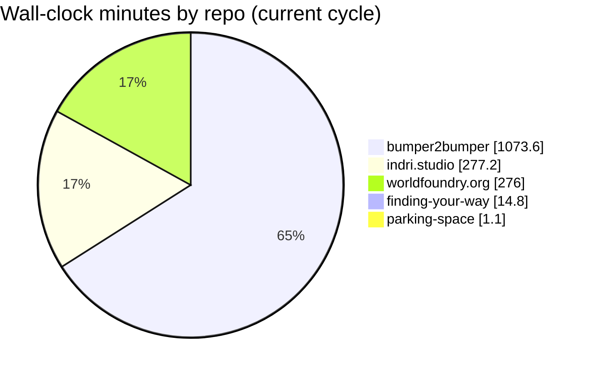
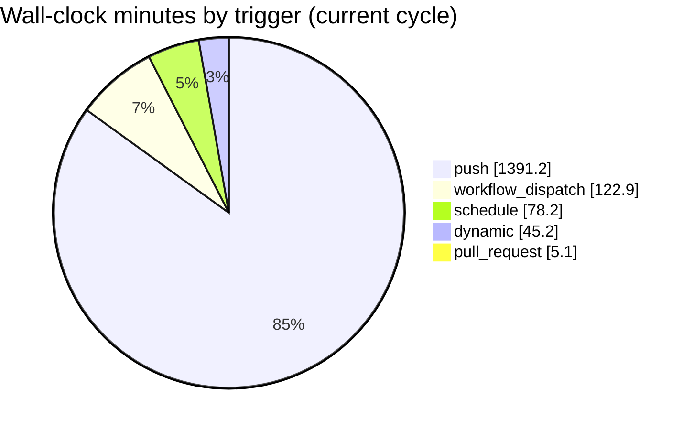
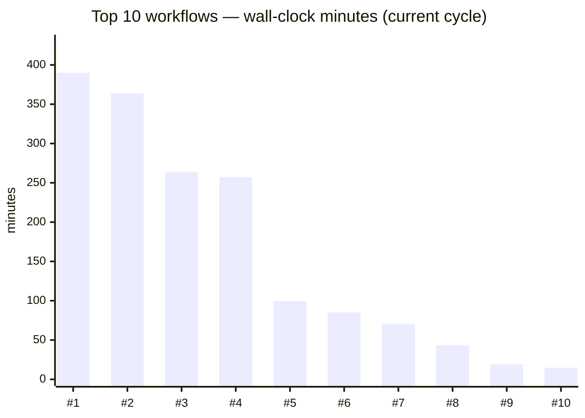

# GitHub Actions usage — wbniv

*Generated 2026-05-21T21:39:02Z · cycle 2026-05-01 → 2026-06-01 · 24 private repos · 22 workflows ran · 400 total runs*

Wall-clock minutes are summed from each run's `updated_at − run_started_at`.
This **undercounts** workflows with parallel/matrix jobs (each run is one wall-time figure regardless of job fan-out),
and ignores macOS/Windows runner multipliers (×10/×2). Public repos are excluded — they don't bill.

## Total

| Wall-clock minutes (cycle) | % of 2,000-min budget |
|---:|---:|
| **1642.6** | **82.1%** |

## Where the minutes go

| # | Workflow | Min |
|---:|---|---:|
| 1 | bumper2bumper/Frontend Release | 390.0 |
| 2 | bumper2bumper/MVP Release | 363.9 |
| 3 | indri.studio/Deploy | 263.6 |
| 4 | worldfoundry.org/Build, sign, and publish APT repo | 257.0 |
| 5 | bumper2bumper/Mobile CI | 99.5 |
| 6 | bumper2bumper/Lightsail rebake | 85.1 |
| 7 | bumper2bumper/Backend CI | 70.6 |
| 8 | bumper2bumper/docker_compose in /deploy-mvp - Update #1370240926 | 43.3 |
| 9 | worldfoundry.org/Deploy | 19.1 |
| 10 | finding-your-way/deploy | 14.8 |

```mermaid
xychart-beta
    title "Top 10 workflows — minutes by trigger (current cycle)"
    x-axis ["#1","#2","#3","#4","#5","#6","#7","#8","#9","#10"]
    y-axis "minutes" 0 --> 389
    bar [323.6,299.5,247.2,244.6,99.5,57.7,70.6,0.0,19.1,14.8]
    bar [40.0,32.2,0.0,0.0,0.0,0.9,0.0,0.0,0.0,0.0]
    bar [0.0,0.0,0.0,0.0,0.0,0.0,0.0,0.0,0.0,0.0]
    bar [26.4,32.2,16.4,12.4,0.0,26.5,0.0,0.0,0.0,0.0]
```

*Bar order: push · schedule · pull_request · workflow_dispatch.*

## Top 10 workflows by wall-clock minutes

| Repo | Workflow | Runs | Minutes | % of 2k | Failed min | Flags |
|---|---|---:|---:|---:|---:|---|
| wbniv/bumper2bumper | `Frontend Release` | 41 | 390.0 | 19.5% | 103.1 | cron='13 3 * * 1,4' |
| wbniv/bumper2bumper | `MVP Release` | 41 | 363.9 | 18.2% | 78.6 | push-no-paths,cron='13 3 * * 1,4' |
| wbniv/indri.studio | `Deploy` | 60 | 263.6 | 13.2% | 57.9 | push-no-paths |
| wbniv/worldfoundry.org | `Build, sign, and publish APT repo` | 40 | 257.0 | 12.8% | 16.5 | no-concurrency,push-no-paths |
| wbniv/bumper2bumper | `Mobile CI` | 34 | 99.5 | 5.0% | 5.8 | no-concurrency |
| wbniv/bumper2bumper | `Lightsail rebake` | 29 | 85.1 | 4.3% | 44.2 | cron='11 3 * * 0' |
| wbniv/bumper2bumper | `Backend CI` | 32 | 70.6 | 3.5% | 22.0 | no-concurrency |
| wbniv/bumper2bumper | `docker_compose in /deploy-mvp - Update #1370240926` | 36 | 43.3 | 2.2% | 20.6 | — |
| wbniv/worldfoundry.org | `Deploy` | 10 | 19.1 | 1.0% | 17.1 | push-no-paths |
| wbniv/finding-your-way | `deploy` | 3 | 14.8 | 0.7% | 14.8 | push-no-paths |

## Per-workflow trigger breakdown (top 10)

| Repo | Workflow | Trigger | Runs | Minutes |
|---|---|---|---:|---:|
| wbniv/bumper2bumper | `Frontend Release` | push | 34 | 323.6 |
| wbniv/bumper2bumper | `MVP Release` | push | 34 | 299.5 |
| wbniv/indri.studio | `Deploy` | push | 56 | 247.2 |
| wbniv/worldfoundry.org | `Build, sign, and publish APT repo` | push | 38 | 244.6 |
| wbniv/bumper2bumper | `Mobile CI` | push | 34 | 99.5 |
| wbniv/bumper2bumper | `Backend CI` | push | 32 | 70.6 |
| wbniv/bumper2bumper | `Lightsail rebake` | push | 23 | 57.7 |
| wbniv/bumper2bumper | `docker_compose in /deploy-mvp - Update #1370240926` | dynamic | 36 | 43.3 |
| wbniv/bumper2bumper | `Frontend Release` | schedule | 4 | 40.0 |
| wbniv/bumper2bumper | `MVP Release` | workflow_dispatch | 3 | 32.2 |
| wbniv/bumper2bumper | `MVP Release` | schedule | 4 | 32.2 |
| wbniv/bumper2bumper | `Lightsail rebake` | workflow_dispatch | 5 | 26.5 |
| wbniv/bumper2bumper | `Frontend Release` | workflow_dispatch | 3 | 26.4 |
| wbniv/worldfoundry.org | `Deploy` | push | 10 | 19.1 |
| wbniv/indri.studio | `Deploy` | workflow_dispatch | 4 | 16.4 |
| wbniv/finding-your-way | `deploy` | push | 3 | 14.8 |
| wbniv/worldfoundry.org | `Build, sign, and publish APT repo` | workflow_dispatch | 2 | 12.4 |
| wbniv/bumper2bumper | `Lightsail rebake` | schedule | 1 | 0.9 |

## Flagged for review

- ⚠ **wbniv/bumper2bumper** / `Frontend Release` — 26% failed-run time (103.1 min wasted, 11/41 runs)
- ⚠ **wbniv/bumper2bumper** / `MVP Release` — 22% failed-run time (78.6 min wasted, 8/41 runs)
- ⚠ **wbniv/indri.studio** / `Deploy` — 22% failed-run time (57.9 min wasted, 8/60 runs)
- ⚠ **wbniv/bumper2bumper** / `Lightsail rebake` — 52% failed-run time (44.2 min wasted, 19/29 runs)
- ⚠ **wbniv/bumper2bumper** / `Backend CI` — 31% failed-run time (22.0 min wasted, 12/32 runs)
- ⚠ **wbniv/bumper2bumper** / `docker_compose in /deploy-mvp - Update #1370240926` — 47% failed-run time (20.6 min wasted, 8/36 runs)
- ⚠ **wbniv/worldfoundry.org** / `Deploy` — 90% failed-run time (17.1 min wasted, 9/10 runs)
- ⚠ **wbniv/finding-your-way** / `deploy` — 100% failed-run time (14.8 min wasted, 3/3 runs)
- ⚠ **wbniv/indri.studio** / `Build, sign, and publish APT repo` — 26% failed-run time (3.5 min wasted, 1/4 runs)
- ⚠ **wbniv/bumper2bumper** / `Rotate Lightsail SSH key` — 82% failed-run time (2.3 min wasted, 1/2 runs)
- ⚠ **wbniv/bumper2bumper** / `Monthly restore drill` — 64% failed-run time (1.2 min wasted, 2/3 runs)
- ⚠ **wbniv/bumper2bumper** / `MVP Release` — push-no-paths,cron='13 3 * * 1,4'
- ⚠ **wbniv/indri.studio** / `Deploy` — push-no-paths
- ⚠ **wbniv/worldfoundry.org** / `Build, sign, and publish APT repo` — no-concurrency,push-no-paths
- ⚠ **wbniv/bumper2bumper** / `Mobile CI` — no-concurrency
- ⚠ **wbniv/bumper2bumper** / `Backend CI` — no-concurrency
- ⚠ **wbniv/worldfoundry.org** / `Deploy` — push-no-paths
- ⚠ **wbniv/finding-your-way** / `deploy` — push-no-paths

## Full workflow table

| Repo | Workflow | Runs | Minutes | Failed runs | Failed min | Flags |
|---|---|---:|---:|---:|---:|---|
| wbniv/bumper2bumper | `Frontend Release` | 41 | 390.0 | 11 | 103.1 | cron='13 3 * * 1,4' |
| wbniv/bumper2bumper | `MVP Release` | 41 | 363.9 | 8 | 78.6 | push-no-paths,cron='13 3 * * 1,4' |
| wbniv/indri.studio | `Deploy` | 60 | 263.6 | 8 | 57.9 | push-no-paths |
| wbniv/worldfoundry.org | `Build, sign, and publish APT repo` | 40 | 257.0 | 5 | 16.5 | no-concurrency,push-no-paths |
| wbniv/bumper2bumper | `Mobile CI` | 34 | 99.5 | 2 | 5.8 | no-concurrency |
| wbniv/bumper2bumper | `Lightsail rebake` | 29 | 85.1 | 19 | 44.2 | cron='11 3 * * 0' |
| wbniv/bumper2bumper | `Backend CI` | 32 | 70.6 | 12 | 22.0 | no-concurrency |
| wbniv/bumper2bumper | `docker_compose in /deploy-mvp - Update #1370240926` | 36 | 43.3 | 8 | 20.6 | — |
| wbniv/worldfoundry.org | `Deploy` | 10 | 19.1 | 9 | 17.1 | push-no-paths |
| wbniv/finding-your-way | `deploy` | 3 | 14.8 | 3 | 14.8 | push-no-paths |
| wbniv/indri.studio | `Build, sign, and publish APT repo` | 4 | 13.6 | 1 | 3.5 | no-concurrency,push-no-paths |
| wbniv/bumper2bumper | `Health check` | 39 | 6.2 | 2 | 0.4 | no-concurrency,cron='47 */8 * * *' |
| wbniv/bumper2bumper | `Infra Validate` | 15 | 5.1 | 0 | 0.0 | no-concurrency |
| wbniv/bumper2bumper | `Rotate Lightsail SSH key` | 2 | 2.9 | 1 | 2.3 | cron='0 6 1 */3 *' |
| wbniv/bumper2bumper | `Graph Update: pip in /tools/splitledger_tui #1357988654` | 1 | 1.9 | 0 | 0.0 | — |
| wbniv/bumper2bumper | `Monthly restore drill` | 3 | 1.8 | 2 | 1.2 | no-concurrency,cron='13 4 7 * *' |
| wbniv/bumper2bumper | `Rotate prod secrets` | 3 | 1.6 | 2 | 0.7 | cron='47 6 8 */3 *' |
| wbniv/bumper2bumper | `Rotate prod Resend API key` | 2 | 0.9 | 0 | 0.0 | cron='29 6 22 */3 *' |
| wbniv/bumper2bumper | `Rotate prod turnstile secret` | 1 | 0.7 | 0 | 0.0 | cron='19 6 15 */3 *' |
| wbniv/parking-space | `Shell Hygiene` | 2 | 0.6 | 2 | 0.6 | no-concurrency,push-no-paths |
| wbniv/parking-space | `Deploy` | 1 | 0.5 | 1 | 0.5 | — |
| wbniv/bumper2bumper | `Remind — rotate Google OAuth client secret` | 1 | 0.2 | 0 | 0.0 | no-concurrency,cron='23 6 24 */3 *' |

---

*Source data: `2026-05-22-gh-actions-usage.tsv` · regenerate with `gh-actions-usage.sh`*
