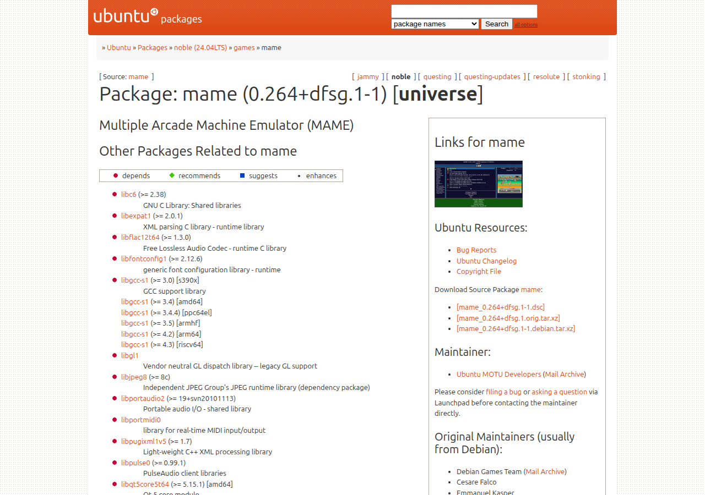
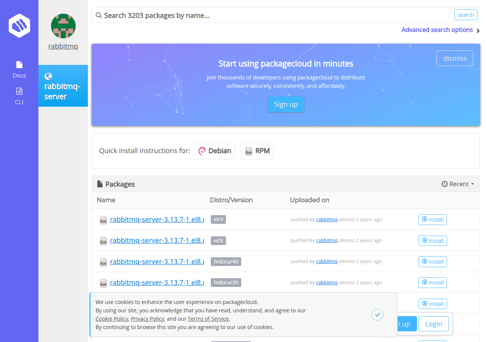
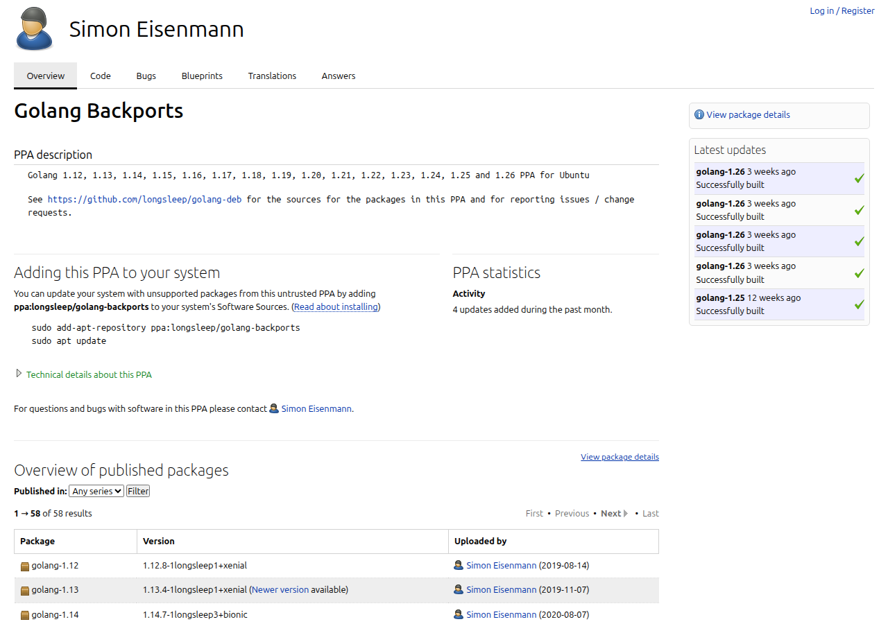
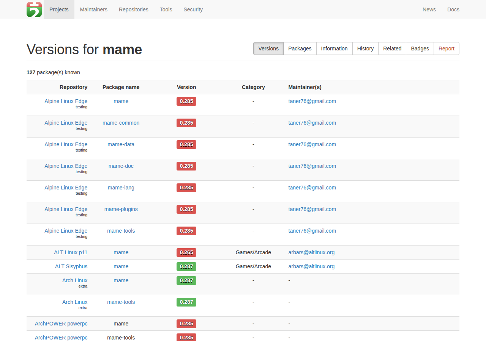
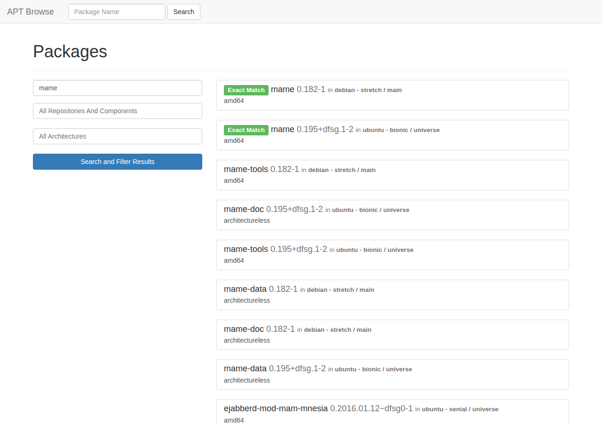

# APT Repository Listing Pages — Landscape Survey

*2026-05-28 | Motivation: assess the standard and enhanced options for human-readable APT repository index pages, as context for improving `foundry-apt/scripts/generate-index.sh`.*

---

## TL;DR

There is **no official spec** for a human-readable APT repository landing page. The Debian repository format specifies `Release`, `Packages`, `InRelease`, and pool structure — all machine-readable. What a browser sees at the repo root is entirely up to the maintainer. Most self-hosted repos show either a raw nginx auto-index or nothing at all. The handful of tools that generate HTML pages vary widely in scope: from simple static tables to full web apps with search and admin panels.

Our `generate-index.sh` is competitive with the best static generators and considerably more polished than most. The main gap is no per-package detail page and no search.

---

## 1. What the Debian Spec Defines

The [Debian Repository Format](https://wiki.debian.org/DebianRepository/Format) specifies only the machine-readable layer:

```
dists/{codename}/
  InRelease            # clearsigned Release (modern APT)
  Release              # unsigned metadata
  Release.gpg          # detached signature (legacy)
  {component}/
    binary-{arch}/
      Packages         # RFC 2822 stanza list, one per package
      Packages.gz / .bz2 / .xz
    source/
      Sources
    Contents-{arch}.gz # optional: path→package file map (used by apt-file)

pool/{component}/{letter}/{name}/
  {name}_{ver}_{arch}.deb
  {name}_{ver}.orig.tar.gz
  {name}_{ver}.dsc
```

**Nothing** in the spec governs what a browser sees at the root URL. That is entirely discretionary.

### Standard metadata fields (from `Packages`)

Package, Version, Architecture, Maintainer, Description, Depends, Recommends, Suggests, Conflicts, Provides, Installed-Size, Size, Filename, SHA256, Homepage.

---

## 2. Aptly — No HTML Generation

Aptly (our repo manager) does not generate any HTML pages. `aptly serve` exposes the standard repository tree over HTTP; `aptly publish` writes the dists/ and pool/ directories. A browser hitting the root sees whatever the web server provides — typically a plain nginx auto-index or 403.

Aptly does expose a **REST API** (port 8080) for machine queries. One third-party React UI wraps it:

- **aptly-web-ui** ([GitHub](https://github.com/sdumetz/aptly-web-ui)) — admin-focused dashboard, not a public package browser.

---

## 3. Static HTML Generators

### apt-html (Java/Maven)

[github.com/dernasherbrezon/apt-html](https://github.com/dernasherbrezon/apt-html)

CLI tool that fetches a live APT repo's `Packages` file and renders a static HTML page from a FreeMarker template. Can filter by architecture, component, codename, and package name.

**What it shows:** package name, version, architecture, short description, download link.  
**Gaps:** reads from a published repo (not source trees); Java dependency; template is not particularly polished.

### repogen (Go)

[github.com/pgaskin/repogen](https://github.com/pgaskin/repogen)

Full repo generator + `--generate-web` flag for an HTML browse page. Also generates Contents index for `apt-file` support. GPG signing built in.

**What it shows:** package listing with search.  
**Gaps:** less documentation; primarily a repo manager, web UI is secondary.

### Our generate-index.sh

Parses `packages/*/debian/control` and `debian/changelog` source trees (not the published `Packages` file). Emits a single-page HTML table: name (linked to Homepage), version (linked to .deb in pool), description. Mobile card layout via CSS grid at ≤639 px. Inherits Foundry CSS variables for on-brand styling.

**Advantages over the above:** no runtime dependency, no Java/Go toolchain, reads source of truth (not a round-trip through published repo), on-brand design.  
**Current gaps:** no per-package detail page, no search, no file size or dependency display, no changelog viewer.

---

## 4. Full Web Apps

These are heavier solutions aimed at repository *management*, not just presentation.

| Tool | Stack | Focus |
|---|---|---|
| [Eratosthenes](https://github.com/Vanilla-OS/Eratosthenes) | Python/Flask | Public package browser; indexes repo into DB; per-package detail with deps and install instructions |
| [ui-apt-mirror](https://github.com/Denrox/ui-apt-mirror) | Docker | Full local mirror + admin panel |
| [Arepa](https://github.com/operasoftware/arepa) | Perl | Repo admin: package approval, build status, GPG signing |
| [repomanager](https://github.com/lbr38/repomanager) | Web UI | Mirror manager for both DEB and RPM repos |
| [dpkg-www](https://github.com/guillemj/dpkg-www) | CGI/Perl | Browse packages on a *local* host; very old |

For a small purpose-built repo like ours (static R2 hosting, no server-side runtime), these are all overkill.

---

## 5. Reference Implementations: Official Package Search Sites

### packages.debian.org / packages.ubuntu.com

Dynamically generated (not static). The gold standard for per-package metadata:

- Full description
- All dependency types (Depends, Recommends, Suggests, Breaks, Conflicts, Replaces)
- Reverse dependencies
- Installed size + download size
- Maintainer
- Homepage
- Source package link
- Changelog
- File list (from Contents index)
- Available in all suites/releases

Both sites are backed by a live database populated from the published repos. Not self-hostable in a meaningful sense.

[packages.debian.org/sid/mame](https://packages.debian.org/sid/mame) *(screenshot needed — Cloudflare blocks headless browsers)*

[packages.ubuntu.com/noble/mame](https://packages.ubuntu.com/noble/mame)



### packagecloud.io

Commercial SaaS. Notable UX: per-repo public page at `packagecloud.io/{owner}/{repo}` with a package browser, install instructions per distro/version, and direct .deb download links. Clean and user-facing. Not open-source.

[packagecloud.io/rabbitmq/rabbitmq-server](https://packagecloud.io/rabbitmq/rabbitmq-server)



### Launchpad PPAs

`launchpad.net/~{user}/+archive/ubuntu/{ppa}` shows: package name, version, series, upload timestamp, build status, binary + source links. Tightly integrated with Ubuntu build farm.

[launchpad.net/~longsleep/+archive/ubuntu/golang-backports](https://launchpad.net/~longsleep/+archive/ubuntu/golang-backports)



---

## 6. What Good APT Listing Pages Show

Synthesising from the above, a well-featured package listing page provides:

**List view (table):**
- Package name (linked to detail page or upstream homepage)
- Version (linked to .deb download)
- Architecture
- Short description
- File size

**Detail page (per-package):**
- Full description
- Dependencies (Depends, Recommends, Suggests)
- Reverse dependencies
- Installed size vs download size
- Homepage
- Maintainer
- SHA256 checksum
- Changelog (version history)
- Files installed (from Contents index, if generated)

**Site-level:**
- Quick-install snippet (curl | gpg; apt-get install)
- GPG key download + fingerprint
- Install instructions per suite
- Link to source repo

---

## 7. Where generate-index.sh Stands

Our `foundry-apt` script covers the site-level elements well and the list-view basics. The `worldfoundry.org` sister repo's `generate-index.sh` is ahead on UX — it already has sortable columns and client-side filter/search, which `foundry-apt` still lacks.

| Feature | foundry-apt | worldfoundry.org | Reference |
|---|---|---|---|
| Package name + homepage link | ✓ | ✓ | ✓ |
| Version + .deb download link | ✓ | ✓ | ✓ |
| Architecture | ✓ | ✓ | ✓ |
| Short description | ✓ | ✓ | ✓ |
| Sortable columns | — | ✓ | ✓ (dynamic sites) |
| Client-side filter / search | — | ✓ | ✓ (dynamic sites) |
| File size | — | — | ✓ |
| Full description | — | — | ✓ |
| Dependencies | — | — | ✓ |
| Reverse dependencies | — | — | ✓ |
| SHA256 checksum | — | — | ✓ |
| Changelog | — | — | ✓ |
| Per-package detail page | — | — | ✓ |
| Quick-install snippet | ✓ | ✓ | varies |
| GPG key link | ✓ | ✓ | varies |
| Mobile layout | ✓ | ✓ | varies |
| On-brand CSS | ✓ | ✓ | — |

The sortable columns and filter/search from `worldfoundry.org` should be ported to `foundry-apt/scripts/generate-index.sh` and baked into the `new-web-apt-repo` skill template so all future repos start with them. File size, SHA256, and full description are available in the published `Packages` file (or `debian/control`). Per-package detail pages and changelog display require either a second generated HTML file per package or a client-side JS fetch from `Packages`.

---

## 8. Enhancement Options

These options are scoped to `apt.foundrylinux.org`'s `generate-index.sh` — the landing page at the apt repo itself. **Note:** `foundrylinux.org/packages` already realises Option D via the `scripts/build-packages-data.js` + `site/packages.jsx` Node/JSX pipeline. The question for the apt repo index is how far to go there independently.

### Option A — Richer table (low effort)

Extend `generate-index.sh` to also emit file size (from `dist/*.deb`) and full description (from `debian/control` Description extended lines) into the existing table, perhaps as a collapsed `<details>` element.

### Option B — Per-package detail pages (medium effort)

Generate one `public/{name}/index.html` per package with full metadata from `debian/control` + `debian/changelog`. Links from the main table. Still purely static; no runtime needed.

### Option C — Client-side UX additions (medium effort)

Port sortable columns + filter/search from `worldfoundry.org`'s `generate-index.sh`. Add copy-to-clipboard on the quick-install block. Publish `public/dists/resolute/main/binary-amd64/Packages` (already generated by aptly) and fetch it client-side for live filtering. No build-time changes needed beyond the JS additions.

### Option D — Full static-site generation (DONE for foundrylinux.org/packages)

The `scripts/build-packages-data.js` + `site/packages.jsx` pipeline already does this for `foundrylinux.org/packages`: multi-page, data-driven, Node-generated static site hosted on R2. The apt repo index (`apt.foundrylinux.org`) could in principle be folded into the same build — sharing data and templates — rather than maintaining a separate shell script. That would be the natural end-state if Options A-C prove insufficient.

---

## 9. Additional Improvement Patterns Seen in the Wild

Beyond the core metadata gaps, real-world enhanced APT pages layer on several additional categories:

### UX / table interaction

- **Sortable columns** — click "Version" or "Size" header to re-sort; pure JS, no server needed.
- **Sticky table header** — header row stays visible while scrolling a long package list.
- **Inline client-side filter** — live text box that filters rows as you type (no page reload). Particularly valuable once a repo exceeds ~20 packages.
- **Group by Section** — the `Section:` field in `debian/control` (e.g. `games`, `devel`, `libs`) can be used as a collapsible group header, mirroring how packages.debian.org organises its results.
- **Copy-to-clipboard buttons** — a small clipboard icon next to install commands; removes the need to carefully select a multi-line code block on mobile.

### Cross-distro version tracking

- **[Repology](https://repology.org/) badges** — Repology tracks the same upstream across every Linux distro and macOS. A small badge per package shows "latest upstream: 2.1.0 / our version: 2.1.0 ✓" or flags stale packages. Embeddable as a static `` pointing to `repology.org/badge/…`. This is the clearest signal that a vendored package is kept up to date.
- **shields.io version badge** — `img.shields.io/badge/version-1.2.3-blue` is simpler but static (requires regenerating the HTML on each release). Repology is authoritative.

[repology.org/project/mame/versions](https://repology.org/project/mame/versions)



### Build provenance and integrity

- **SHA256 checksum display** — show the hex digest next to the download link so users can verify without trusting the transfer. Already in the `Packages` file; trivially emittable.
- **Build status badge** — a GitHub Actions badge (`github.com/{org}/{repo}/actions/workflows/publish.yml/badge.svg`) gives visitors confidence the last publish succeeded.
- **GPG key fingerprint** — display the full fingerprint (not just a download link) so users can verify the key they imported matches what the maintainer published.

### Package content browsing

- **[apt-browse.org](https://www.apt-browse.org/) deep-link** — `apt-browse.org/browse/{codename}/{component}/{arch}/{name}/{ver}/` lists every file in the installed package. Link directly to it from the version cell; no self-hosting required.
- **File list inline** — generated from the aptly-produced `Contents-{arch}.gz`; a collapsed `<details>` element avoids cluttering the detail page.

[apt-browse.org](https://www.apt-browse.org/) *(indexes older releases only — stretch/bionic; newer releases not yet indexed)*



### Protocol / install integration

- **`apt://` links** — some desktop APT GUIs (GNOME Software, apturl) handle `apt://{package-name}` URIs, opening a GUI install dialog. A small "Install" button with `href="apt://foundry-retro-tools"` works silently on desktops that have apturl; degrades to nothing on those that don't. Low effort, niche payoff.
- **One-liner in-page generator** — a small JS widget where the user picks their Ubuntu release from a dropdown and the `sources.list` snippet updates in real time. Useful if the repo ever supports multiple codenames.

### Machine-readable supplements

- **JSON index** — generate a `public/packages.json` alongside `index.html` with the same data in structured form. Lets downstream tools (Repology ingestors, documentation sites, badge services) consume the repo listing without parsing HTML.
- **OpenGraph meta tags** — `<meta property="og:title">`, `<meta property="og:description">` on per-package detail pages so link previews on Mastodon/Discord show the package name and description rather than the domain.
- **`<link rel="alternate" type="application/rss+xml">` feed** — an RSS/Atom feed of new package releases. Low maintenance cost (generate alongside the HTML); provides a subscription mechanism for users tracking the repo.

### Security / vulnerability layer

- **CVE status column** — link each package to its [Debian Security Tracker](https://security.debian.org/tracker/) page or [Ubuntu CVE Tracker](https://ubuntu.com/security/cves?package={name}) entry. Passive link; no maintenance unless there is an actual CVE.
- **"No known CVEs" badge** (if true) — a positive signal for security-conscious users, sourced from the same trackers.

### Visual / presentation

- **Changelog popover on hover** — a `<details>` or CSS `::before` tooltip that shows the latest changelog entry without leaving the listing page. The `debian/changelog` first stanza is always short.
- **Version timeline** — a small sparkline or text list of past versions (from git tags or the full changelog) shows the package is actively maintained.
- **Metapackage expansion** — for umbrella packages like `foundry-retro-tools`, show the resolved dependency list inline so users know what they're getting before running `apt install`.

### Summary table

| Category | Feature | foundry-apt | worldfoundry.org | Status |
|---|---|---|---|---|
| UX | Sortable columns | — | ✓ | planned — port from worldfoundry.org |
| UX | Client-side filter/search | — | ✓ | planned — port from worldfoundry.org |
| UX | Sticky table header | — | — | — |
| UX | Group by Section | — | — | — |
| UX | Copy-to-clipboard | — | — | planned |
| Cross-distro | Repology badges | — | — | planned |
| Cross-distro | shields.io badge | — | — | — |
| Provenance | SHA256 inline | — | — | — |
| Provenance | Build status badge | — | — | — |
| Provenance | GPG fingerprint display | — | — | — |
| Content | apt-browse.org deep-link | — | — | — |
| Content | File list inline | — | — | — |
| Install | `apt://` links | — | — | — |
| Install | Release-picker widget | — | — | — |
| Machine-readable | JSON index | — | — | planned |
| Machine-readable | OpenGraph meta tags | — | — | planned |
| Machine-readable | RSS feed | — | — | planned |
| Security | CVE tracker link (passive) | — | — | planned |
| Security | CVE live-count badge | — | — | deferred (after passive ships) |
| Visual | Changelog popover on hover | — | — | planned |
| Visual | Metapackage dep expansion | — | — | planned |
| Visual | Version timeline | — | — | — |
| Skill | new-web-apt-repo template update | — | — | planned |

---

## Sources

- [Debian Repository Format](https://wiki.debian.org/DebianRepository/Format)
- [APT repository internals — Packagecloud Blog](https://blog.packagecloud.io/apt-repository-internals/)
- [aptly documentation](https://www.aptly.info/doc/)
- [apt-html](https://github.com/dernasherbrezon/apt-html)
- [repogen](https://github.com/pgaskin/repogen)
- [Eratosthenes (Vanilla OS)](https://github.com/Vanilla-OS/Eratosthenes)
- [aptly-web-ui](https://github.com/sdumetz/aptly-web-ui)
- [dpkg-www](https://github.com/guillemj/dpkg-www)
- [packages.debian.org](https://packages.debian.org/)
- [packages.ubuntu.com](https://packages.ubuntu.com/)
- [Launchpad PPA docs](https://documentation.ubuntu.com/launchpad/user/reference/packaging/ppas/ppa/)
- [apt-browse.org](https://www.apt-browse.org/)
