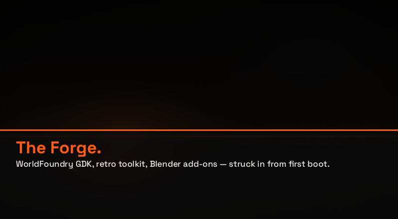
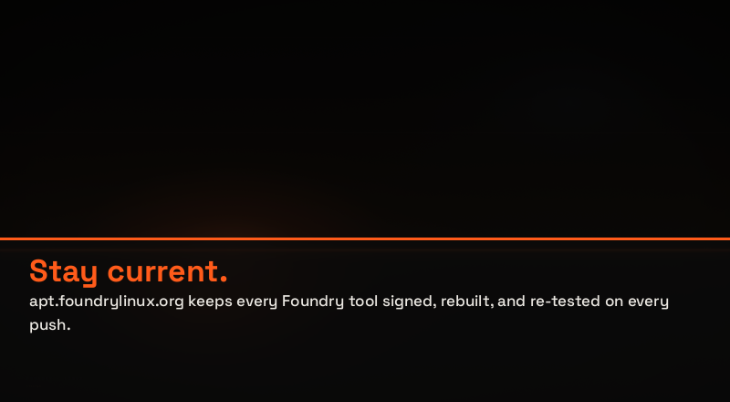
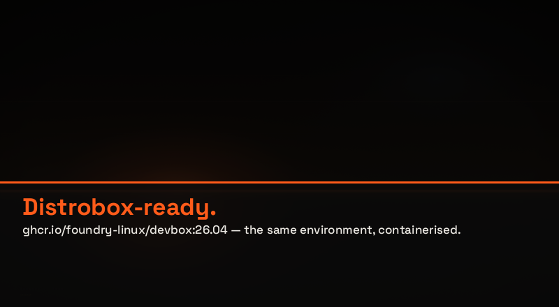
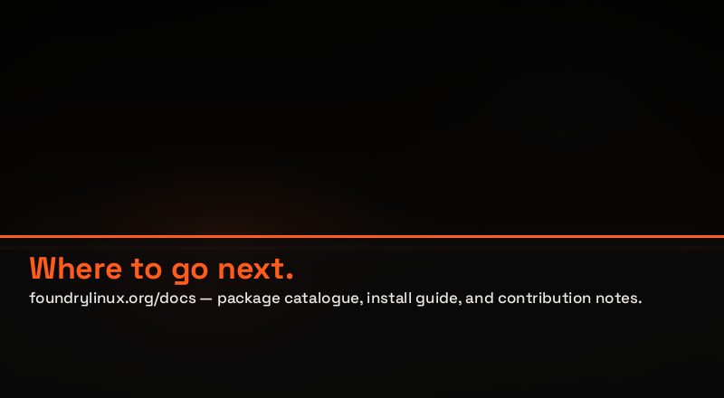

# Foundry Linux installer & boot resources

**Date**: 2026-06-10
**Packages**: `calamares-settings-foundry-linux` (installer-only, purged on install) and
`foundry-kde-theme` (survives install — owns the assets the *installed* system renders).

A visual + config reference for every resource that brands the Foundry boot and install
experience: the GRUB menu, the Plymouth splash, the Calamares installer (logo, banner, carousel),
the live install wallpaper, and the SDDM login greeter.

> Images below are copies captured 2026-06-10 (in `screenshots/`). The live files are under each
> package's `data/` dir; regenerate the copies if the assets change.

---

## Palette

Every resource draws from the same Foundry tokens — near-black surfaces, warm-white text, the
orange forge accent:

| Swatch | Hex | RGB | Role |
|--------|-----|-----|------|
| <span style="display:inline-block;width:12px;height:12px;background:#0a0a0a;border-radius:2px;vertical-align:middle;border:1px solid #333"></span> | `#0a0a0a` | 10, 10, 10 | Surface / window & sidebar background, GRUB desktop-color |
| <span style="display:inline-block;width:12px;height:12px;background:#0e0e0e;border-radius:2px;vertical-align:middle;border:1px solid #333"></span> | `#0e0e0e` | 14, 14, 14 | Carousel letterbox backdrop |
| <span style="display:inline-block;width:12px;height:12px;background:#f7f7f7;border-radius:2px;vertical-align:middle;border:1px solid #333"></span> | `#f7f7f7` | 247, 247, 247 | Primary text, GRUB title |
| <span style="display:inline-block;width:12px;height:12px;background:#ebe8e2;border-radius:2px;vertical-align:middle;border:1px solid #333"></span> | `#ebe8e2` | 235, 232, 226 | GRUB menu item text |
| <span style="display:inline-block;width:12px;height:12px;background:#ff5b1a;border-radius:2px;vertical-align:middle"></span> | `#ff5b1a` | 255, 91, 26 | Accent — sidebar highlight, GRUB label/message, slide headings |
| <span style="display:inline-block;width:12px;height:12px;background:#ffffff;border-radius:2px;vertical-align:middle;border:1px solid #333"></span> | `#ffffff` | 255, 255, 255 | GRUB selected-item text |

---

## Where they live

| Resource | Source (`data/…`) | Installed path | Package | Survives install? |
|----------|-------------------|----------------|---------|-------------------|
| GRUB theme | `config/grub/` | `/usr/share/grub/themes/foundry-linux/` | calamares-settings | live/ISO only |
| Plymouth splash | `config/plymouth/` | `/usr/share/plymouth/themes/foundry-linux/` | calamares-settings | live/ISO only |
| Calamares branding | `branding/foundry-linux/` | `/usr/share/calamares/branding/foundry-linux/` | calamares-settings | installer-only (purged) |
| Install wallpaper | `config/foundry-linux-wallpaper.png` | `/usr/share/backgrounds/` | calamares-settings | installer-only (purged) |
| SDDM greeter theme | `data/sddm-theme/` | `/usr/share/sddm/themes/foundry-linux/` | **foundry-kde-theme** | **yes** |
| Desktop wallpaper | `data/wallpapers/…` | `/usr/share/wallpapers/FoundryLinux-ForgeHorizon/` | **foundry-kde-theme** | **yes** |
| User avatar | `data/avatar.png` | `/usr/share/foundry-linux/avatar.png` → `/etc/skel/.face` | **foundry-kde-theme** | **yes** |

> Anything the *installed* system renders (login greeter, desktop wallpaper, avatar) must ship
> from `foundry-kde-theme`, never `calamares-settings` — the latter `Depends: calamares` and is
> purged from the target. See the wallpaper/SDDM-theme investigations.

---

## Boot — GRUB theme


`theme.txt` — desktop-color <span style="display:inline-block;width:12px;height:12px;background:#0a0a0a;border-radius:2px;vertical-align:middle;border:1px solid #333"></span> `#0a0a0a`, title <span style="display:inline-block;width:12px;height:12px;background:#f7f7f7;border-radius:2px;vertical-align:middle;border:1px solid #333"></span> `#f7f7f7`, accent <span style="display:inline-block;width:12px;height:12px;background:#ff5b1a;border-radius:2px;vertical-align:middle"></span> `#ff5b1a`, with a centred "FOUNDRY LINUX 26.04 LTS" label:

```ini
desktop-image: "background.png"
desktop-color: "#0a0a0a"
title-color:   "#f7f7f7"
message-color: "#ff5b1a"

+ boot_menu {
  left = 10%   top = 22%   width = 80%   height = 55%
  item_color          = "#ebe8e2"
  selected_item_color = "#ffffff"
  item_height = 34   item_padding = 12   item_spacing = 4
  scrollbar = false
}

+ label {
  top = 83%   left = 50%-140   width = 280   align = "center"
  text  = "FOUNDRY LINUX 26.04 LTS"
  color = "#ff5b1a"
  font  = "sans Regular 13"
}
```

---

## Boot — Plymouth splash


Logo overlaid on the splash (the anvil mark, 256×256):


`foundry-linux.plymouth` is a `script`-module theme; `foundry-linux.script` registers a
`Plymouth.SetMessageFunction` callback so shutdown messages ("remove the media and press
enter…") are actually drawn (see the Plymouth-messages fix in the installer-polish plan).

```ini
[Plymouth Theme]
Name=Foundry Linux
ModuleName=script

[script]
ImageDir=/usr/share/plymouth/themes/foundry-linux
ScriptFile=/usr/share/plymouth/themes/foundry-linux/foundry-linux.script
```

---

## Install — Calamares branding

### `branding.desc` — the descriptor

Window geometry, product strings/URLs, image bindings, the sidebar palette, and the slideshow
entrypoint:

```yaml
componentName: foundry-linux
windowSize:    1100px,680px
windowPlacement: center
sidebar:    widget
navigation: widget

strings:
    productName: "Foundry Linux"
    version:     "26.04"
    versionedName: "Foundry Linux 26.04"
    productUrl:  "https://foundrylinux.org/"
    supportUrl:  "https://foundrylinux.org/docs"

images:
    productLogo:    "logo.png"
    productIcon:    "logo.png"
    productWelcome: "banner.png"

style:
    SidebarBackground:        "#0a0a0a"
    SidebarText:              "#f7f7f7"
    SidebarTextCurrent:       "#0a0a0a"
    SidebarBackgroundCurrent: "#ff5b1a"

slideshow:    "slideshow.qml"
slideshowAPI: 2
```

Sidebar palette: background <span style="display:inline-block;width:12px;height:12px;background:#0a0a0a;border-radius:2px;vertical-align:middle;border:1px solid #333"></span> `#0a0a0a`, text <span style="display:inline-block;width:12px;height:12px;background:#f7f7f7;border-radius:2px;vertical-align:middle;border:1px solid #333"></span> `#f7f7f7`, and the current step highlighted with the accent <span style="display:inline-block;width:12px;height:12px;background:#ff5b1a;border-radius:2px;vertical-align:middle"></span> `#ff5b1a` (text flipping to <span style="display:inline-block;width:12px;height:12px;background:#0a0a0a;border-radius:2px;vertical-align:middle;border:1px solid #333"></span> `#0a0a0a` on that step).

### `logo.png` — 256×256 (`productLogo` / `productIcon`)


The Foundry anvil on a circular near-black field with orange sparks. **Same mark as the user
avatar** (`foundry-kde-theme`) and the app-menu/installer icon — one logo everywhere.

### `banner.png` — 2400×600 (4:1, `productWelcome`)


The Welcome-page header: the metallic **"FOUNDRY [anvil] LINUX"** horizontal wordmark — chrome /
brushed-silver lettering on black with the anvil set between the two words, fitted to the slot's
4:1 aspect. (Replaced the older flat-text banner that carried the orange rule and "26.04 LTS ·
ANVIL" subtitle.)

### The carousel — `slideshow.qml` + 4 slides

Shown in the installer's right pane while packages unpack: **4 slides, 20 s each**, each a
self-contained **800×440** PNG with its heading + body typeset into the artwork.

#### 1 · The Forge — `slide-01-forge.png`


> **The Forge** — WorldFoundry GDK, retro toolkit, Blender add-ons, emulators — struck in from
> first boot.

#### 2 · Stay current. — `slide-02-apt.png`


> **Stay current.** — apt.foundrylinux.org keeps every Foundry tool signed, rebuilt, and
> re-tested on every push.

#### 3 · Distrobox-ready. — `slide-03-devbox.png`


> **Distrobox-ready.** — ghcr.io/foundry-linux/devbox:26.04 — the same environment, containerised.

#### 4 · Where to go next. — `slide-04-docs.png`


> **Where to go next.** — foundrylinux.org/docs — package catalogue, install guide, and
> contribution notes.

The QML driver — a `Timer` advances a non-interactive `ListView`; each delegate is the slide PNG
shown with `Image.PreserveAspectFit` over a <span style="display:inline-block;width:12px;height:12px;background:#0e0e0e;border-radius:2px;vertical-align:middle;border:1px solid #333"></span> `#0e0e0e` backdrop:

```qml
import QtQuick 2.15
Item {
    id: root
    anchors.fill: parent
    Rectangle { anchors.fill: parent; color: "#0e0e0e" }   // letterbox backdrop

    Timer { interval: 20000; running: true; repeat: true
            onTriggered: view.currentIndex = (view.currentIndex + 1) % view.count }

    ListView {
        id: view
        anchors.fill: parent
        orientation: ListView.Horizontal
        snapMode: ListView.SnapOneItem
        interactive: false
        clip: true
        model: ListModel {
            ListElement { src: "slide-01-forge.png" }
            ListElement { src: "slide-02-apt.png" }
            ListElement { src: "slide-03-devbox.png" }
            ListElement { src: "slide-04-docs.png" }
        }
        delegate: Item {
            width: view.width; height: view.height
            Image { anchors.fill: parent; source: model.src
                    fillMode: Image.PreserveAspectFit; asynchronous: true }
        }
    }
}
```

**Why the text is baked in (take-6):** the model is `src`-only — the heading/body are part of each
PNG. The old left-edge clipping ("Where"→"Vhere") was the *PNG* being cropped by
`Image.PreserveAspectCrop` (the pane is taller than the slides' 1.818:1, so Crop scaled-to-fill and
ate ~77 px off each side). Five "text-margin" patches chased a redundant QML caption before take-6
switched to `PreserveAspectFit` and removed it. Full write-up in the
[installer-polish plan](../plans/2026-06-09-foundry-welcome-and-installer-polish.md) and the
[howto pitfalls](../../foundry-iso/docs/howto-kubuntu-remix.md).

### `foundry-linux-wallpaper.png` — 1999×1124 (live desktop during install)


The live-session desktop wallpaper visible behind the installer (`/usr/share/backgrounds/`).
Installer-only — the *installed* desktop uses `FoundryLinux-ForgeHorizon` from foundry-kde-theme.

---

## Login — SDDM greeter


The login screen background. **Ships from `foundry-kde-theme`** (`data/sddm-theme/` →
`/usr/share/sddm/themes/foundry-linux/`) so it survives the install — `calamares-settings` is
purged. `Main.qml` references `Qt.resolvedUrl("background.png")` (relative); `[Theme] Current=foundry-linux`
is set in `/etc/sddm.conf.d/30-foundry-live.conf` and resolves on the installed system.

---

## Calamares module sequence (`settings.conf`)

```yaml
sequence:
  - show: [ welcome, locale, keyboard, partition, users, summary ]
  - exec: [ partition, mount, unpackfsc, machineid, fstab, locale, keyboard,
            localecfg, shellprocess, users, displaymanager, networkcfg, hwclock,
            services-systemd, grubcfg, packages, bootloader, removeuser, umount ]
  - show: [ finished ]
```

Module configs (`data/modules/`):

| Module | Role / notable Foundry setting |
|--------|-------------------------------|
| `partition.conf` | ext4; `userSwapChoices: [none]` (no swap chooser); `partitionLayout` with mandatory `name` |
| `unpackfsc.conf` | unsquashfs extract (`destination: "/"`, flat format) — fixed the rsync-error-11 / empty-target bugs |
| `mount.conf` | bind-mount options as YAML arrays; `efi: true` |
| `displaymanager.conf` | `sddm` + `startplasma-wayland` / `plasma` |
| `packages.conf` | `remove: [ calamares, live-boot, live-config, … ]` on the target (why calamares-settings is purged) |
| `shellprocess.conf` | removes the live installer icon from the target before `users` runs |
| `grubcfg.conf` / `bootloader.conf` | grub-efi config; `efiBootLoader=grub` |

---

## Conventions

- **Slides**: 800×440 (1.818:1) on a near-black field — keep new slides at that size so the
  carousel's `PreserveAspectFit` letterbox stays invisible.
- **Logo**: 256×256 square (anvil). **Banner**: 2400×600 (4:1) metallic wordmark.
  **Backgrounds** (GRUB, Plymouth, wallpapers): 1920×1080+.
- **Colors**: accent <span style="display:inline-block;width:12px;height:12px;background:#ff5b1a;border-radius:2px;vertical-align:middle"></span> `#ff5b1a`, surfaces <span style="display:inline-block;width:12px;height:12px;background:#0a0a0a;border-radius:2px;vertical-align:middle;border:1px solid #333"></span> `#0a0a0a`–<span style="display:inline-block;width:12px;height:12px;background:#0e0e0e;border-radius:2px;vertical-align:middle;border:1px solid #333"></span> `#0e0e0e`, text <span style="display:inline-block;width:12px;height:12px;background:#f7f7f7;border-radius:2px;vertical-align:middle;border:1px solid #333"></span> `#f7f7f7`.
