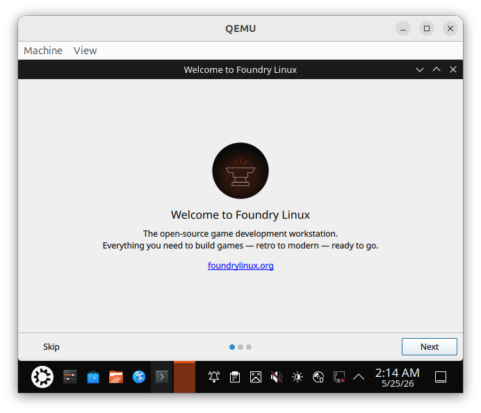
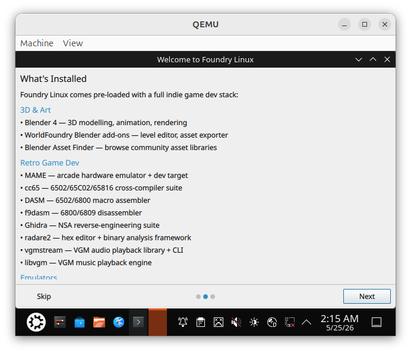
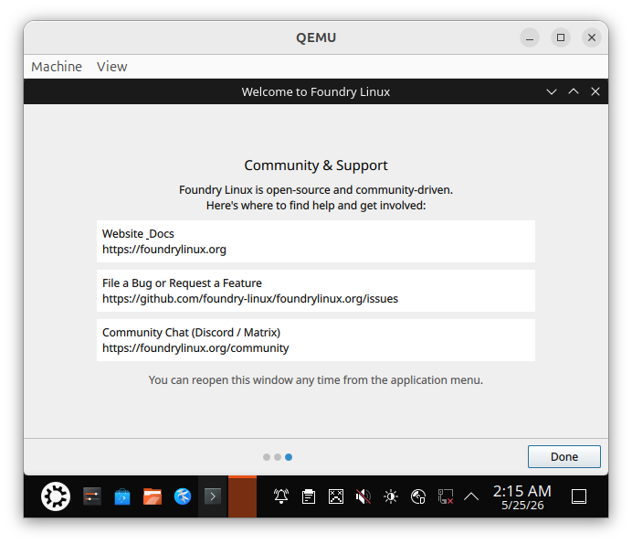

# foundry-welcome — Implementation (2026-05-25)

Executing the plan written 2026-05-24: see [`2026-05-24-foundry-welcome.md`](2026-05-24-foundry-welcome.md) for the full design.

## Scope this session

1. Create `foundry-apt/packages/foundry-welcome/` — CMakeLists.txt, C++ launcher, QML pages, debian/ tree
2. Update `foundry-apt/.github/workflows/publish.yml` — add cmake + Qt6 build deps to Docker step
3. Update `foundry-iso/config/hooks/1100-live-autologin.hook.chroot` — mask plasma-welcome, remove Kubuntu extra-page
4. Add TODO entry under Phase 3
5. Build and smoke-test in Docker

## Key decisions vs the plan

- Using `QUrl::fromLocalFile` (filesystem) for QML, not Qt resources — easier to iterate
- `FOUNDRY_WELCOME_QML_DIR` env var as dev override so QML is testable without installing
- C++ sentinel logic in `main.cpp`; Qt.quit() in QML triggers it via `engine.quit` signal
- Architecture: `amd64` (ISO-only target for now)

## Verification

Steps from the 2026-05-24 plan, executed here:

1. Build in Docker
2. Install smoke test (foundry-welcome opens, 3 pages, nav works)
3. Sentinel check (second run exits immediately)
4. QEMU ISO test — **PASS** (2026-05-25, QEMU boot)

   Page 1 — Welcome logo:

   

   Page 2 — What's Installed (3D & Art + Retro Game Dev sections visible, scrollable):

   

   Page 3 — Community & Support (Done button closes dialog):

   

5. Re-login test (deferred)
