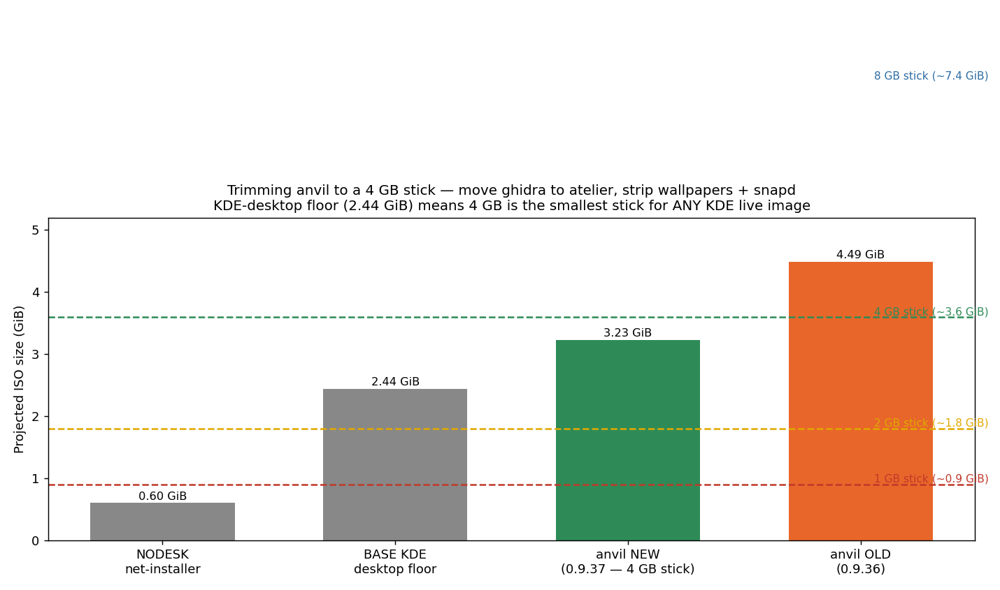
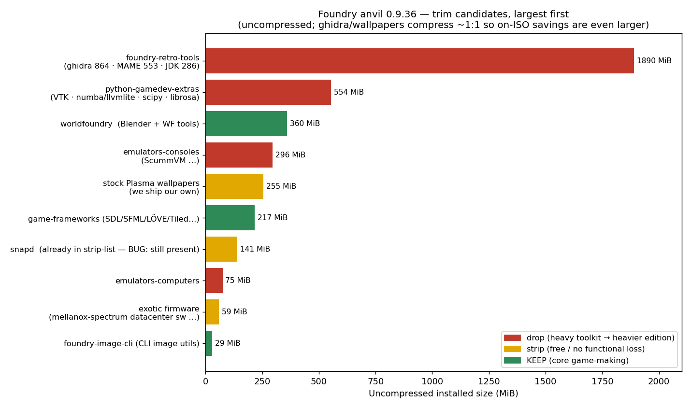

# Plan: USB-stick-sized ISO editions (4 GB SLIM; 2 GB / 1 GB = installer media)

**Date:** 2026-06-04  
**Status:** CLOSED — 0.9.53 at **3.837 GiB**; all planned cuts made; 4 GB stick target not reached; **minimum stick is 8 GB**

---

## Context

The [create-foundry-usb tool](2026-05-30-create-foundry-usb.md) lets a user write
a Foundry Linux USB stick in one click — but the current **anvil** ISO is
**4.8 GB (~4.47 GiB)**, so it only fits an **8 GB** stick. The question this plan
answers: *what can we **not** put on the image if the target stick is 4 GB or
less?* — and what's the cheapest coherent way to ship a smaller image.

All numbers below come from extracting the package DB straight out of the built
`foundry-anvil-0.9.36-amd64.iso` squashfs and computing each metapackage's
**exclusive dependency closure** (so shared packages aren't double-counted).
Reproducible backing scripts + the captured `dpkg-status` live in
[`docs/investigations/2026-06-04-usb-iso-sizing/`](../investigations/2026-06-04-usb-iso-sizing/).
Model validation: the FULL projection (4.49 GiB) matches the real ISO (4.53 GiB).

**Stick usable capacity** (nominal GB → GiB after FS overhead; `dd`/isoimagewriter
writes the whole image, so the ISO must fit): 1 GB ≈ 0.9 GiB · 2 GB ≈ 1.8 GiB ·
4 GB ≈ 3.6 GiB · 8 GB ≈ 7.4 GiB.

---

## Key finding: the KDE-desktop floor is ~2.44 GiB

A bare Kubuntu/Plasma live desktop is **~2.44 GiB ISO before a single Foundry
tool**. That single number drives everything:

| Scenario | Projected ISO | Actual ISO | Smallest stick |
|---|--:|--:|---|
| NODESK — no GUI, net-installer | ~0.60 GiB | — | **1 GB** |
| BASE — KDE desktop floor (zero Foundry tools) | ~2.44 GiB | — | 4 GB |
| MINI — KDE + Blender/WF only | ~2.75 GiB | — | 4 GB |
| **anvil 0.9.40** (ghidra→atelier, wallpapers stripped; snapd blocked) | ~3.23 GiB | **3.88 GiB** ⚠ | **8 GB** |
| **anvil 0.9.53** ✅ (+ opencv→atelier, snapd fixed, onnxruntime added) | **~3.68 GiB** | **3.837 GiB** | **8 GB** |
| anvil 0.9.36 (baseline) | ~4.49 GiB | ~4.53 GiB | 8 GB |

**Model error:** projection was 0.65 GiB optimistic for 0.9.40 and 0.15 GiB optimistic for 0.9.53. Cause: Ubuntu 26.04 package growth between the 0.9.36 squashfs model and actual builds — not from Foundry packages themselves. Model compression ratio (4.49/9.40 ≈ 48%) used for subsequent projections.

**4 GB stick verdict (2026-06-05):** The 3.726 GiB 4 GB stick limit is 111 MiB below the settled 0.9.53 size. All planned cuts were made and exhaustively investigated. Remaining large packages are all intentional: ibus-data (148 MiB, Asian IME), fonts-noto-cjk (91 MiB, CJK display), python3-llvmlite (107 MiB, Numba JIT in `foundry-python-gamedev`), libicu-dev (50 MiB, legitimate Allegro→GTK3-dev chain). Closing the gap requires removing intentional content (MAME, scummvm, or the Python game-dev stack). Decision: **keep all content, accept 8 GB as the minimum stick for anvil.**

**Consequence:** below ~2.4 GiB you stop trimming packages and start changing
what the image *is*.

- **4 GB stick** → feasible as a trimmed live desktop (SLIM, below).
- **2 GB stick (~1.8 GiB)** → **impossible with Plasma** (already 0.6 GiB under
  the floor). Only paths: a lightweight session (LXQt/Openbox — a different
  desktop) or a **live installer** image (boots Calamares, installs from network).
- **1 GB stick (~0.9 GiB)** → only a **no-GUI text/ncurses net-installer**
  (~0.60 GiB) fits; it installs the base then pulls `foundry-core` from apt.
  A separate product.

So 4 GB is the smallest stick that holds a real Foundry KDE desktop; 2 GB and
1 GB are *installer media*, not a live distro.

---

## The trim list (largest first)

Uncompressed MiB (ghidra jars / wallpapers compress ~1:1, so their **on-ISO**
savings are even larger than shown):

**DECISION (Will, 2026-06-04): keep the most — cut only ghidra.** Because ghidra
is the one near-incompressible giant (~0.8 GiB on the ISO), cutting *just it*
(plus its JDK and the two safe free strips) frees the needed ~0.9 GiB while
keeping MAME, every emulator, the sci-Python stack, Blender, and frameworks. The
Action column reflects that final call, not the largest-possible cut:

| # | Cluster | MiB | Final action |
|--:|---|--:|---|
| 1a | **ghidra** (within retro-tools; ~0.8 GiB ISO, jars) | 864 | ✅ **→ atelier** (`foundry-retro-tools` 1.0.7; hook 1010 autoremoves) |
| 1b | OpenJDK (ghidra's only consumer) | 286 | ✅ follows ghidra → atelier (autoremoved by hook 1010) |
| 1c | MAME + rest of `foundry-retro-tools` | ~553 | ✅ **KEEP** in anvil |
| 2a | **opencv + libvtk9.5** (split from -extras; libvtk9.5 alone ~276 MiB) | 318 | ✅ → **`foundry-cv`** (new, atelier-only); hook 1010 purges python3-opencv + autoremoves viz410+vtk chain. NOTE: libopencv-core/imgproc/videoio/imgcodecs stay — libopenimageio2.5 (Blender) + kde-spectacle need them. |
| 2b | `foundry-python-gamedev-extras` remainder (av · librosa · networkx · mss · fonttools…) | ~236 | ✅ **KEEP** in anvil; +`libonnxruntime-dev` (~20 MiB) added |
| 3 | `worldfoundry` (Blender + WF tools) | 360 | ✅ **KEEP** — the point of the distro |
| 4 | `foundry-emulators-consoles` (ScummVM…) | 296 | ✅ **KEEP** |
| 5 | stock Plasma **extra** wallpapers (`plasma-workspace-wallpapers`) | 217 | ✅ **stripped** — hook 0020 explicit `_purge` (`.chroot.purge` does not fire in live-build 3.0~a57) |
| 6 | `foundry-game-frameworks` (SDL/SFML/LÖVE/Tiled…) | 217 | ✅ **KEEP** |
| 7 | snapd | 141 | ✅ **hook 0025** downloads Mozilla firefox via `dpkg --force-downgrade` (bypasses gpgv, which cannot exec in the chroot environment); then `dpkg --purge snapd` (not apt-get purge — apt index still shows snap-transitional PreDepending snapd). Confirmed absent in 0.9.53. |
| 8 | `foundry-emulators-computers` | 75 | ✅ **KEEP** |
| 9 | exotic firmware (`linux-firmware-mellanox-spectrum`) | 59 | **NOT stripped** — hard Depends of the `linux-firmware` umbrella; apt purge cascades and can autoremove ALL firmware |
| 10 | `foundry-image-cli` (CLI image utils) | 29 | ✅ **KEEP** |
| — | `breeze-wallpaper` | 38 | **KEEP** — hard Depends of `breeze` (default Plasma style) |

---

## Qt WebEngine — investigated, **KEEP** (not a cut candidate)

Earlier guess was that QtWebEngine (~270 MiB) might be orphaned after the
plasma-welcome/PIM purge. **It is not.** Installed reverse-deps:

| Depends on QtWebEngine | What it is |
|---|---|
| **`plasma-nm`** | network / Wi-Fi system-tray applet — **essential** on live |
| **`khelpcenter`** | KDE Help Center |
| **`plasma-widgets-addons`** | stock Plasma applets |
| `kaccounts-providers`, `signon-ui-qt`, `qml6-module-qtwebview` | KDE online-accounts / web-view |

It is also a base Qt shared library other KDE components link against. Removing it
cascade-breaks the Wi-Fi applet. **Verdict: keep; do not strip.**

---

## Implemented: trim anvil itself, move ghidra → atelier

Not a new "slim" edition — **anvil itself is the trimmed image** (3.837 GiB settled,
8 GB stick), and ghidra moves up to the atelier "complete edition". Everything else
anvil shipped stays. The 4 GB stick target was not reached — see verdict in the
scenario table above.

**Metapackages** (apt.foundrylinux.org): ✅
- ~~`foundry-retro-tools` 1.0.6 → **1.0.7**~~: drop `ghidra` from `Depends` (+ its
  `Suggests: java-common`). Since retro-tools is pulled by `foundry-core`, this
  removes ghidra from core/anvil/sprite. MAME and the rest stay.
- ~~`foundry-atelier` 0.9.1 → **0.9.2**~~: add `ghidra` to `Depends` (its OpenJDK
  rides along). The complete edition still ships it.
- ~~`foundry-core` 1.0.2 → **1.0.3**~~: Description-only (ghidra now atelier).

**ISO build** (`foundry-iso/`): ✅
- ~~`strip.list.chroot.purge`: add `plasma-workspace-wallpapers`~~ — **NOTE:**
  `.chroot.purge` does NOT fire in live-build 3.0~a57. Entry is harmless but
  inert. Actual removal is hook 0020's `_purge plasma-workspace-wallpapers`
  (added 2026-06-04 session 2). ✅ removal confirmed in 0.9.38+ builds.
- ~~New hook **`1010-trim-atelier-only-pkgs.hook.chroot`**~~: runs after the
  local-debs install; `apt-mark auto ghidra openjdk-21-*` then
  `apt-get autoremove --purge`. Dependency-driven, so it removes ghidra+JDK from
  anvil/sprite (now orphaned by retro-tools 1.0.7) but leaves them on atelier
  (where `foundry-atelier` Depends ghidra). Never cascades. Gated off atelier as
  a belt-and-suspenders guard. This handles the transient pull from hook 0030
  (`apt install foundry-anvil` against the still-published 1.0.6) until the
  metapackage bump is published. ✅ confirmed in 0.9.37+ builds.
- snapd: hook `0025-mozilla-pin.hook.chroot` — **root cause of repeated failures
  (0.9.41–0.9.49) now understood:**
  - **gpgv not exec-able by chroot's apt during hook phase.** During
    `lb_chroot_install-packages`, live-build runs apt from the *host* container
    (working gpgv); during hooks, apt runs *inside* the chroot where `execvp("gpgv",...)`
    fails with "Could not execute 'gpgv'" for ALL repos. Root cause is not binary
    removal — `/usr/bin/gpgv --version` succeeds — but something about the chroot
    environment breaks apt's gpgv method exec path (likely Ubuntu 26.04 apt's
    Sequoia-backend falls back to gpgv in a broken way inside chroot).
  - **Effect:** apt marks every repo (including Mozilla's) unverified in the hook
    session → `apt-get install -t mozilla firefox` silently falls back to
    "already newest version (1:1snap1-0ubuntu8)".
  - **Fix (0.9.53):** Hook 0025 parses the cached Mozilla package index on disk,
    downloads the `.deb` with `curl`, installs with `dpkg --force-downgrade`. Then
    `dpkg --purge snapd` (not `apt-get purge` — apt's index still shows snap-transitional
    firefox PreDepending snapd even after dpkg has replaced it). ✅ Confirmed absent
    in 0.9.53.

**Round 2 metapackages** (post-0.9.40):
- `foundry-python-gamedev-extras` **1.0.0 → 1.0.1**: drop `python3-opencv`
  (now in `foundry-cv`); add `libonnxruntime-dev` (~20 MiB, ONNX inference engine).
- New metapackage **`foundry-cv` 1.0.0**: `python3-opencv`, `libopencv-dev`,
  `gstreamer1.0-opencv`, `tesseract-ocr`, `libvips-tools`. Atelier-only because
  `python3-opencv` → `libopencv-viz` → `libvtk9.5` (~276 MiB, the actual giant).
- `foundry-atelier` **0.9.2 → 0.9.3**: add `foundry-cv` to Depends.

**create-foundry-usb**: targets the anvil `-latest-` image directly. Minimum stick
is 8 GB.

2 GB / 1 GB images stay **out of scope** as *live* images (the KDE floor is
~2.44 GiB) — captured above as the "installer media" finding for a possible future
network-installer product.

---

## Spin-off findings

1. **snapd** — was shipping in 0.9.36 despite the strip-list (re-pulled as a
   Recommends). Now fixed by an apt pin (`no-snapd.pref`, priority −1) applied
   before package install. ~140 MiB freed across every edition.
2. **opencv → `foundry-cv` (atelier-only)** — `libvtk9.5` (~276 MiB) is the real
   giant, pulled transitively by `libopencv-viz`. Hook 1010 purges `python3-opencv`
   via `apt-get purge` (safe: apt uses dpkg status for reverse-dep checking), then
   autoremove sweeps out `libopencv-viz410` → `libvtk9.5` and the full HPC tail
   (OpenMPI, HDF5-OpenMPI, ADIOS2, AMD HIP/ROCm). **Important constraint:** the
   underlying `libopencv-core410 / imgproc410 / videoio410 / imgcodecs410` C++ libs
   stay on anvil — `libopenimageio2.5` (Blender), `kde-spectacle`, and
   `libkquickimageeditor1` all depend on them. The `foundry-cv` metapackage bundles
   the Python binding + `tesseract-ocr`, `libvips-tools`, `libopencv-dev` as a
   coherent CV toolkit for atelier. The remaining `-extras` (av, librosa, networkx,
   mss, fonttools, onnxruntime…) stays in anvil.
3. **onnxruntime added to anvil** — `libonnxruntime-dev` (~20 MiB) added to
   `foundry-python-gamedev-extras` for ONNX model inference in game-dev pipelines.
   Pairs with OpenCV's DNN module and the numba stack already in anvil.
4. **`breeze-wallpaper` (38 MiB) is stuck** — it is a hard `Depends` of `breeze`
   (the default Plasma style), so purging it cascades to removing `breeze` itself.
   To reclaim the 38 MiB: package a stub `foundry-breeze` that `Provides: breeze-wallpaper`
   and `Conflicts: breeze-wallpaper`, ships no images, and satisfies `breeze`'s dep.
   Not worth it at 38 MiB alone (would still leave anvil 73 MiB over the 4 GB limit),
   but it is the correct path if the stick target is ever reopened.

---

## Verification

1. ~~`task build` (foundry-apt) → `foundry-retro-tools` 1.0.7 `.deb` no longer
   `Depends: ghidra`; `foundry-atelier` 0.9.2 does.~~ ✅ (2026-06-04)
2. `EDITION=anvil task iso-build` → ISO **≤ 3.6 GiB** (target ~3.3). Confirm via
   `unsquashfs -cat … var/lib/dpkg/status`: **ghidra + openjdk-21-\* absent**;
   **MAME, ScummVM, Blender, SDL/SFML, VTK present**; **snapd absent**;
   `plasma-workspace-wallpapers` absent, our wallpaper present.

   **RESULT (0.9.40 build, 2026-06-04):** ISO = **3.88 GiB** — FAIL vs ≤ 3.6 GiB target.
   Breakdown: ghidra removal saved ~0.71 GiB (4.8→4.09), wallpapers saved ~0.21 GiB
   (4.09→3.88). Snapd still present (~0.10 GiB). 4 GB stick target not met.
   
   Package presence confirmed (hook 1010 output in build log):
   - ghidra: ABSENT ✅  openjdk-21-jre-headless: ABSENT ✅
   - mame: present ✅  scummvm: present ✅  blender: present ✅  libvtk9.5t64: present ✅
   - snapd: **PRESENT** ⚠  (PreDepends from firefox 1:1snap1-0ubuntu8 blocks removal)
   - plasma-workspace-wallpapers: ABSENT ✅  foundry-kde-theme wallpaper: present ✅

   **RESULT (0.9.44–0.9.49 builds):** ISO = **3.904 GiB** — FAIL.
   opencv→foundry-cv split added libonnxruntime-dev (+~10 MiB on ISO). Snapd still
   present (hook 0025 apt-get install silently failed — gpgv broken in chroot's apt).
   Hook 1010 did purge ghidra (`PASS: ghidra absent from anvil`). libvtk9.5 still
   present (python3-opencv still installed — needs investigation of reverse deps).

   **RESULT (0.9.53, 2026-06-05):** ISO = **3.837 GiB** — all cuts confirmed.
   Hook 1010 PASS output:
   - ghidra: ABSENT ✅  openjdk-21-*: ABSENT ✅
   - python3-opencv: ABSENT ✅  libvtk9.5t64: ABSENT ✅
   - libopencv-viz410: ABSENT ✅ (autoremoved after python3-opencv purge)
   - snapd: ABSENT ✅  (dpkg --purge in hook 0025)
   - plasma-workspace-wallpapers: ABSENT ✅
   - mame: present ✅  scummvm: present ✅  blender: present ✅
   - libopencv-core410/imgproc410/videoio410/imgcodecs410: present ✅ (needed by Blender/KDE)

   4 GB stick target (≤ 3.726 GiB): **FAIL by 111 MiB**. No non-intentional packages
   remain to cut — see verdict in scenario table. Settled size is 3.837 GiB on 8 GB stick.

3. `EDITION=atelier task iso-build` (or metapackage resolve) → ghidra present.
4. Boot anvil in QEMU: KDE desktop + Wi-Fi applet work (QtWebEngine retained),
   foundry-welcome appears.
5. Regenerate `foundry-iso/docs/howto-kubuntu-remix-installed-packages.md` against
   the new anvil as the committed size source-of-truth.
6. Write the anvil ISO to a real 8 GB stick via isoimagewriter; boot end-to-end.
