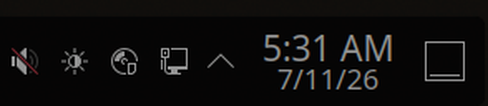
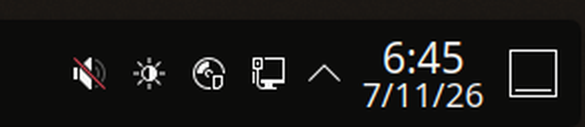
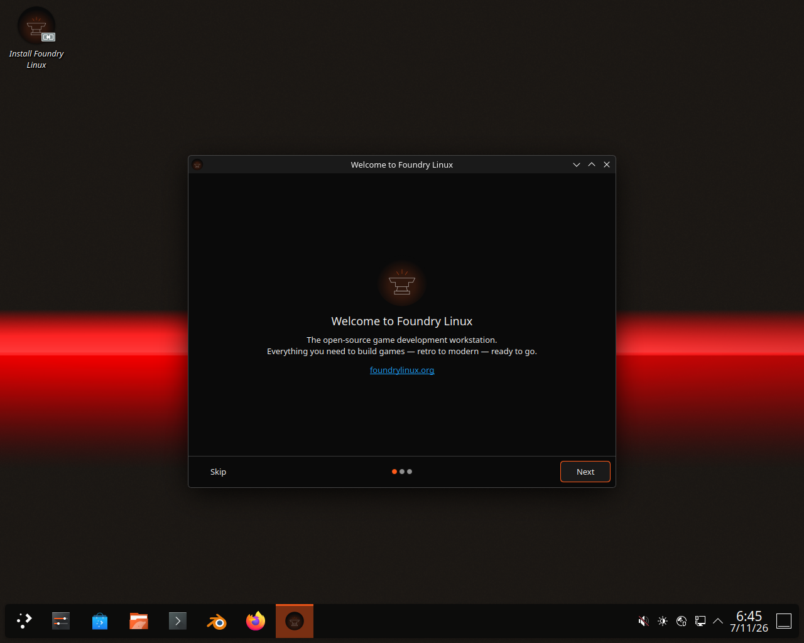

# Default the Foundry Linux desktop clock to a 24-hour clock

**Date:** 2026-07-10 (corrected 2026-07-11 after VM test)
**Status:** Done — verified 24-hour on a headless ISO boot (foundry-anvil 0.9.124)

## Context

Foundry Linux's KDE digital clock had **no** 12h/24h format set anywhere, so it
fell through to "follow locale". Since no `LC_TIME`/`LANG` is configured anywhere
in the repo either, the base system locale (typically `en_US`) won and the panel
clock showed a 12-hour time. We want a 24-hour clock to be the shipped default.

The clock is provisioned declaratively at first login by the Foundry
Look-and-Feel desktop-layout script, so the fix is a single `writeConfig` line
where the clock applet is already configured — no autostart/D-Bus dance needed
(unlike the sibling touchpad natural-scroll change, which had to be per-device).

## Approach

The digital clock is built in the first-login desktop-layout script alongside its
`showDate` config. The Plasma digital clock exposes `use24hFormat` in its
`[Appearance]` config group.

> **Enum gotcha (caught by the VM test).** Plasma 6 **reordered** this enum
> versus Plasma 5. The authoritative values, from KDE's own
> `applets/digital-clock/configAppearance.qml` / `main.xml`:
>
> - `0` → 12-hour
> - `1` → **use region defaults** (the applet default; en_US → 12-hour)
> - `2` → 24-hour ← **what we want**
>
> The common `use24hFormat = 1` snippet is a Plasma 5-ism (there `1` meant 24h).
> Shipping `1` on Plasma 6 left the clock at region default = `5:31 AM`. The fix
> is **`use24hFormat = 2`**.

Setting `use24hFormat = 2` forces the 24-hour clock regardless of locale.

## Changes

**`foundry-apt/packages/foundry-kde-theme/data/look-and-feel/org.foundrylinux.foundry-linux/contents/layouts/org.kde.plasma.desktop-layout.js`**

Add one line in the existing clock block:

```js
const clock = panel.addWidget("org.kde.plasma.digitalclock");
clock.currentConfigGroup = ["Appearance"];
clock.writeConfig("showDate", "true");
clock.writeConfig("use24hFormat", 2);   // Plasma 6 enum: 0=12h, 1=region default, 2=24h
```

(`showDate` already defaults to `true`, so that line is redundant but harmless.)

**`foundry-apt/packages/foundry-kde-theme/debian/changelog`** — the change shipped
across two stanzas: `1.0.7` (initial, with the wrong `use24hFormat=1`) and `1.0.8`
(the `=2` correction after the VM test).

## Verification

1. `cd foundry-apt && task build` — confirm the `foundry-kde-theme` `.deb` builds
   and the `1.0.7` changelog version is picked up.
2. Confirm the layout script ships to
   `usr/share/plasma/look-and-feel/org.foundrylinux.foundry-linux/contents/layouts/`:
   `dpkg-deb -c dist/foundry-kde-theme_1.0.7_*.deb | grep layout.js`.
3. Real desktop check (needs a KDE VM/ISO): on a **fresh user's first login** the
   layout script runs once — confirm the panel clock reads 24-hour (e.g. 14:30,
   not 2:30 PM). An already-provisioned user won't retroactively change (expected;
   same as every other layout default).

### How it was actually verified (2026-07-11)

Headless QEMU boot of the live anvil ISO, framebuffer captured via QMP
`screendump` (SSH into the live session is disabled by design, so no shell):

```bash
qemu-system-x86_64 -enable-kvm -m 6144 \
  -drive if=pflash,format=raw,readonly=on,file=/usr/share/OVMF/OVMF_CODE_4M.fd \
  -drive if=pflash,format=raw,file=<copy of OVMF_VARS_4M.fd> \
  -drive file=dist/foundry-anvil-<ver>-amd64.iso,media=cdrom,format=raw,readonly=on \
  -boot order=d -device virtio-vga -display none \
  -qmp unix:/tmp/qmp.sock,server,nowait
# wait ~5 min for autologin → plasmashell → first-login layout.js, then QMP screendump
```

- `use24hFormat=1` build → clock rendered `5:31 AM` (**bug**).
- `use24hFormat=2` build → clock rendered `6:45`, no AM/PM (**fixed**).

**Before** — `use24hFormat=1`, anvil 0.9.122 (12-hour, AM suffix):



**After** — `use24hFormat=2`, anvil 0.9.124 (24-hour, no AM/PM):



Full desktop on first login (after the fix), showing the Foundry panel +
ForgeHorizon wallpaper the layout script builds:



Host deps: `task iso-deps` (installs `qemu-system-x86`, `ovmf`, `xorriso`).

## Notes / out of scope

- Locale-wide `LC_TIME` in `/etc/default/locale` was considered and rejected:
  broader blast radius (affects every app's date/time formatting), whereas the
  ask was the clock. The applet-level `use24hFormat` is the targeted lever.
- No ISO-side change needed; the ISO installs `foundry-kde-theme`, which carries
  this.
