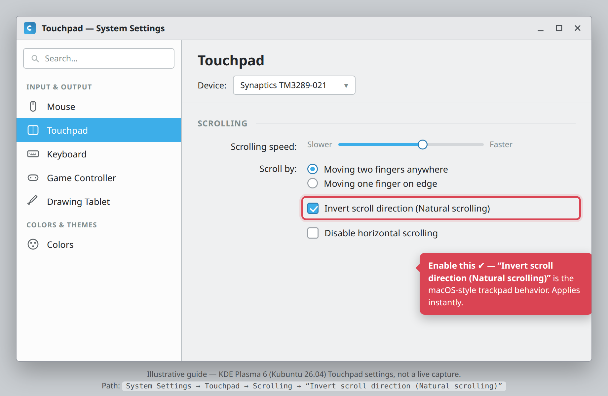

# Default touchpad natural scrolling (macOS-style) on Foundry Linux

**Date:** 2026-07-10
**Status:** Implemented (working tree — pending build/live verification)

## Context

A MacBook trackpad scrolls "naturally" by default — content follows your fingers
(drag up → content moves up), the inverse of the traditional wheel direction.
KDE Plasma on Ubuntu 26.04 ships the *traditional* direction. We want Foundry
Linux to default the **touchpad** to natural scrolling so the out-of-box feel
matches a MacBook trackpad.

Scope decisions (confirmed with the user):
- **Touchpad only** — attached mice keep traditional scroll (faithful to a
  MacBook's built-in trackpad; KDE tracks touchpad scroll direction separately
  from mouse anyway).
- **Set-once, respect overrides** — apply on first login via a sentinel file; if
  the user later flips it off in System Settings, it stays off.

Greenfield: repo-wide search found **no** existing `kcminputrc`, libinput,
`kwriteconfig`, or scroll/touchpad handling anywhere.

## Approach

KDE Plasma stores natural-scroll **per input device**, keyed by
vendor/product/name in `~/.config/kcminputrc`:

```
[Libinput][1739][52759][Synaptics TM3289-021]
NaturalScroll=true
```

Because the group name embeds the hardware ID, a statically shipped
`/etc/xdg/kcminputrc` cannot target an unknown user's trackpad. So we apply the
setting **at first login**, enumerating live devices and flipping only touchpads.

Home: the **`foundry-kde-theme` deb** — where all KDE session config already
lives, pulled in by every desktop edition (`foundry-desktop` ⊆ anvil/sprite/
atelier and the ISO). It is *not* in the Phase-2 devbox (`foundry-core`, no KDE),
which is correct — a container has no trackpad. We mirror the existing
`foundry-set-wallpaper.sh` precedent: a per-user `sh` script run from an XDG
autostart `.desktop`, guarded by a sentinel in `~/.config`, with a retry loop to
survive a not-yet-ready session.

**Application mechanism: KWin D-Bus.** At login KWin exposes each input device
over D-Bus; setting the writable `naturalScroll` property both applies the change
live and persists it to `kcminputrc`. Self-enumerates (no need to guess
vendor/product IDs), needs no root:

```sh
for d in $(qdbus6 org.kde.KWin /org/kde/KWin/InputDevice devicesSysNames \
           | tr ',\n' '  '); do
    p="/org/kde/KWin/InputDevice/$d"
    [ "$(qdbus6 org.kde.KWin "$p" touchpad)" = "true" ] || continue
    qdbus6 org.kde.KWin "$p" naturalScroll true
done
```

> **Verified against KDE Plasma 6 sources:** the config key
> `kcminputrc → [Libinput][VID][PID][Name] → NaturalScroll=true`, and the KWin
> D-Bus names — service `org.kde.KWin`, manager path `/org/kde/KWin/InputDevice`,
> manager property `devicesSysNames`, per-device interface `org.kde.KWin.InputDevice`
> with lowerCamelCase properties `touchpad` / `naturalScroll` (the `qdbus` shorthand
> `qdbus SVC PATH prop [value]` reads/writes these). The script picks whichever
> `qdbus` binary exists (`qdbus6` / `qdbus-qt6` / `qdbus`). Still do the pixel-level
> behavior check on a live session (repo lesson: "config resolves ≠ the surface
> renders it").

## Changes (done in working tree)

### 1. `foundry-apt/packages/foundry-kde-theme/data/bin/foundry-set-natural-scroll.sh` (new, 0755)
POSIX `sh`, structure copied from `foundry-set-wallpaper.sh`: sentinel
`${XDG_CONFIG_HOME:-$HOME/.config}/foundry-natural-scroll-set`; retry ≤60× (1s)
until KWin answers `devicesSysNames`, flip `naturalScroll=true` on touchpads
only, then `touch` the sentinel (written once KWin is reachable — even on a
desktop with no touchpad — so we don't retry 60s every login).

### 2. `foundry-apt/packages/foundry-kde-theme/data/autostart/foundry-natural-scroll.desktop` (new)
`Exec=/usr/lib/foundry-kde-theme/foundry-set-natural-scroll.sh`,
`X-KDE-autostart-phase=2` — mirrors `foundry-wallpaper.desktop`.

### 3. `foundry-apt/packages/foundry-kde-theme/debian/install`
Two lines added next to the wallpaper entries: the `.sh` →
`usr/lib/foundry-kde-theme/`, the `.desktop` → `etc/xdg/autostart/`.

### 4. `foundry-apt/packages/foundry-kde-theme/debian/changelog`
New top entry `1.0.6` (behavior change → patch bump). No `postinst` change — this
is user-session config applied at login, not an `/etc/skel` or divert case.

## Updating an already-installed system (no patch)

1. **GUI (no terminal):** System Settings → *Mouse & Touchpad* → **Touchpad** →
   under **Scrolling**, enable **"Invert scroll direction (Natural scrolling)"**.
   Applies immediately.

   

   *(Illustrative guide of the KDE Plasma 6 / Kubuntu 26.04 Touchpad KCM — real
   section wording; replace with a live capture at the VM-verification step.)*
2. **Package upgrade (permanent default):**
   `sudo apt update && sudo apt install --only-upgrade foundry-kde-theme`, then
   log out/in. No sentinel exists yet on an un-patched system, so the new
   autostart runs once and flips the touchpad automatically.
3. **CLI equivalent of the GUI toggle (apply now, no relogin):**
   ```sh
   for d in $(qdbus6 org.kde.KWin /org/kde/KWin/InputDevice devicesSysNames \
              | tr ',\n' '  '); do
     p="/org/kde/KWin/InputDevice/$d"
     [ "$(qdbus6 org.kde.KWin "$p" touchpad)" = "true" ] \
       && qdbus6 org.kde.KWin "$p" naturalScroll true
   done
   ```
   (Substitute `qdbus`/`qdbus-qt6` if `qdbus6` is absent.)

> To re-run the sentinel-guarded default, delete
> `~/.config/foundry-natural-scroll-set` and log in again — or just use route 1/3.

## Verification

1. **Build** (in an `ubuntu:26.04` container): `cd foundry-apt && task build`,
   `task verify` — `.deb` is `1.0.6`.
2. **Contents:** `dpkg-deb -c dist/foundry-kde-theme_1.0.6_all.deb | grep natural-scroll`
   → the `.sh` (0755) under `usr/lib/foundry-kde-theme/` and the `.desktop` under
   `etc/xdg/autostart/`.
3. **Live behavior (the real test):** in a Plasma 6 / Ubuntu 26.04 VM (or ISO),
   install, log into a fresh user, **physically confirm the touchpad scrolls the
   macOS way** (two-finger drag up moves content up) and an attached **mouse
   wheel is unchanged**. Confirm the D-Bus names in the script are correct on the
   real session.
4. **Idempotency / override:** sentinel exists after first login; turn the toggle
   off in System Settings, relogin, confirm it **stays off**.
5. **Upgrade path:** install 1.0.5 → upgrade to 1.0.6 on a session that never had
   the setting → relogin → touchpad flips.
