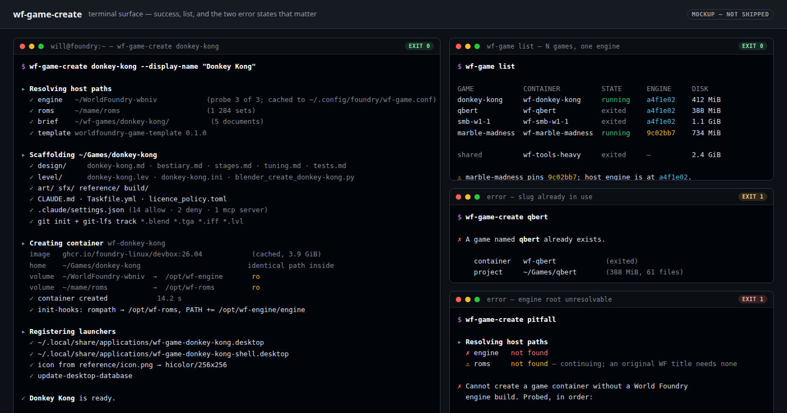
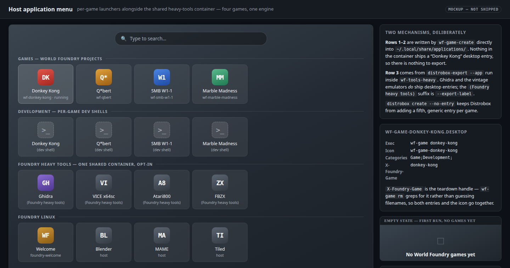

# Phase 2 — per-game tooling: `wf-game-create`, per-game Distrobox, `:26.04-maintainer`

**Status:** design complete, not implemented. This plan is the contract; code follows it in a
separate dispatch.
**TODO entry:** `## Open` → `- [T4] **Phase 2 devbox — per-game tooling** …`
**Supersedes the sketch in:** [`docs/investigations/2026-05-16-foundry-linux-distro-proposal.md`](../investigations/2026-05-16-foundry-linux-distro-proposal.md)
§"Engine dev vs game dev: container-per-project workflow" (lines 766–845).
**Deferred from:** [`docs/plans/2026-05-21-phase-2-devbox-image.md`](2026-05-21-phase-2-devbox-image.md)
§"Out of scope (follow-up plans)".

---

## 1. What changed since the sketch was written

The May proposal was written **before** `foundry-core` existed and before
`ghcr.io/foundry-linux/devbox:26.04` shipped. Three of its premises are now factually wrong,
and the design has to be re-derived rather than transcribed.

| Proposal assumed (2026‑05‑16) | Actually true (2026‑09‑03) | Consequence |
|---|---|---|
| The retro toolchain is heavy, so keep it **out** of the base image and in a dedicated container | `foundry-retro-tools` is a **`Depends:` of `foundry-core`**, which is the *only* thing the devbox image installs. MAME, `dasm`, `cc65`, `z80dasm`, `z80asm`, `radare2`, `binwalk`, `sox`, `binutils-m68k`, `xa65`, `f9dasm`, `libvgm`, `vgmstream` + the reducers are in **every** container spawned from `devbox:26.04` | The mandatory `wf-tools-retro` container loses ~90 % of its reason to exist — see **D1** |
| Ghidra is part of the retro bundle | Ghidra is **atelier-only** (`foundry-retro-tools/debian/control:65` — "ghidra … is not here"), ~860 MiB of jars | Ghidra is the *residue* that still justifies a shared container |
| Foundry Linux is a GNOME distro ("registers … with the host's GNOME") | Foundry Linux is **KDE Plasma** — `foundry-desktop` pulls `foundry-kde-theme`, `foundry-welcome` is QML/Kirigami | Launcher registration must be desktop-agnostic XDG, not GNOME-specific — see **D5** |
| Per-game layout is `game.blend` + `<game>.lev` + `asset.inc` | 20+ real level directories under `~/WorldFoundry-wbniv/wflevels/` use `<name>.lev` → `<name>.lvl` → `<name>.iff` (+ `.iff.txt`), `<name>.ini` (generated by `levcomp-rs`), `blender_create_<name>.py`, `<name>.blend`, `Room*.{cyc,ruv,tga}`, `pal*.tga`, `mesh.flags`, `sfx/gen_sfx.py`, `licence_policy.toml`. **There is no `asset.inc` anywhere.** | The template is derived from observed reality, not from the sketch — see **D9** |

Two things the proposal did **not** know about but which exist and must be wired in:

- **`~/wf-games`** (`git@github.com:wbniv/wf-games.git`) — ~50 per-game *design briefs*:
  `<game>.md` at the top level plus `<game>/{bestiary,stages,tuning,tests,audio-anim-hud}.md`.
  This is the design half of a game project and belongs in the scaffold.
- **`~/mame/roms`** already exists on the reference host — MAME's default `rompath`. The
  proposal's `~/Roms/` is not what anyone actually has.

---

## 2. Scope

**In:**

1. `wf-game-tools` — a new `.deb` in `foundry-apt/packages/`, shipping `wf-game-create`,
   `wf-game`, `wf-tools-create`, bash completion and man pages.
2. The per-game project layout and its scaffold template (split across two repos — **D2**).
3. The host↔container mount contract.
4. XDG desktop-entry registration and teardown.
5. Per-game Claude Code permission scoping.
6. `wf-tools-heavy` — the shared heavy/licence-encumbered container, **opt-in** (**D1**).
7. `ghcr.io/foundry-linux/devbox:26.04-maintainer` — a derived image tier.

**Out** (stated so the follow-up dispatch does not drift):

- Any change to `devbox:26.04` itself. The maintainer tier is a *derived* image.
- The WF-format template's actual content authoring — that lands in `../worldfoundry.org/apt/`
  as `worldfoundry-game-template` (**D2**); this repo ships only the fallback.
- A GUI game manager. `wf-game list` is a table on a terminal.
- Steam / `release-sniper` builds. Its own initiative, per the proposal.
- Adding `gh`/`devscripts`/`aptly` to the maintainer tier. It is android + iOS, nothing more.

---

## 3. Design decisions

Each decision names the alternative rejected, per this repo's convention.

### D1 — `wf-tools-retro` becomes `wf-tools-heavy`, and stops being mandatory

**Decision.** Retire the proposal's "always create `wf-tools-retro` at first boot, regardless of
role" policy. Replace it with an **opt-in** `wf-tools-heavy` container, created by
`wf-tools-create heavy`, containing only what is *not* already in every game container:

```
ghidra                              ~860 MiB   (atelier-only; the real reason for a shared container)
foundry-emulators-vintage           ~120 MiB   (vice/atari800/fbzx/mame-extra — multiverse, ROM-bundled)
foundry-emulators-consoles-heavy    ~1.4 GB    (the large console cores)
```

**Why the policy flipped.** The May rationale was "keep the engine host clean — no 400 MB Ghidra
in the user's `/opt`, no 30+ disassembler packages cluttering `apt list --installed`". Both halves
have since been solved *elsewhere*: the disassemblers are in `foundry-retro-tools`, which is in
`foundry-core`, which is in the image — so a per-game container already has them, and the *host*
never installed them either (`foundry-anvil` on the ISO does install them, but that is the ISO's
deliberate choice, not something a first-boot container can undo). What is left is Ghidra and the
ROM-bundled emulators, and those are:

- **Bigger than advertised.** The proposal budgeted "~500 MB of disk … trivial on any modern
  install". The honest figure today is **~2.4 GB**, most of it Ghidra.
- **A hostile first-boot side effect.** Pulling 2.4 GB unprompted on first login of a live ISO
  session, or inside a 30 GB VirtualBox disk (the VM quickstart's recommended size), is not
  "trivial". It also fails outright offline, which the live-session path must tolerate.
- **Legally awkward to pre-create.** `foundry-emulators-vintage` pulls multiverse packages that
  bundle non-redistributable ROM/BIOS data. The devbox plan already decided we do not ship those
  in a public image; silently apt-installing them on the user's behalf at first boot is the same
  decision made in the other direction, without asking.

**Rejected alternative:** keep it mandatory but shrink it to Ghidra only. That halves the download
but keeps the worst property — an unprompted multi-hundred-MB first-boot fetch — for a tool most
users will not open in their first week. The `foundry-welcome` app is the right place to *offer*
it, and it already exists.

**Migration note.** The name `wf-tools-retro` is retired, not aliased. Nothing has shipped under
it, so there is no compatibility surface to preserve. `wf-tools-create retro` prints a one-line
"renamed to `heavy`; the retro toolchain is already in every game container" and exits 2.

### D2 — the template ships in a `.deb`, split across the two apt repos along the existing seam

**Decision.**

| Artifact | Repo | Path | Contains |
|---|---|---|---|
| `wf-game-tools` | `apt.foundrylinux.org` (this repo) | `foundry-apt/packages/wf-game-tools/` | the CLIs, bash completion, man pages, and a **minimal format-agnostic fallback template** at `/usr/share/wf-game-tools/fallback-template/` |
| `worldfoundry-game-template` | `apt.worldfoundry.org` (sibling `../worldfoundry.org/apt/`) | `/usr/share/worldfoundry/game-template/` | the real WF scaffold — `.lev` seed, `.ini`, `blender_create_<name>.py`, palettes, `licence_policy.toml` |

`wf-game-tools` `Recommends: worldfoundry-game-template` (**not** `Depends:`), so the CLI is
installable and testable without the WF half, and `wf-game-create --template <dir|git-url>`
overrides both from day one.

**Why this seam.** `CLAUDE.md` draws the repo boundary at "the distribution" vs "one tenant's
authoring stack". `wf-game-create` is pure distro plumbing — Distrobox, bind mounts, XDG desktop
entries, podman. It knows nothing about `.lev` files. The template is *entirely* WF format
knowledge, and it goes stale the moment `levcomp-rs` changes its `.ini` schema — so it must live
next to the tools that define that schema. Splitting here means a WF format change is a
`worldfoundry-game-template` changelog bump in the sibling repo and nothing else moves.

**Why a `.deb` and not a git repo.**

- `wf-game-create` must work on a live ISO session with no network. A `git clone` of a template
  repo fails at exactly the moment a first-time user is trying the flow. The `.deb` is on disk.
- Version coupling. A template repo tracking `main` lets `wf-game-create` 1.0 scaffold something
  it does not understand. Pinning a tag means a second release process for a directory of ~20
  small files.
- Reproducibility mandate. We already own two apt repos with CI, signing and R2 backup. A third
  GitHub repo means a third CI, third set of secrets, third thing to restore after a catastrophic
  loss — for content that is a few kilobytes of text.

**Rejected alternative:** `foundry-linux/wf-game-template` as its own GitHub repo, cloned by the
tool. It gives template authors a fast iteration loop and makes third-party templates natural.
The `--template <git-url>` escape hatch buys the second benefit at zero structural cost, and the
first is not worth a repo. This is the closest call in the plan; if template churn turns out to
be high in practice, promoting the WF template to its own repo is a one-line change to the
package's `build.sh`.

### D3 — the container's `$HOME` **is** the game directory, at an identical path on both sides

**Decision.**

```
distrobox create \
  --name  wf-<slug> \
  --image ghcr.io/foundry-linux/devbox:26.04 \
  --home  "$HOME/Games/<slug>" \
  --no-entry \
  --volume "$WF_ENGINE_ROOT:/opt/wf-engine:ro" \
  --volume "$WF_ROM_LIBRARY:/opt/wf-roms:ro" \
  --init-hooks '…'
```

`--home/-H` is documented as "select a custom HOME directory for the container. Useful to avoid
host's home littering with temp files" (verified against `distrobox 1.8.2.4` on the reference
host). Distrobox mounts host directories at **identical paths** inside the container, so
`~/Games/donkey-kong/level/dk.lev` is the same string on the host and in the container. That
**path parity** is load-bearing: error messages, `.ini` relative paths, Blender's recent-files
list, Claude transcripts and `task` output are all copy-pasteable across the boundary without
translation.

Consequences that fall out for free:

- `.claude/`, `.config/`, `.cache/`, `.local/` land **inside the game directory**. Per-game pip
  venvs, per-game MAME `cfg`, per-game Claude state — isolation by construction, not by policy.
- `distrobox rm` plus removing the launchers is a complete teardown; nothing was written outside
  the game directory (**D11**).

**Must verify before implementation** (verification step 1): that `--home` alone prevents the real
`$HOME` from also being mounted. If it does not, the fallback is `--home` plus `--unshare-all` and
an explicit `--volume` allowlist; the design does not change, only the flag set.

**Rejected alternative:** default Distrobox behaviour (whole `$HOME` shared) with the game
directory as just another folder. It is one flag simpler and it is what most Distrobox users do —
but it defeats the entire premise. With a shared `$HOME`, game A's Claude settings, Python venv
and MAME config are game B's too, and "tear-down is trivial" becomes false.

### D4 — engine and ROM library are resolved, not hardcoded

Neither `~/Projects/WorldFoundry/` nor `~/Roms/` (the proposal's paths) exists on the reference
host; the real ones are `~/WorldFoundry-wbniv` and `~/mame/roms`.

**Decision.** Resolve both at first run and cache the answer in `~/.config/foundry/wf-game.conf`
(INI, hand-editable):

| Variable | Probe order | Mount |
|---|---|---|
| `WF_ENGINE_ROOT` | `$WF_ENGINE_ROOT` → config file → `~/Projects/WorldFoundry` → `~/WorldFoundry` → `~/WorldFoundry-wbniv` | `/opt/wf-engine` **ro** |
| `WF_ROM_LIBRARY` | `$WF_ROM_LIBRARY` → config file → `~/mame/roms` → `~/Roms` → *unset* | `/opt/wf-roms` **ro** |

An unresolvable `WF_ENGINE_ROOT` is a **hard error** with the three probed paths printed and
`--engine <path>` suggested — a game container with no engine cannot run anything.
An unresolvable `WF_ROM_LIBRARY` is a **warning**, not an error: an original WF title needs no
ROMs, and the mount is simply omitted.

Both mounts are `ro`. The read-only engine mount is the mechanical expression of the proposal's
"engine is API; games are clients" discipline — a game container *cannot* edit engine source, and
`task build` inside a game container fails loudly rather than silently forking the engine.

### D5 — desktop integration uses two different mechanisms, deliberately

The proposal says "registers the container with the host's GNOME so the game appears as a launcher
in Activities". That conflates two mechanisms that are not interchangeable, and names the wrong
desktop (Foundry Linux is KDE Plasma; the ISO ships `foundry-kde-theme`).

**Decision.**

**(a) Game entry points — `wf-game-create` writes the `.desktop` file itself.** Nothing inside the
container ships a `.desktop` for "Donkey Kong", so there is nothing for `distrobox-export` to
export. Two entries per game, written to `~/.local/share/applications/`:

```ini
# wf-game-<slug>.desktop
[Desktop Entry]
Type=Application
Name=<Display Name>
Comment=World Foundry game project (container wf-<slug>)
Exec=wf-game <slug>
Icon=wf-game-<slug>
Terminal=false
StartupWMClass=wf_game
Categories=Game;Development;
X-Foundry-Game=<slug>
X-Foundry-Container=wf-<slug>
```

```ini
# wf-game-<slug>-shell.desktop
[Desktop Entry]
Type=Application
Name=<Display Name> (dev shell)
Exec=distrobox enter wf-<slug>
Icon=wf-game-<slug>
Terminal=true
Categories=Development;
X-Foundry-Game=<slug>
```

`X-Foundry-Game` is the teardown handle: `wf-game rm` greps for it rather than guessing filenames.
Icon: `reference/icon.png` from the game directory if present, else the packaged Foundry mark,
installed to `~/.local/share/icons/hicolor/256x256/apps/wf-game-<slug>.png`. Then
`update-desktop-database ~/.local/share/applications` so the menu updates without a re-login.

`--no-entry` is passed to `distrobox create` so Distrobox does **not** also add its own generic
container entry — otherwise every game shows up twice, once as ours and once as a bare terminal.

**(b) Real GUI apps that live in a container — `distrobox-export --app`.** This is the correct
mechanism where it applies, and it applies to exactly one place: `wf-tools-create heavy` runs
`distrobox-export --app ghidra --export-label "(Foundry heavy tools)"` and the same for the vintage
emulators, because those packages *do* ship `.desktop` files. `distrobox-export` rewrites `Exec=`
to re-enter the container and copies icons to the host.

**Rejected alternative:** `distrobox-export --bin` for a generated `wf-game-<slug>` shim inside
each container. It would unify the two mechanisms — but it puts the launcher's lifetime inside the
container, so a container that fails to start leaves an orphaned host launcher with no way to
remove it except by hand. Host-written entries stay under the host tool's control.

### D6 — per-game Claude scoping uses checked-in `settings.json`, not `settings.local.json`

The proposal specifies `.claude/settings.local.json`. That is the wrong file for a *scaffolded*
allowlist: `settings.local.json` is the per-machine, git-ignored layer. An allowlist that
describes "what this game project is allowed to do" should travel with the project.

**Decision.** The template ships `.claude/settings.json` (checked in) and `.gitignore`s
`.claude/settings.local.json` for the user's own overrides:

```json
{
  "permissions": {
    "allow": [
      "Bash(task:*)",
      "Bash(levcomp:*)", "Bash(iffcomp:*)", "Bash(lvldump:*)",
      "Bash(oaddump:*)", "Bash(oas2oad:*)", "Bash(textile:*)", "Bash(cdpack:*)",
      "Bash(mame:*)", "Bash(blender:*)",
      "Read(/opt/wf-engine/**)",
      "Read(/opt/wf-roms/**)"
    ],
    "deny": [
      "Write(/opt/wf-engine/**)",
      "Write(/opt/wf-roms/**)"
    ],
    "additionalDirectories": ["/opt/wf-engine"]
  },
  "enabledMcpjsonServers": ["blender"]
}
```

`enabledMcpjsonServers: ["blender"]` matches what `~/WorldFoundry-wbniv/.claude/settings.local.json`
already does, so a game container behaves like the engine checkout does today.

**The `deny` rules are documentation, not enforcement.** `/opt/wf-engine` and `/opt/wf-roms` are
`ro` bind mounts; the kernel is what stops a write. The deny rules exist so the failure is a clear
refusal instead of an `EROFS` traceback. This distinction is stated in the template's `CLAUDE.md`
so nobody later "hardens" the design by deleting the mount flags and trusting the JSON.

### D7 — `wf-game-tools` is shell in a `.deb`, and it is **not** in `foundry-core`

**Decision.** Shell scripts (`set -euo pipefail`, `-h`/`--help` short-circuit before any argument
validation, per repo convention), packaged as `wf-game-tools`:

```
/usr/bin/wf-game-create
/usr/bin/wf-game
/usr/bin/wf-tools-create
/usr/lib/wf-game-tools/libwfgame.sh        colours, logging, slug validation, config resolution
/usr/share/wf-game-tools/fallback-template/
/usr/share/bash-completion/completions/wf-game
/usr/share/man/man1/wf-game{,-create}.1.gz
```

`Depends: distrobox, podman, desktop-file-utils` · `Recommends: worldfoundry-game-template`

**Not shell-plus-Python:** the tool is ~95 % `distrobox`/`podman`/`install`/`sed` orchestration.
A Python CLI would read nicer but introduces a second idiom for one tool in a repo whose entire
scripting surface is bash with a shared `lib.sh`.

**`libwfgame.sh` is not a copy of `foundry-setup/lib.sh`.** The house rule is "reference shared
scripts, never copy them" — but `foundry-setup/lib.sh` is Phase 0 bootstrap machinery (`run_sudo`,
`apt_update`, `enable_multiverse`, `setup_worldfoundry_source`) that is not installed anywhere and
is irrelevant here. `libwfgame.sh` carries container-lifecycle helpers and a ~15-line logging
shim. Different concerns, not duplication.

**Which metapackage pulls it in: `foundry-anvil`, not `foundry-core`.** This is the important
half. `foundry-core` is what the **devbox image itself installs** — putting a host-only Distrobox
orchestrator inside the container image would ship a tool that cannot work there, plus a
`Depends: podman` inside a podman container. `foundry-anvil` (= `core` + `desktop`) is the ISO /
host edition and is never installed in the container. That seam already exists; use it.

`wf-game-create` therefore refuses to run inside a container, detecting
`/run/.containerenv` or `/run/.toolboxenv` (the same marker `distrobox-export` probes — visible in
its stderr on a host: `grep: /run/.containerenv: No such file or directory`).

### D8 — the maintainer tier is a **derived** image, not a second Dockerfile

**Decision.** `foundry-devbox/Dockerfile.maintainer`:

```dockerfile
FROM ghcr.io/foundry-linux/devbox:26.04
RUN apt-get update \
 && apt-get install -y --no-install-recommends \
        foundry-android-development foundry-ios-development \
 && apt-get clean && rm -rf /var/lib/apt/lists/*
LABEL org.opencontainers.image.title="Foundry Linux devbox (maintainer)"
```

Published by the existing workflow via a build matrix over
`{26.04: Dockerfile, 26.04-maintainer: Dockerfile.maintainer}`. GHCR stores only the delta layer,
so the second tag costs ~2.5 GB of registry storage, not ~7 GB.

`install.sh` already accepts `--role maintainer`, so the naming is consistent with what shipped.

**Honest limitation, to be documented in `foundry-devbox/README.md`.** "iOS development" here is
`libimobiledevice` + `ideviceinstaller` + `usbmuxd` + `ifuse` + `codemagic-cli-tools` — device
plumbing and CI upload, **not** Xcode, and not a route to building an iOS binary on Linux. Device
access additionally needs the *host's* `usbmuxd` socket visible in the container
(`--volume /var/run/usbmuxd:/var/run/usbmuxd`), because the daemon that owns the USB device runs on
the host. Without that volume the tools are installed and inert. This is called out because a tier
that silently does not work is worse than one that does not exist.

**Rejected alternative:** a standalone `Dockerfile.maintainer` repeating the apt-source bootstrap.
It would let the maintainer tier diverge from the base — which is precisely the drift the single
`foundry-core` layer was designed to prevent.

### D9 — the project layout is derived from real level directories

Observed from `~/WorldFoundry-wbniv/wflevels/{qbert_practice,smb_w1_1,marble-madness,smb_w1_2,…}`
and `~/WorldFoundry-wbniv/CLAUDE.md:36` ("`.lev` (text) → `.lvl` (binary via levcomp-rs) → `.iff`
(via iffcomp-rs)"), plus the brief structure in `~/wf-games/<game>/`. See §4 for the layout itself.

The one structural departure from what exists: real `wflevels/` directories are **flat** — 30+
files of five kinds in one directory. That is fine for level *siblings inside the engine repo*; it
is not fine for a standalone project that also carries design docs, container state and build
output. The template groups into `design/`, `level/`, `art/`, `sfx/`, `reference/`, `build/`.

**Risk, stated up front:** the WF CLIs (`levcomp`, `iffcomp`, `textile`) may assume a flat cwd —
`smb_w1_1.ini` contains `Path = ../smb` and bare `.iff` filenames, which is consistent with
relative resolution from the level directory. The template's `Taskfile.yml` therefore `cd`s into
`level/` for every WF CLI invocation, so grouping is invisible to the tools. Verification step 6
is the check that this holds; if it does not, the fallback is a flat `level/` containing
everything and only `design/`, `reference/` and `build/` as siblings.

### D10 — a host engine rebuild is visible in a running container with no container action

Because `/opt/wf-engine` is a bind mount rather than a copy, `task build` on the host rewrites
`engine/wf_game` and every game container sees it immediately. There is no image rebuild, no
`distrobox stop`, no re-create. One engine build serves N games — that is the design's main
payoff and verification step 4 proves it.

Caveat worth stating so nobody files it as a bug: a process **already running** holds its old
inode if the build replaces the binary by rename. The next launch picks up the new one. This is
ordinary POSIX behaviour, not a mount problem.

### D11 — teardown is name-scoped and leaves the user's work alone

`wf-game rm <slug>`:

1. `distrobox rm -f wf-<slug>`
2. remove every `~/.local/share/applications/*.desktop` whose `X-Foundry-Game=` matches `<slug>`
3. remove `~/.local/share/icons/hicolor/*/apps/wf-game-<slug>.png`
4. `update-desktop-database ~/.local/share/applications`
5. **leave `~/Games/<slug>/` in place** — it is the user's work, and `.claude/`, `.config/` etc.
   live inside it. `--purge` removes it, and only after the user types the slug back.

The image is *not* removed: it is shared across all game containers and the heavy container.
When `wf-game rm` removes the last game container it prints the `podman rmi` command rather than
running it.

### D12 — designed for N games, not one

Everything is plural by construction: containers are `wf-<slug>` with a collision check and a
`[a-z0-9][a-z0-9-]*` slug validator; `wf-game list` is a table; bash completion enumerates
existing games from `podman ps -a --filter name=wf-`; one engine mount, one ROM library and one
heavy-tools container serve all N. Nothing in the design has a "the game" singular.

---

## 4. Per-game project layout

```
~/Games/<slug>/                       ← container $HOME, identical path inside and out
├── CLAUDE.md                         game-specific Claude context (from template + brief)
├── README.md
├── Taskfile.yml                      build / lev / iff / play / capture
├── .gitignore  .gitattributes        LFS: *.blend *.tga *.iff *.lvl
├── .claude/
│   ├── settings.json                 checked-in allowlist (D6)
│   └── settings.local.json           gitignored, user overrides
├── design/                           ← imported from ~/wf-games/<slug>/ when present
│   ├── <slug>.md                     the conversion brief
│   ├── bestiary.md  stages.md  tuning.md  tests.md  audio-anim-hud.md
├── level/
│   ├── <slug>.lev                    authored text source
│   ├── <slug>.ini                    levcomp-rs input (generated, checked in)
│   ├── blender_create_<slug>.py      scene generator
│   ├── <slug>.blend                  (git-lfs)
│   ├── mesh.flags
│   └── <slug>.{lvl,iff,iff.txt}      generated — gitignored
├── art/
│   ├── pal0.tga  palPerm.tga
│   └── Room0.{cyc,ruv,tga}  …
├── sfx/
│   └── gen_sfx.py
├── reference/                        screenshots, MAME captures, disassembly notes
│   └── icon.png                      → the launcher icon, if present
├── build/                            gitignored
├── licence_policy.toml               asset licence policy (pattern from wflevels/)
└── .config/ .cache/ .local/          container state — gitignored, per-game by construction
```

`design/` is populated by `wf-game-create --from-brief <slug>` when a `wf-games` checkout is
resolvable (`$WF_GAMES_ROOT` → `~/wf-games`); otherwise the template's placeholder headings are
used and the CLI prints where the brief would have come from.

---

## 5. CLI surface

```
wf-game-create <slug> [--display-name NAME] [--engine PATH] [--roms PATH]
                      [--template DIR|GIT-URL] [--from-brief SLUG]
                      [--no-launcher] [--dry-run] [-h|--help]

wf-game <slug>                 enter the container (or run the game if --play)
wf-game list                   table: slug, container state, engine rev, disk
wf-game rm <slug> [--purge]    teardown (D11)
wf-game doctor [<slug>]        verify mounts, engine binary, ROM path, launchers

wf-tools-create heavy [--dry-run]   the shared heavy container (D1)
```

`--dry-run` prints every `distrobox`/`podman`/`install` command without executing — this is what
makes verification steps 2 and 3 runnable on a machine that does not want a 3 GB pull.

---

## 6. Mount contract

| Host | Container | Mode | Failure mode if absent |
|---|---|---|---|
| `~/Games/<slug>` | `~/Games/<slug>` (`$HOME`) | rw | created by `wf-game-create` |
| `$WF_ENGINE_ROOT` | `/opt/wf-engine` | **ro** | hard error, probed paths printed |
| `$WF_ROM_LIBRARY` | `/opt/wf-roms` | **ro** | warning; mount omitted |
| `/var/run/usbmuxd` | same | rw | maintainer tier only; without it iOS tools are inert (**D8**) |

`--init-hooks` writes `~/.mame/mame.ini` with `rompath /opt/wf-roms` and appends
`/opt/wf-engine/engine` to the container `PATH`, so `wf_game` and `wf_edit` are on `PATH` without
the user knowing where they are mounted.

---

## 7. Mockups

Design surfaces: the `wf-game-create` terminal output, and the host application menu once several
games exist. Both at 1440×900, self-contained, in
[`2026-09-03-phase-2-per-game-tooling/`](2026-09-03-phase-2-per-game-tooling/).

[](2026-09-03-phase-2-per-game-tooling/wf-game-create-cli.html)

**`wf-game-create` CLI** — the happy path, then `wf-game list` with four games and the heavy
container, then the two error states that matter: slug collision and unresolvable engine root.

[](2026-09-03-phase-2-per-game-tooling/desktop-launchers.html)

**Host application menu** — four game launchers with their dev-shell siblings, and the
`distrobox-export`-produced Ghidra / vintage-emulator entries labelled
`(Foundry heavy tools)`. Shown with the empty state (no games yet) inset, because that is what a
first-time user actually sees.

---

## 8. Sequencing

| Stage | Deliverable | Repo | Independently shippable? |
|---|---|---|---|
| A | `wf-game-tools` `.deb` + fallback template + `foundry-anvil` `Depends:` bump | this repo | yes — `--template` and the fallback make it testable alone |
| B | `worldfoundry-game-template` `.deb` | `../worldfoundry.org/apt/` | yes — data-only package |
| C | `wf-tools-create heavy` + `foundry-welcome` offer for it | this repo | yes |
| D | `devbox:26.04-maintainer` + workflow matrix + README limitation note | this repo | yes |

Stages are ordered by dependency, not priority. **A** is the only one that blocks anything.

---

## 9. Verification

Acceptance criteria, re-runnable. Steps 1 and 6 are *pre-implementation* checks — they validate
assumptions this plan rests on, and a FAIL on either changes the design before code is written.

Per repo convention: keep these steps verbatim, paste raw output in a code block under each, add
PASS/FAIL.

1. **`--home` isolates the host home (design assumption, D3).**
   ```bash
   distrobox create -i ghcr.io/foundry-linux/devbox:26.04 -n wf-probe \
       --home "$HOME/Games/_probe" --no-entry -Y
   distrobox enter wf-probe -- sh -c 'echo HOME=$HOME; ls -a "$HOME"; ls /home'
   distrobox rm -f wf-probe
   ```
   PASS if `$HOME` is `~/Games/_probe` and the real home's contents are **not** listed.
   FAIL ⇒ adopt the `--unshare-all` + explicit-volume fallback in D3.

2. **Dry run emits the exact contract in §6.**
   ```bash
   wf-game-create testgame --dry-run
   ```
   PASS if the printed `distrobox create` contains `--home`, `--no-entry`, both `:ro` volumes and
   no other host path.

3. **Real create produces container, layout and launchers.**
   ```bash
   wf-game-create testgame --display-name "Test Game"
   podman ps -a --filter name=wf-testgame --format '{{.Names}} {{.Status}}'
   find ~/Games/testgame -maxdepth 2 -not -path '*/.git/*' | sort
   grep -l 'X-Foundry-Game=testgame' ~/.local/share/applications/*.desktop
   desktop-file-validate ~/.local/share/applications/wf-game-testgame.desktop
   ```
   PASS if the container exists, the §4 layout is present, **two** desktop files match, and
   `desktop-file-validate` is silent.

4. **A host engine rebuild is visible inside the container with no container action (D10).**
   ```bash
   distrobox enter wf-testgame -- sha256sum /opt/wf-engine/engine/wf_game
   ( cd "$WF_ENGINE_ROOT" && task build )
   distrobox enter wf-testgame -- sha256sum /opt/wf-engine/engine/wf_game
   ```
   PASS if the two hashes differ and no `distrobox` create/stop/start ran in between.

5. **The engine mount is genuinely read-only.**
   ```bash
   distrobox enter wf-testgame -- sh -c 'touch /opt/wf-engine/CANARY; echo exit=$?'
   distrobox enter wf-testgame -- sh -c 'touch /opt/wf-roms/CANARY;   echo exit=$?'
   ```
   PASS if both are non-zero with `Read-only file system`, and no `CANARY` appears on the host.

6. **The WF CLIs tolerate the grouped layout (design assumption, D9).**
   ```bash
   distrobox enter wf-testgame -- sh -c 'cd ~/Games/testgame && task lev'
   ls -l ~/Games/testgame/level/testgame.lvl
   ```
   PASS if `.lev` → `.lvl` succeeds from the grouped tree. FAIL ⇒ flatten `level/` per D9's
   fallback.

7. **Per-game Claude scoping is isolated.**
   ```bash
   wf-game-create testgame2
   diff <(jq -S . ~/Games/testgame/.claude/settings.json) \
        <(jq -S . ~/Games/testgame2/.claude/settings.json)
   distrobox enter wf-testgame -- sh -c 'ls ~/Games/testgame2 2>&1; echo exit=$?'
   ```
   PASS if the settings files are structurally identical (same template) **and** testgame's
   container cannot see testgame2's directory.

8. **N containers coexist.**
   ```bash
   wf-game list
   ```
   PASS if both test games appear with correct state and the shared engine revision.

9. **Teardown leaves no host residue (D11).**
   ```bash
   wf-game rm testgame2
   podman ps -a --filter name=wf-testgame2
   ls ~/.local/share/applications/ | grep -c testgame2 || true
   ls ~/.local/share/icons/hicolor/256x256/apps/ | grep -c testgame2 || true
   ls -d ~/Games/testgame2
   wf-game rm testgame --purge   # confirm with the slug when prompted
   ls -d ~/Games/testgame 2>&1
   ```
   PASS if the container and both launchers and the icon are gone, `~/Games/testgame2` **survives**
   plain `rm`, and `--purge` removes `~/Games/testgame`.

10. **`wf-game-create` refuses to run inside a container (D7).**
    ```bash
    distrobox enter wf-probe2 -- wf-game-create nested; echo exit=$?
    ```
    PASS if it exits non-zero with the "cannot run inside a container" message.

11. **Heavy container is opt-in and exports its GUI apps (D1).**
    ```bash
    wf-tools-create retro          # expect exit 2 + rename notice
    wf-tools-create heavy
    ls ~/.local/share/applications/ | grep -i ghidra
    ```
    PASS if `retro` exits 2 with the notice, `heavy` creates the container, and a Ghidra launcher
    labelled `(Foundry heavy tools)` appears on the host.

12. **Maintainer tier builds and is a delta on the base (D8).**
    ```bash
    docker build -f foundry-devbox/Dockerfile.maintainer -t devbox:26.04-maintainer foundry-devbox/
    docker run --rm devbox:26.04-maintainer sh -c 'command -v adb ideviceinstaller idevice_id'
    ```
    PASS if the build reuses the base layers and all three binaries resolve.

13. **Repo hygiene.**
    ```bash
    cd foundry-apt && task shellcheck && task build && task verify
    ```
    PASS if shellcheck is clean and `wf-game-tools_*.deb` builds and passes `dpkg-deb --info`.

---

## 10. Risks and open questions

| Risk | Impact | Confirmation |
|---|---|---|
| `--home` does not fully isolate the host home | The whole isolation premise weakens; needs `--unshare-all` + volume allowlist | Verification step 1 — **run this first** |
| WF CLIs assume a flat level directory | Template restructure late in implementation | Verification step 6; fallback documented in D9 |
| Blender 5.0.1 vs WF add-ons authored for 4.2 | The scaffold's `blender_create_<slug>.py` may not run | Pre-existing, tracked in `../WorldFoundry-wbniv/TODO.md` §TOOLS — **not** this plan's to fix, but it will surface here first |
| Template churn is higher than expected | D2's "`.deb`, not a repo" call inverts | Track it; promoting to a repo is a one-line `build.sh` change |
| `usbmuxd` socket passthrough does not work under rootless podman | Maintainer tier's iOS half is decorative | Verification step 12 covers presence, not device access; a real device test is needed before advertising it |

**Open question for the user, not blocking:** should `foundry-welcome` gain a fourth panel
offering `wf-tools-create heavy` and a "create your first game" button? It is the natural home for
the offer that D1 removed from first boot, but it changes a shipped QML app and belongs in the
`foundry-welcome` backlog rather than here.

---

## 11. Out of scope (explicitly)

- Any modification to `devbox:26.04` or to `foundry-core`.
- A `wf-game` GUI / Podman Desktop integration.
- Authoring the WF-format template's actual `.lev` content (Stage B, sibling repo).
- `release-sniper` Steam builds.
- Windows/macOS host support — Distrobox is Linux-only by construction.
